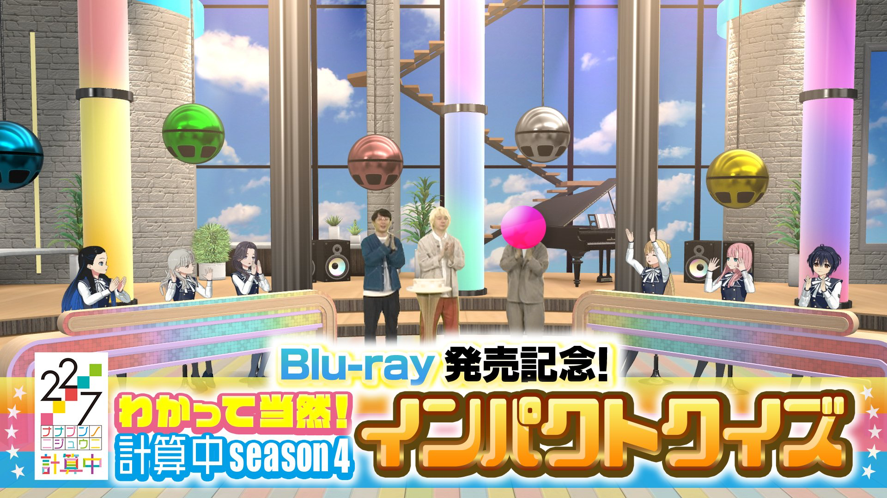

### 22/7 計算中 Keisanchu Season 5
##### [Back](227Keisanchu_List.md)

<table>
  <tr>
    <th><a href="#Ep1-10">Ep1-10</a></th>
	<th><a href="#Ep11-20">Ep11-20</a></th>
  </tr>
</table>

#### [#11 ユニット対抗戦！一致団結４クイズバトル #11 小組對抗戰！團結一致４問答對決](S5/Ep11.md) 

#### [#10 ナナニジ先輩後輩！思い出マッチング！ #10 ナナニジ前輩後輩！回憶配對！](S5/Ep10.md) 

#### [#9 わかって当然！計算中season４インパクトクイズ 後半戦 #9 當然知道！計算中 season4印象問答 後半戰](S5/Ep09.md) 

#### [#8 わかって当然！計算中season４インパクトクイズ #8 當然知道！計算中 season4印象問答](S5/Ep08.md) 

#### [#7 11thシングル"僕は今夜、出て行く"ヒット祈願 最終章 #7 11th單曲『僕は今夜、出ていく』大賣祈願 最終章](S5/Ep07.md) 

#### #6

#### #5

#### #4

#### #3

#### #2

#### #1
