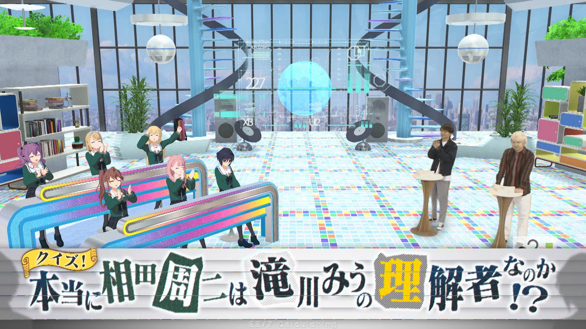

### 22/7 計算中 Keisanchu Season 3
##### [Back](../227Keisanchu_S3.md)

#### #11 クイズ！本当に相田周二は滝川みうの理解者なのか！？ #11 問答！相田周二真的是滝川みう的理解者！？ 
Date: 12Jun,2021

<section class="accordion">
  <input type="checkbox" name="collapse" id="handle1">
  <h4 class="handle">
    <label for="handle1">
    資訊 Description
    </label>
  </h4>
  
  

    

6月12日（土）の企画は『クイズ！本当に相田周二は滝川みうの理解者なのか！？』！ 
「滝川みうの理解者」を自負している三四郎・相田だが、本当に滝川みうの事を理解できているのかを徹底検証！ 
今回はテーマに沿って滝川＆小宮＆他のメンバー１人が作品を制作。 
その中から相田が滝川の作品を当てることができるかのクイズを決行！ 
もしも滝川以外の作品を選んでしまったら「理解者」の称号から降格に⁉︎ 
しかし滝川の理解し難いセンスに一同驚愕！ 
果たして相田は「滝川みうの理解者」の称号を死守できるのか！？ 
<blockquote>
6月12日（六）的企劃是『問答！相田周二真的是滝川みう的理解者！？』！ 
以「滝川みう的理解者」為榮的三四郎・相田，徹底驗證他是否真正理解滝川みう！ 
這次，滝川＆小宮＆另一位成員按照主題製作作品。 
相田能否從中猜出滝川作品的問答將會舉行！ 
如果揀選了滝川以外的作品﹐「理解者」的稱號將會降格⁉︎ 
然而，滝川難以理解的感覺令眾人驚呆！ 
相田能否保住「滝川みう的理解者」這一個稱號！？ 
</blockquote>

  
  

</section>

PV 
<video width="100%" height="100%" controls>
  <source src="https://github.com/LYHPandaKing/227PhotoBackup/releases/download/227Keisanchu_S3_PV/227KeisanchuS3_PV_11_RAW_1080P.mp4" type="video/mp4">
</video>

Bangumi 
<video width="100%" height="100%" controls>
  <source src="https://github.com/LYHPandaKing/227PhotoBackup/releases/download/227Keisanchuu_S3-mp4/227Keisanchu_S3_11_RAW_1080P.mp4" type="video/mp4">
</video>

<table>
  <tr>
  <th>Raw</th>
    <th colspan="2"><a rel="noopener noreferrer" target="_blank" href="https://www.bilibili.com/video/BV1uf4y187Ho">Source</a></th>
    <th><a rel="noopener noreferrer" target="_blank" href="https://github.com/LYHPandaKing/227PhotoBackup/releases/download/227Keisanchuu_S3-mp4/227Keisanchu_S3_11_RAW_1080P.mp4">Download</a></th>
  </tr>
  <tr>
  <th>Sub</th>
    <th><a rel="noopener noreferrer" target="_blank" href="https://www.bilibili.com/video/BV1iw411f7r3">CHS - bilibili</a></th>
    <th>CHT - YouTube</th>
    <th>CHT (.ass) </th>
  </tr>
</table>