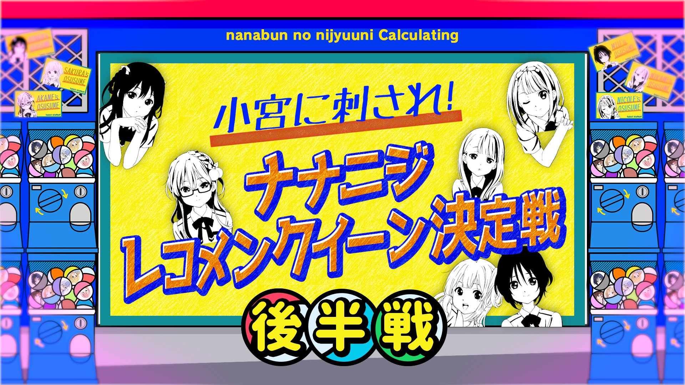

### 22/7 計算中 Keisanchu Season 4
##### [Back](../227Keisanchu_S4.md)

#### #12 小宮に刺され！ナナニジレコメンクイーン決定戦 後半戦 #12 小宮被刺中！ナナニジ推薦女王決定戰 後半戰 
Date: 18Jun,2022

<section class="accordion">
  <input type="checkbox" name="collapse" id="handle1">
  <h4 class="handle">
    <label for="handle1">
    資訊 Description
    </label>
  </h4>
  
  

    

６月１８日（土）の企画は「小宮に刺され！ナナニジレコメンクイーン決定戦」後半戦！ 
今週は「泣きたい時に確実に泣ける作品」「人生の糧となる作品」でメンバーが小宮に向けて猛プッシュ！ 
滝川みうはやっぱりあの作品でテンションMAXに！？ 
斎藤ニコルのあざといレコメンが小宮に突き刺さる！？ 
そしてなぜか藤間桜が大号泣！一体何が！？ 
果たして初代レコメンクイーンに輝くメンバーは！？ 
<blockquote>
６月１８日（六）的企劃為「小宮被刺中！ナナニジ推薦女王決定戰」後半戰！ 
這週成員們向小宮猛推「當你想哭時一定可以哭出來的作品」「人生食糧的作品」等作品！ 
滝川みう果然對那作品的情緒MAX！？ 
斎藤ニコル耍小聰明的推薦刺透了小宮！？ 
然後藤間桜不知為何大哭了！到底發生了甚麼！？ 
到底初代推薦女王的輝煌會屬於哪位成員！？ 
</blockquote>

  
  

</section>

PV 
<video width="100%" height="100%" controls>
  <source src="https://github.com/LYHPandaKing/227PhotoBackup/releases/download/227Keisanchu_S4_PV/227KeisanchuS4_PV_12_RAW_1080P.mp4" type="video/mp4">
</video>

Bangumi 
<video width="100%" height="100%" controls>
  <source src="https://github.com/LYHPandaKing/227PhotoBackup/releases/download/227Keisanchuu_S4/227Keisanchu_S4_12_RAW_1080P.mp4" type="video/mp4">
</video>

<table>
  <tr>
  <th>Raw</th>
    <th><a rel="noopener noreferrer" target="_blank" href="https://www.bilibili.com/video/BV1g34y157fp">Source</a></th>
    <th><a rel="noopener noreferrer" target="_blank" href="https://github.com/LYHPandaKing/227PhotoBackup/releases/download/227Keisanchuu_S4/227Keisanchu_S4_12_RAW_1080P.mp4">Download</a></th>
  </tr>
  <tr>
  <th>Sub</th>
    <th colspan="2"><a rel="noopener noreferrer" target="_blank" href="https://www.bilibili.com/video/BV1Wr4y1E7fV/">CHS - bilibili</a></th>
  </tr>
</table>