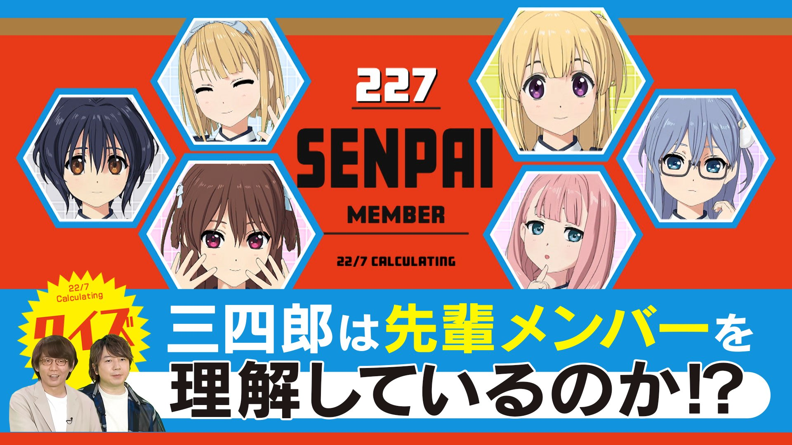

### 22/7 計算中 Keisanchu Season 4
##### [Back](../227Keisanchu_S4.md)

#### #19 クイズ！三四郎は先輩メンバーを理解しているのか！？後半戦 #19 問答！三四郎能否理解前輩成員們！？後半戰 
Date: 6Aug,2022

<section class="accordion">
  <input type="checkbox" name="collapse" id="handle1">
  <h4 class="handle">
    <label for="handle1">
    資訊 Description
    </label>
  </h4>
  
  

    

８月６日（土）の企画は「クイズ！三四郎は先輩メンバーを理解しているのか！？後半戦」 
新メンバー加入でちょっぴり嫉妬気味の先輩メンバー！三四郎が自分たちのことを理解しているのか探る企画！ 
今回は「大喜利」と「４コマ漫画」で先輩メンバーの作品を当てるはずが… 
斎藤ニコルは時代遅れの女！？八神叶愛が先輩に対してマウント発言！？ 
永峰楓の独特すぎる世界観にスタジオ騒然！三四郎・相田は藤間桜のまさかの理解者！？ 
果たして三四郎は先輩メンバーの作品を見極められるのか！？ 
<blockquote>
８月６日（六）的企劃為「問答！三四郎能否理解前輩成員們！？後半戰」 
因新成員加入而感到少許妒忌的前輩成員們！要找出三四郎是否真的理解自己的企劃！ 
今次應為猜想前輩成員們的「大喜利」和「4格漫畫」作品… 
斎藤ニコル是落後的女人！？八神叶愛對前輩的炫耀發言！？ 
永峰楓的獨特世界觀令錄影廠一片嘩言！三四郎・相田竟是藤間意想不到的理解者！？ 
到底三四郎能否找到前輩成員們的作品！？ 
</blockquote>

  
  

</section>

PV 
<video width="100%" height="100%" controls>
  <source src="https://github.com/LYHPandaKing/227PhotoBackup/releases/download/227Keisanchu_S4_PV/227KeisanchuS4_PV_19_RAW_1080P.mp4" type="video/mp4">
</video>

Bangumi 
<video width="100%" height="100%" controls>
  <source src="https://github.com/LYHPandaKing/227PhotoBackup/releases/download/227Keisanchuu_S4/227Keisanchu_S4_19_RAW_1080P.mp4" type="video/mp4">
</video>

<table>
  <tr>
  <th>Raw</th>
    <th><a rel="noopener noreferrer" target="_blank" href="https://www.bilibili.com/video/BV1ha411K74k">Source</a></th>
    <th><a rel="noopener noreferrer" target="_blank" href="https://github.com/LYHPandaKing/227PhotoBackup/releases/download/227Keisanchuu_S4/227Keisanchu_S4_19_RAW_1080P.mp4">Download</a></th>
  </tr>
  <tr>
  <th>Sub</th>
    <th colspan="2">CHS - bilibili</th>
  </tr>
</table>