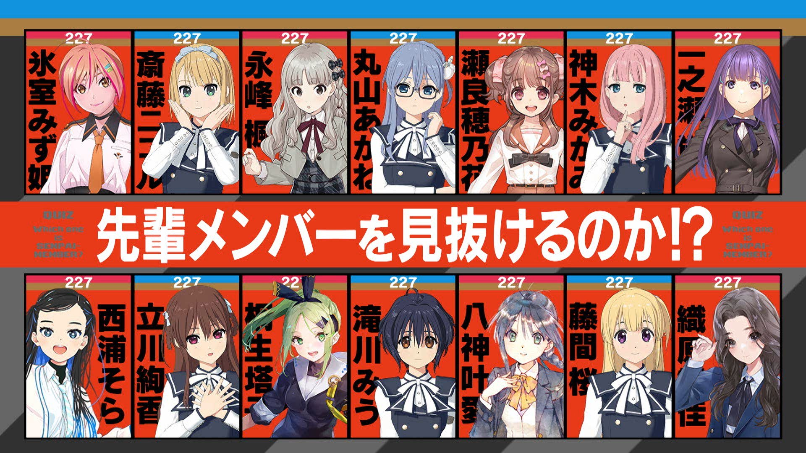

### 22/7 計算中 Keisanchu Season 4
##### [Back](../227Keisanchu_S4.md)

#### #20 クイズ！三四郎は先輩メンバーを理解しているのか！？完結編 #20 問答！三四郎能否理解前輩成員們！？完結編 
Date: 13Aug,2022

<section class="accordion">
  <input type="checkbox" name="collapse" id="handle1">
  <h4 class="handle">
    <label for="handle1">
    資訊 Description
    </label>
  </h4>
  
  

    

８月１３日（土）は「クイズ！三四郎は先輩メンバーを理解しているのか！？」完結編となる今回は「食リポ」「三四郎のキャッチフレーズ」から先輩メンバーのセンスを見抜く！ 
薄っぺらい食リポや大爆笑を誘った食リポを披露したのは誰なのか！？ 
そして個性爆発のキャッチフレーズにスタジオ騒然！？ 
さらにあのメンバーから三四郎・相田に猛クレームが！ 
緊急企画・滝川みうの真の理解者対決も！ 
<blockquote>
８月１３日（六）的企劃為「問答！三四郎能否理解前輩成員們！？」完結編，然後從今次展示的「食評」「三四郎的口號」中看透前輩的品味！ 
誰的淺薄食評和令人大爆笑的食評被披露！？ 
然後個性爆發的口號令錄影廠一片混亂！？ 
此外，那位成員不停向三四郎・相田申訴！ 
緊急企劃・滝川みう的真的理解者對決！ 
</blockquote>

  
  

</section>

PV 
<video width="100%" height="100%" controls>
  <source src="https://github.com/LYHPandaKing/227PhotoBackup/releases/download/227Keisanchu_S4_PV/227KeisanchuS4_PV_20_RAW_1080P.mp4" type="video/mp4">
</video>

Bangumi 
<video width="100%" height="100%" controls>
  <source src="https://github.com/LYHPandaKing/227PhotoBackup/releases/download/227Keisanchuu_S4/227Keisanchu_S4_20_RAW_1080P.mp4" type="video/mp4">
</video>

<table>
  <tr>
  <th>Raw</th>
    <th><a rel="noopener noreferrer" target="_blank" href="https://www.bilibili.com/video/BV1Qv4y1F7Pa">Source</a></th>
    <th><a rel="noopener noreferrer" target="_blank" href="https://github.com/LYHPandaKing/227PhotoBackup/releases/download/227Keisanchuu_S4/227Keisanchu_S4_20_RAW_1080P.mp4">Download</a></th>
  </tr>
  <tr>
  <th>Sub</th>
    <th colspan="2"><a rel="noopener noreferrer" target="_blank" href="https://www.bilibili.com/video/BV1EG4y1k7qV/">CHS - bilibili</a></th>
  </tr>
</table>