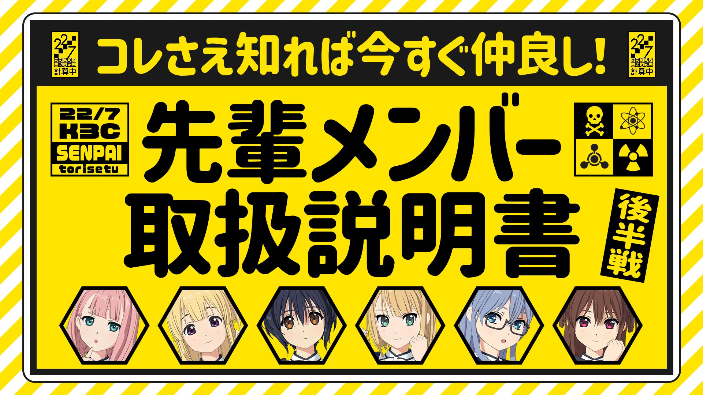

### 22/7 計算中 Keisanchu Season 4
##### [Back](../227Keisanchu_S4.md)

#### #22 コレさえ知れば今すぐ仲良し！先輩メンバー取り扱い説明書 後半戦 #22 如果知道的話就能馬上變得友好！前輩成員們的說明書 後半戰 
Date: 27Aug,2022

<section class="accordion">
  <input type="checkbox" name="collapse" id="handle1">
  <h4 class="handle">
    <label for="handle1">
    資訊 Description
    </label>
  </h4>
  
  

    

８月２７日(土)の企画は「コレさえ知れば今すぐ仲良し！先輩メンバー取扱説明書」後半戦！ 
先輩と後輩の距離をグっと縮めるべく先輩メンバーが自分以外のメンバーの取扱説明書を大公開！ 
丸山あかねは○○が怖い！？藤間桜はアレへのこだわりが異常！？ 
などなど先輩メンバーの意外な一面が続出！ 
さらに後輩メンバーにとって最も重要なMC三四郎のトリセツを先輩メンバーが大公開！ 
相田は○○したがっている！？そして小宮の㊙︎情報にスタジオ騒然！？ 
<blockquote>
８月２７日（六）的企劃為「如果知道的話就能馬上變得友好！前輩成員們的說明書」後半戰！ 
為了縮短前後輩之間的距離，前輩成員們發表自己以外的成員說明書！ 
丸山あかね害怕○○！？藤間桜對那個有著異常的執著！？ 
前輩成員們這樣那樣的一面接連顯露！ 
此外，前輩成員們發表對後輩成員們最重要的MC三四郎的說明書！ 
相田想要○○！？小宮的秘密情報令錄影廠一片嘩然！？ 
</blockquote>

  
  

</section>

PV 
<video width="100%" height="100%" controls>
  <source src="https://github.com/LYHPandaKing/227PhotoBackup/releases/download/227Keisanchu_S4_PV/227KeisanchuS4_PV_22_RAW_1080P.mp4" type="video/mp4">
</video>

Bangumi 
<video width="100%" height="100%" controls>
  <source src="https://github.com/LYHPandaKing/227PhotoBackup/releases/download/227Keisanchuu_S4/227Keisanchu_S4_22_RAW_1080P.mp4" type="video/mp4">
</video>

<table>
  <tr>
  <th>Raw</th>
    <th><a rel="noopener noreferrer" target="_blank" href="https://www.bilibili.com/video/BV1Qd4y1A7gi">Source</a></th>
    <th><a rel="noopener noreferrer" target="_blank" href="https://github.com/LYHPandaKing/227PhotoBackup/releases/download/227Keisanchuu_S4/227Keisanchu_S4_22_RAW_1080P.mp4">Download</a></th>
  </tr>
  <tr>
  <th>Sub</th>
    <th colspan="2">CHS - bilibili</th>
  </tr>
</table>