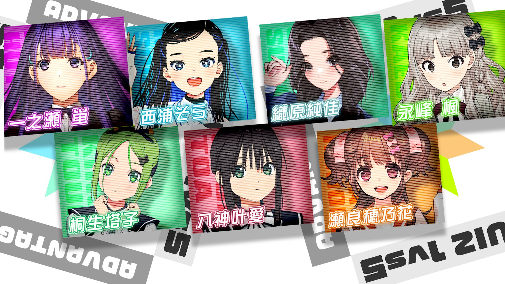

### 22/7 計算中 Keisanchu Season 4
##### [Back](../227Keisanchu_S4.md)

#### #30 出る杭は打たれる！？アドバンテージクイズ１ＶＳ５ 完結編 #30 槍打出頭鳥！？優勢問答１ＶＳ５ 完結編 
Date: 22Oct,2022

<section class="accordion">
  <input type="checkbox" name="collapse" id="handle1">
  <h4 class="handle">
    <label for="handle1">
    資訊 Description
    </label>
  </h4>
  
  

    

１０月２２日(土)の企画は「出る杭は打たれる！？アドバンテージクイズ１ＶＳ５」完結編！ 
最後のチャレンジャーは瀬良穂乃花！得意ジャンルの「猫」でご褒美ゲットに挑むもなぜかあの猫おじさんが立ちはだかる！？ 
そして斎藤ニコルＶＳ八神叶愛の因縁のリベンジマッチが早くも実現！果たしてその結果は！？ 
さらに三四郎・小宮もあのお題でリベンジマッチに挑戦！しかしまさかの結果に大激怒！？ 
<blockquote>
１０月２２日（六）的企劃為「槍打出頭鳥！？優勢問答１vs５」完結編！ 
最後的挑戰者是瀬良穂乃花！嘗試挑戰其擅長領域「貓」以獲得獎勵，但不知為何貓大叔要阻礙她！？ 
然後，斎藤ニコルＶＳ八神叶愛的宿命復仇比賽經已成真！到底結果會是怎樣！？ 
此外，三四郎・小宮進行那個主題的復仇戰挑戰！但對意想不到的結果大激怒！？ 
</blockquote>

  
  

</section>

PV 
<video width="100%" height="100%" controls>
  <source src="https://github.com/LYHPandaKing/227PhotoBackup/releases/download/227Keisanchu_S4_PV/227KeisanchuS4_PV_30_RAW_1080P.mp4" type="video/mp4">
</video>

Bangumi 
<video width="100%" height="100%" controls>
  <source src="https://github.com/LYHPandaKing/227PhotoBackup/releases/download/227Keisanchuu_S4/227Keisanchu_S4_30_RAW_1080P.mp4" type="video/mp4">
</video>

<table>
  <tr>
  <th>Raw</th>
    <th><a rel="noopener noreferrer" target="_blank" href="https://www.bilibili.com/video/BV1QV4y1373D/">Source</a></th>
    <th><a rel="noopener noreferrer" target="_blank" href="https://github.com/LYHPandaKing/227PhotoBackup/releases/download/227Keisanchuu_S4/227Keisanchu_S4_30_RAW_1080P.mp4">Download</a></th>
  </tr>
  <tr>
  <th>Sub</th>
    <th colspan="2"><a rel="noopener noreferrer" target="_blank" href="https://www.bilibili.com/video/BV1p24y117Az/">CHS - bilibili</a></th>
  </tr>
</table>