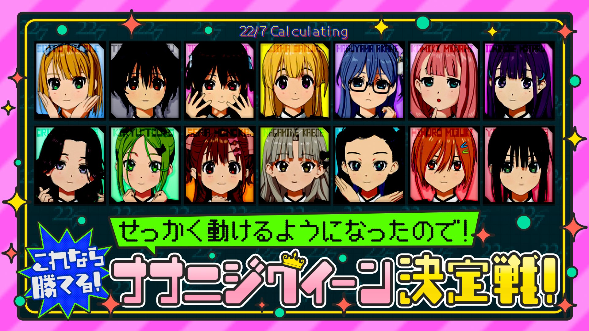

### 22/7 計算中 Keisanchu Season 4
##### [Back](../227Keisanchu_S4.md)

#### #34 せっかく動けるようになったので！これなら勝てる！ナナニジクイーン決定戦 後半戦 #34 難得終於可以動起來！這個的話我能贏！ナナニジ女王決定戰 後半戰 
Date: 19Nov,2022

<section class="accordion">
  <input type="checkbox" name="collapse" id="handle1">
  <h4 class="handle">
    <label for="handle1">
    資訊 Description
    </label>
  </h4>
  
  

    

１１月１９日（土）の企画は「せっかく動けるようになったので！これなら勝てる！ナナニジクイーン決定戦」後半戦！ 
後輩メンバー全員のパネル卒業を記念して「これなら誰にも負けない」という後輩メンバーの特技でナナニジクイーン決定戦を開催！ 
西浦そらの特技「鏡文字対決」では滝川みうが珍解答に一同騒然！？ 
一之瀬蛍の特技は「体内時計」ではマイペースすぎる一之瀬がまさかのギアチェンジ！？ 
八神叶愛の特技「片足バランス」では斎藤ニコルvs八神の因縁バトルが再び！ 
<blockquote>
１１月１９日（六）的企劃為「難得終於可以動起來！這個的話我能贏！ナナニジ女王決定戰」後半戰！ 
紀念後輩成員全員從看板畢業，舉行「這個的話我不會輸給任何人」後輩成員特技的ナナニジ女王決定戰！ 
西浦そら的特技「鏡文字対決」但滝川みう的不尋常作答令大家議論紛紛！？ 
一之瀬蛍的特技是「體內時鐘」一向我行我素的一之瀬沒想到會轉換節奏！？ 
八神叶愛的特技「單腳平衡」斎藤ニコルvs八神的宿命對決再次展開！ 
</blockquote>

  
  

</section>

PV 
<video width="100%" height="100%" controls>
  <source src="https://github.com/LYHPandaKing/227PhotoBackup/releases/download/227Keisanchu_S4_PV/227KeisanchuS4_PV_34_RAW_1080P.mp4" type="video/mp4">
</video>

Bangumi 
<video width="100%" height="100%" controls>
  <source src="https://github.com/LYHPandaKing/227PhotoBackup/releases/download/227Keisanchuu_S4/227Keisanchu_S4_34_RAW_1080P.mp4" type="video/mp4">
</video>

<table>
  <tr>
  <th>Raw</th>
    <th><a rel="noopener noreferrer" target="_blank" href="https://www.bilibili.com/video/BV1qK411Z7n8/">Source</a></th>
    <th><a rel="noopener noreferrer" target="_blank" href="https://github.com/LYHPandaKing/227PhotoBackup/releases/download/227Keisanchuu_S4/227Keisanchu_S4_34_RAW_1080P.mp4">Download</a></th>
  </tr>
  <tr>
  <th>Sub</th>
    <th colspan="2"><a rel="noopener noreferrer" target="_blank" href="https://www.bilibili.com/video/BV1ev4y197zU/">CHS - bilibili</a></th>
  </tr>
</table>