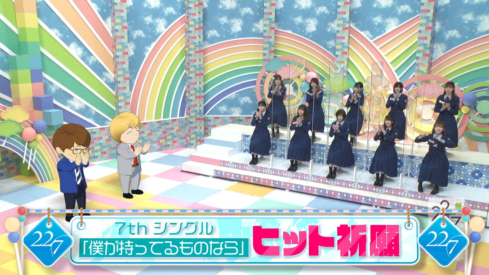
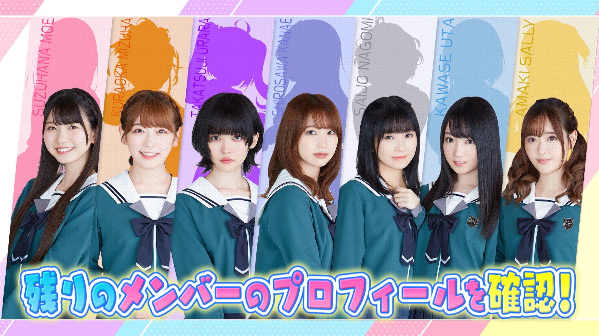

### 22/7 検算中 Kenzanchu
 

アニメアイドルバラエティ番組「22/7計算中」が新番組として変貌！22/7声優メンバー自らがトーク＆ロケで奮闘。 
アニメキャラと化したMC三四郎とお送りする新感覚声優バラエティ番組！ 
📺TOKYO MX・BS11にて毎週土曜23時～ 

##### [Back](../../../readme.md)

<table style="width:100%">
  <tr>
  <th><a href="#Ep1-10">#1-10</a></th>
  </tr>
  <tr>
  <td>CHT (.ass)</td>
  </tr>
</table>

#### [#6 7thシングル「僕が持ってるものなら」ヒット祈願企画！ #6 七單「僕が持ってるものなら」熱賣祈願企劃！](Ep6.md)
 
---

#### [#5 催眠術でめざせ！パーフェクトアイドル #5 以催眠術為目標！完美的偶像](Ep5.md)
 
---

#### [#4 抜き打ち楽屋チェック!  アイドル私物クイーン決定戦!! #4 突擊檢查更衣室! 偶像的私人物品女王決定戰!!](Ep4.md)
 
---

#### [#3 声優メンバーのプロフィールを改めて確認しまＳＨＯＷ！ 3 #3 聲優成員們的個人資料 再次確認 ＳＨＯＷ！ 3](Ep3.md)
 
---

#### [#2 声優メンバーのプロフィールを改めて確認しまＳＨＯＷ！ 2 #2 聲優成員們的個人資料 再次確認 ＳＨＯＷ！ 2](Ep2.md)
 
---

#### [#1 声優メンバーのプロフィールを改めて確認しまＳＨＯＷ！ #1 聲優成員們的個人資料 再次確認 ＳＨＯＷ！](Ep1.md)
 
---
