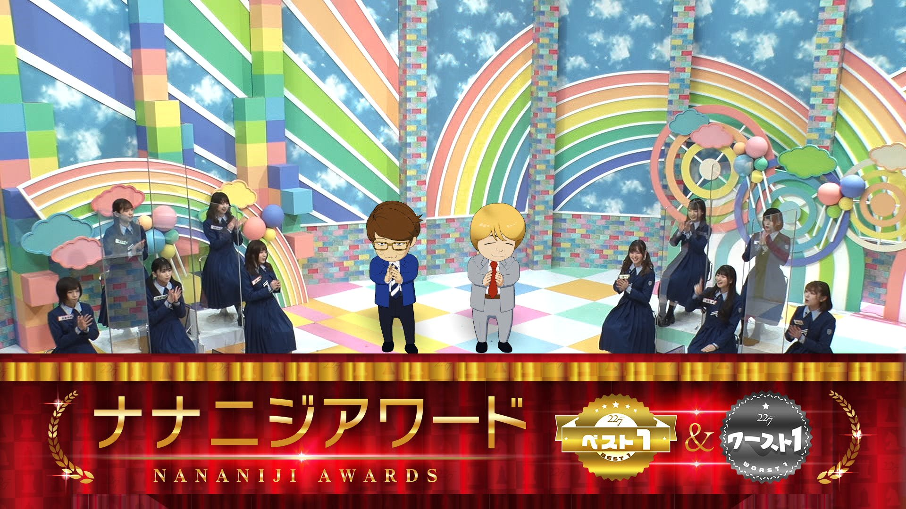

### 22/7 検算中 Kenzanchu
##### [Back](227Kenzanchu_List.md)

#### #8 ナナニジアワードベスト１＆ワースト１ #8 ナナニジ Award Best 1 & Worst 1 
Date: 27Feb,2021

<section class="accordion">
  <input type="checkbox" name="collapse" id="handle1">
  <h4 class="handle">
    <label for="handle1">
    資訊 Description
    </label>
  </h4>
  
  

    

2月27日(土)の企画は「ナナニジアワードベスト１＆ワースト１」を開催！ 
メンバーのさらなる個性を深掘りするために様々なお題のベスト１＆ワースト１をメンバー内で選出するはずが…容赦のない暴露合戦に！ 
海乃るりはドジっ娘！？ 
天城サリーは変人！？ 
白沢かなえが超ご立腹！？ 
メンバーの知られざる素顔が明らかに！ 
<blockquote>
2月27日(六)舉行「ナナニジ Award Best 1 & Worst 1」企劃！ 
為了深入了解各個成員的個性，在眾多主題中分別選出Best 1 & Worst 1成員…進行着一場無情的曝光戰！ 
海乃るり是個冒失娘！？ 
天城サリー是個怪人！？ 
白沢かなえ超級生氣！？ 
揭露成員們未知的一面！ 
</blockquote>

  
  

</section>

PV 
<video width="100%" height="100%" controls>
  <source src="https://github.com/LYHPandaKing/227PhotoBackup/releases/download/227Kenzanchu_PV/227Kenzanchu_PV_08_RAW_1080P.mp4" type="video/mp4">
</video>

Bangumi 
<video width="100%" height="100%" controls>
  <source src="https://github.com/LYHPandaKing/227PhotoBackup/releases/download/227Kenzanchu/227Kenzanchu_08_RAW_1080P.mp4" type="video/mp4">
</video>

<table>
  <tr>
  <th>Raw</th>
    <th colspan="2"><a rel="noopener noreferrer" target="_blank" href="https://www.bilibili.com/video/BV1oU4y1H7Fm">Source</a></th>
    <th><a rel="noopener noreferrer" target="_blank" href="https://github.com/LYHPandaKing/227PhotoBackup/releases/download/227Kenzanchu/227Kenzanchu_08_RAW_1080P.mp4">Download</a></th>
  </tr>
  <tr>
  <th>Sub</th>
    <th><a rel="noopener noreferrer" target="_blank" href="https://www.bilibili.com/video/BV18r4y1A7WV">CHS - bilibili</a></th>
    <th><a rel="noopener noreferrer" target="_blank" href="https://www.youtube.com/watch?v=Pzg1TVHPjV0">CHT - YouTube</a></th>
    <th>CHT (.ass) </th>
  </tr>
</table>
