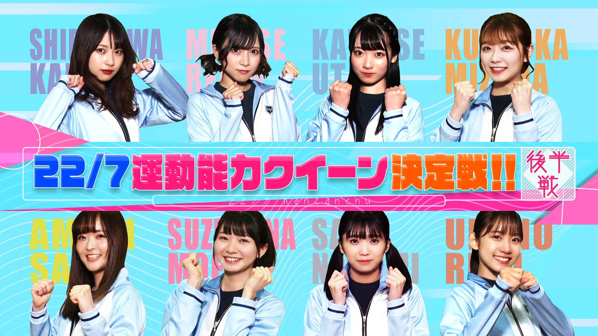

### 22/7 検算中 Kenzanchu
##### [Back](227Kenzanchu_List.md)

#### #10 ２２/７運動能力クイーン決定戦 後半戦 #10 ２２/７運動能力女王決定戰 後半戰 
Date: 13Mar,2021

<section class="accordion">
  <input type="checkbox" name="collapse" id="handle1">
  <h4 class="handle">
    <label for="handle1">
    資訊 Description
    </label>
  </h4>
  
  

    

3月13日(土) の企画は「22/7運動能力クイーン決定戦」後半戦！ 
「20mスキップ」「バーピージャンプ」「逆上がり」など前半戦に続きメンバーが様々な種目に挑戦！ 
皆が真剣に挑むなかあのメンバーの奇妙な動きにスタジオ騒然！ 
そして１発逆転の最終種目でまさかの展開が 
果たして栄冠を手にするのはどのメンバー！？ 
<blockquote>
3月13日(六) 的企劃是「２２/７運動能力女王決定戰」後半戰！ 
在比賽前半戰後，成員們將挑戰各式各樣的項目如「20m跑跳步」「波比跳」「引體後空翻」！ 
正當每人都認真地進行挑戰，因一位成員的奇怪舉動，工作室陷入一片混亂！ 
最後１次逆轉的項目有意想不到的發展 
哪一位成員最終能夠獲得殊榮！？ 
</blockquote>

  
  

</section>

PV 
<video width="100%" height="100%" controls>
  <source src="https://github.com/LYHPandaKing/227PhotoBackup/releases/download/227Kenzanchu_PV/227Kenzanchu_PV_10_RAW_1080P.mp4" type="video/mp4">
</video>

Bangumi 
<video width="100%" height="100%" controls>
  <source src="https://github.com/LYHPandaKing/227PhotoBackup/releases/download/227Kenzanchu/227Kenzanchu_10_RAW_1080P.mp4" type="video/mp4">
</video>

<table>
  <tr>
  <th>Raw</th>
    <th colspan="2"><a rel="noopener noreferrer" target="_blank" href="https://www.bilibili.com/video/BV1eZ4y1P7Vu">Source</a></th>
    <th><a rel="noopener noreferrer" target="_blank" href="https://github.com/LYHPandaKing/227PhotoBackup/releases/download/227Kenzanchu/227Kenzanchu_10_RAW_1080P.mp4">Download</a></th>
  </tr>
  <tr>
  <th>Sub</th>
    <th><a rel="noopener noreferrer" target="_blank" href="https://www.bilibili.com/video/BV1WK4y1U7Xv">CHS - bilibili</a></th>
    <th><a rel="noopener noreferrer" target="_blank" href="https://www.youtube.com/watch?v=ha5FO0VOCA8">CHT - YouTube</a></th>
    <th>CHT (.ass) </th>
  </tr>
</table>
