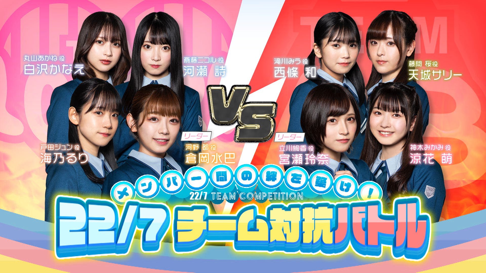

### 22/7 検算中 Kenzanchu
##### [Back](227Kenzanchu_List.md)

#### #12 メンバー間の絆を築け！２２／７チーム対抗バトル 後半戦 #12 建立成員之間的羈絆！２２／７小組對抗戰 後半戰 
Date: 27Mar,2021

<section class="accordion">
  <input type="checkbox" name="collapse" id="handle1">
  <h4 class="handle">
    <label for="handle1">
    資訊 Description
    </label>
  </h4>
  
  

    

３月２７日(土)の企画は、「メンバー間の絆を築け！22/7チーム対抗バトル！後半戦」。 
今週は「相手チームを欺け！演技力バトル！」で対決！ 
「足つぼマット」「電流ビリビリ」「人気芸人にテレフォン」など様々な演技に挑戦！ 
しかし相手を欺くはずが...あのメンバーの珍リアクションやポンコツ演技にスタジオ騒然！ 
さらに白沢かなえが本気の大号泣!? 
果たして勝利するのはどちらのチームなのか!? 
<blockquote>
３月２７日(六)的企劃是「建立成員之間的羈絆！２２／７小組對抗戰！後半戰」。 
本週將會在「欺騙對手隊伍！演技力對戰！」中對決！ 
「卵石墊」「電流嗶哩嗶哩」「打電話給人氣藝人」等各式各樣的演技挑戰！ 
但是要欺騙對手...工作室因那成員稀奇的反應和無用的演技而變得吵鬧！ 
再者，白沢かなえ認真地大哭!? 
哪個隊伍會獲得勝利!? 
</blockquote>

  
  

</section>

PV 
<video width="100%" height="100%" controls>
  <source src="https://github.com/LYHPandaKing/227PhotoBackup/releases/download/227Kenzanchu_PV/227Kenzanchu_PV_12_RAW_1080P.mp4" type="video/mp4">
</video>

Bangumi 
<video width="100%" height="100%" controls>
  <source src="https://github.com/LYHPandaKing/227PhotoBackup/releases/download/227Kenzanchu/227Kenzanchu_12_RAW_1080P.mp4" type="video/mp4">
</video>

<table>
  <tr>
  <th>Raw</th>
    <th colspan="2"><a rel="noopener noreferrer" target="_blank" href="https://www.bilibili.com/video/BV1Ab4y1X7Wn">Source</a></th>
    <th><a rel="noopener noreferrer" target="_blank" href="https://github.com/LYHPandaKing/227PhotoBackup/releases/download/227Kenzanchu/227Kenzanchu_12_RAW_1080P.mp4">Download</a></th>
  </tr>
  <tr>
  <th>Sub</th>
    <th>CHS - bilibili</th>
    <th>CHT - YouTube</th>
    <th>CHT (.ass) </th>
  </tr>
</table>
