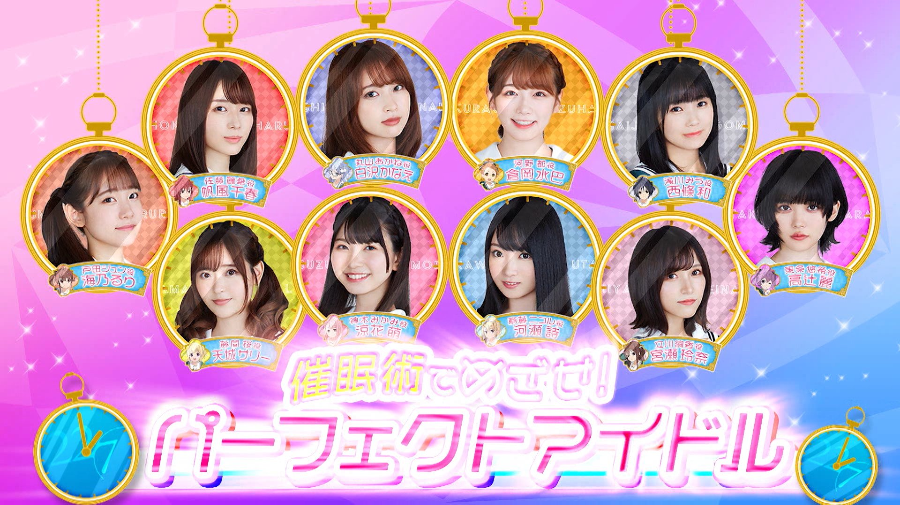

### 22/7 検算中 Kenzanchu
##### [Back](227Kenzanchu_List.md)

#### #5 催眠術でめざせ！パーフェクトアイドル #5 以催眠術為目標！完美的偶像 
Date: 6Feb,2021

２月６日(土)の企画は「催眠術でめざせ！パーフェクトアイドル」 
今後ＴＶやＣＭでの活躍が期待されるナナニジメンバー！ 
その為には“できない事”があってはいけない！という事で、今回は催眠術パワーを借りてアイドルに必要な様々なスキルを身につけていく！ 
羞恥心を無くすため恥ずかしい動物になりきる！？ 
あの飲み物が大好きな飲み物に変貌！？河瀬詩は苦手な動物と触れ合えるか！？ 
<blockquote>
２月６日(六)的企劃為「以催眠術為目標！完美的偶像」 
期待22/7成員們今後在TV、CM等有活躍的表現！ 
為此，那應該沒有「做不到的事情」！所以今次，借助催眠術的力量，備助各式各樣偶像所需的技能！ 
為了無羞恥心而變成丟臉的動物！？ 
將該飲品轉變成最喜歡的飲品！？河瀬詩能夠接觸她不擅長的動物嗎！？ 
</blockquote>

PV 
<video width="100%" height="100%" controls>
  <source src="https://github.com/LYHPandaKing/227PhotoBackup/releases/download/227Kenzanchu_PV/227Kenzanchu_PV_05_RAW_1080P.mp4" type="video/mp4">
</video>

Bangumi 
<video width="100%" height="100%" controls>
  <source src="https://github.com/LYHPandaKing/227PhotoBackup/releases/download/227Kenzanchu/227Kenzanchu_05_RAW_1080P.mp4" type="video/mp4">
</video>

<table>
  <tr>
  <th>Raw</th>
    <th colspan="2"><a rel="noopener noreferrer" target="_blank" href="https://www.bilibili.com/video/BV1yv411e7dJ">Source</a></th>
    <th><a rel="noopener noreferrer" target="_blank" href="https://github.com/LYHPandaKing/227PhotoBackup/releases/download/227Kenzanchu/227Kenzanchu_04_RAW_1080P.mp4">Download</a></th>
  </tr>
  <tr>
  <th>Sub</th>
    <th>CHS - bilibili</th>
    <th>CHT - YouTube</th>
    <th>CHT (.ass) </th>
  </tr>
</table>
