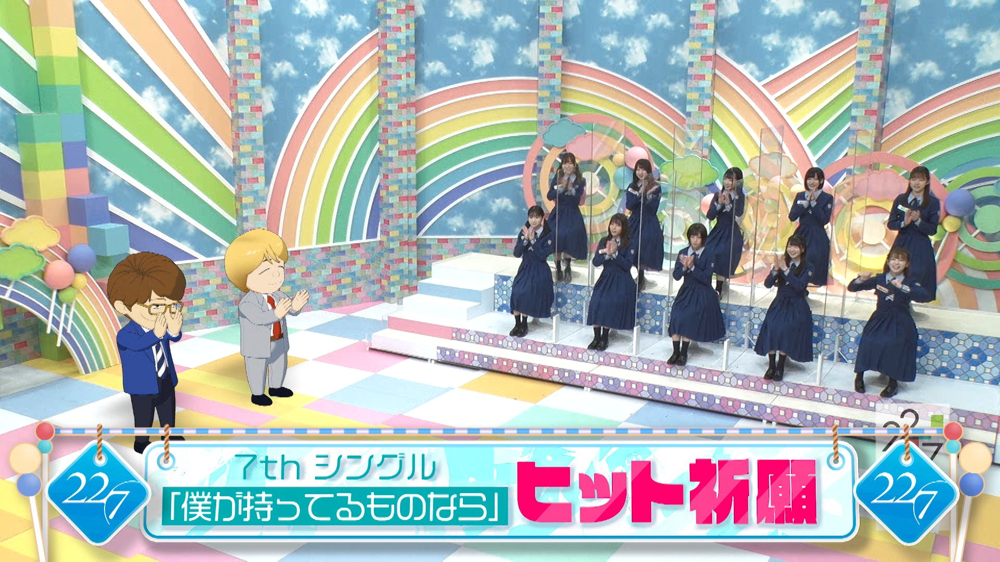

### 22/7 検算中 Kenzanchu
##### [Back](227Kenzanchu_List.md)

#### #6 7thシングル「僕が持ってるものなら」ヒット祈願企画！ #6 七單「僕が持ってるものなら」熱賣祈願企劃！ 
Date: 13Feb,2021

2月13日(土)の企画は7thシングル「僕が持ってるものなら」ヒット祈願！ 
これまでに様々なヒット祈願を行ってきたが今回もメンバー全員であるプロジェクトに挑戦！ 
ヒット祈願達成のために悪戦苦闘するメンバー！ 
貴重な思い出が飛び出したり大ピンチに陥ったりするなか見事成し遂げることはできるのか！？ 
<blockquote>
2月13日(六)的企劃是七單「僕が持ってるものなら」熱賣祈願！ 
在此之前，已進行過各式各樣的熱賣祈願。這次想與成員全員一起挑戰！ 
成員們為了達成熱賣祈願而奮鬥著！ 
當珍貴的回憶湧上心頭、有成員陷入大危機，這企劃有可能出色地完成嗎！？ 
</blockquote>

PV 
<video width="100%" height="100%" controls>
  <source src="https://github.com/LYHPandaKing/227PhotoBackup/releases/download/227Kenzanchu_PV/227Kenzanchu_PV_06_RAW_1080P.mp4" type="video/mp4">
</video>

Bangumi 
<video width="100%" height="100%" controls>
  <source src="https://github.com/LYHPandaKing/227PhotoBackup/releases/download/227Kenzanchu/227Kenzanchu_06_RAW_1080P.mp4" type="video/mp4">
</video>

<table>
  <tr>
  <th>Raw</th>
    <th colspan="2"><a rel="noopener noreferrer" target="_blank" href="https://www.youtube.com/watch?v=yEHPH0wVkFQ">Source</a></th>
    <th><a rel="noopener noreferrer" target="_blank" href="https://github.com/LYHPandaKing/227PhotoBackup/releases/download/227Kenzanchu/227Kenzanchu_06_RAW_1080P.mp4">Download</a></th>
  </tr>
  <tr>
  <th>Sub</th>
    <th><a rel="noopener noreferrer" target="_blank" href="https://www.bilibili.com/video/BV1z5411N79V">CHS - bilibili</a></th>
    <th><a rel="noopener noreferrer" target="_blank" href="https://www.youtube.com/watch?v=NaPGrpaRmgY">CHT - YouTube</a></th>
    <th>CHT (.ass) </th>
  </tr>
</table>
