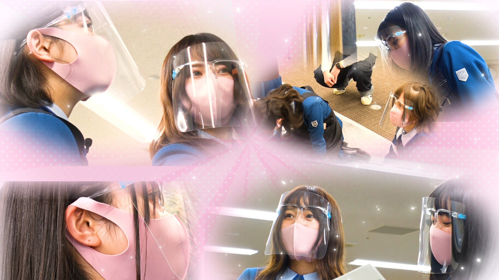

### 22/7 検算中 Kenzanchu
##### [Back](227Kenzanchu_List.md)

#### #7 7thシングル「僕が持ってるものなら」ヒット祈願 完結編 #7 七單「僕が持ってるものなら」熱賣祈願 完結編 
Date: 20Feb,2021

２月２０日(土)は前回に引き続き7thシングル「僕が持ってるものなら」ヒット祈願をお届け！ 
歌詞にちなんだ黒板アートを描くため資料集めに奔走したメンバーたち！ 
今回ついに黒板アート制作がスタート！ 
初めての経験に悪戦苦闘するメンバー！ 
最後は黒板アートミュージックビデオが完成！ 
果たしてどんな作品になったのか！？ 
さらに番組の最後に步は嬉しいお知らせも！ 
<blockquote>
２月２０日(六) 將繼續傳遞上集的七單「僕が持ってるものなら」熱賣祈願！ 
努力地搜集資料來繪畫對應歌詞的黑板畫的成員們！ 
今集終於開始製作黑板畫了！ 
成員們在初體驗中努力奮鬥！ 
最終完成了黑板畫MV！ 
會是個怎樣的作品呢！？ 
進一步，節目結束時將有好消息！ 
</blockquote>

PV 
<video width="100%" height="100%" controls>
  <source src="https://github.com/LYHPandaKing/227PhotoBackup/releases/download/227Kenzanchu_PV/227Kenzanchu_PV_07_RAW_1080P.mp4" type="video/mp4">
</video>

Bangumi 
<video width="100%" height="100%" controls>
  <source src="https://github.com/LYHPandaKing/227PhotoBackup/releases/download/227Kenzanchu/227Kenzanchu_07_RAW_1080P.mp4" type="video/mp4">
</video>

<table>
  <tr>
  <th>Raw</th>
    <th colspan="2"><a rel="noopener noreferrer" target="_blank" href="  ">Source</a></th>
    <th><a rel="noopener noreferrer" target="_blank" href="https://github.com/LYHPandaKing/227PhotoBackup/releases/download/227Kenzanchu/227Kenzanchu_07_RAW_1080P.mp4">Download</a></th>
  </tr>
  <tr>
  <th>Sub</th>
    <th>CHS - bilibili</th>
    <th>CHT - YouTube</th>
    <th>CHT (.ass) </th>
  </tr>
</table>
