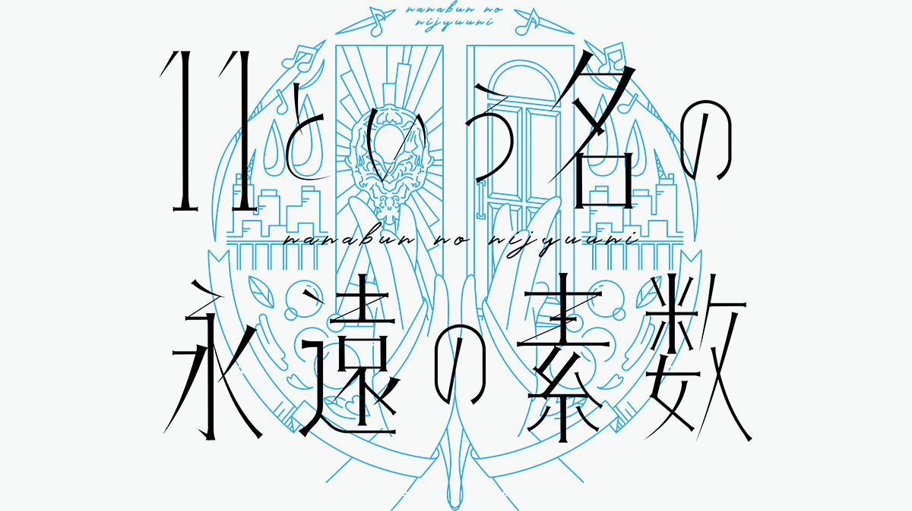

### 1st アルバム『11という名の永遠の素数』リリースTour 2021
##### [Back](Live_List.md)

  
Date: 22Jul,2021  

<a target="_blank" rel="noopener noreferrer" href="https://nanabunnonijyuuni.com/s/n129/news/detail/10335?ima=5027">Official New</a>

<section class="accordion">
  <input type="checkbox" name="collapse" id="handle1">
  <h4 class="handle">
    <label for="handle1">
    倒數日曆 Advent Calendar
    </label>
  </h4>
  
  

    

當質數的日子及Live演出當日到來，格子將會打開。 
到底打開後會有怎樣的內容(全11種)很令人期待♪ 
請慢慢享受！ 
 
2Jul: 天城サリー 
<audio controls="controls">
  <source type="audio/mp3" src="../../../Resources/1stAL_Tour2021/a1.mp3"></source>
  
Your browser does not support the audio element.

</audio> 
3Jul: 西條和 
<audio controls="controls">
  <source type="audio/mp3" src="../../../Resources/1stAL_Tour2021/a4.mp3"></source>
  
Your browser does not support the audio element.

</audio> 
5Jul: 倉岡水巴 
<audio controls="controls">
  <source type="audio/mp3" src="../../../Resources/1stAL_Tour2021/a3.mp3"></source>
  
Your browser does not support the audio element.

</audio> 
7Jul: 宮瀬玲奈 
<audio controls="controls">
  <source type="audio/mp3" src="../../../Resources/1stAL_Tour2021/a11.mp3"></source>
  
Your browser does not support the audio element.

</audio> 
11Jul: 高辻麗 
<audio controls="controls">
  <source type="audio/mp3" src="../../../Resources/1stAL_Tour2021/a7.mp3"></source>
  
Your browser does not support the audio element.

</audio> 
13Jul: 河瀬詩 
<audio controls="controls">
  <source type="audio/mp3" src="../../../Resources/1stAL_Tour2021/a12.mp3"></source>
  
Your browser does not support the audio element.

</audio> 
14Jul: 武田愛奈 
<audio controls="controls">
  <source type="audio/mp3" src="../../../Resources/1stAL_Tour2021/a8.mp3"></source>
  
Your browser does not support the audio element.

</audio> 
15Jul: 白沢かなえ 
<audio controls="controls">
  <source type="audio/mp3" src="../../../Resources/1stAL_Tour2021/a5.mp3"></source>
  
Your browser does not support the audio element.

</audio> 
17Jul: 海乃るり 
<audio controls="controls">
  <source type="audio/mp3" src="../../../Resources/1stAL_Tour2021/a2.mp3"></source>
  
Your browser does not support the audio element.

</audio> 
19Jul: 西條和 
<audio controls="controls">
  <source type="audio/mp3" src="../../../Resources/1stAL_Tour2021/a6.mp3"></source>
  
Your browser does not support the audio element.

22Jul: 22/7 
<audio controls="controls">
  <source type="audio/mp3" src="../../../Resources/1stAL_Tour2021/a227.mp3"></source>
  
Your browser does not support the audio element.

</audio> 

  

</section>

<section class="accordion">
  <input type="checkbox" name="collapse" id="handle1">
  <h4 class="handle">
    <label for="handle1">
    資訊 Information
    </label>
  </h4>
  
  

    

<blockquote>
公演情報  
22/7 
1stアルバム『11という名の永遠の素数』リリース　Tour 2021  
【出演】 
22/7 
※出演者は予告なく変更となる場合がございます。あらかじめご了承ください。  
【日程・時間】 
《東京》Zepp DiverCity(TOKYO) 
7月22日(木･祝)　 
開場(配信開始) 12:15／開演(ライブ開始)13:00　※終演(ライブ終了)15:30予定 
開場(配信開始) 17:15／開演(ライブ開始)18:00　※終演(ライブ終了) 20:30予定  
【料金】 
■FC会員限定アフター配信付き視聴チケット:4,500円(税込)　 
※アフター配信付き（コンサート終了後配信予定） 
■一般視聴チケット:3,500円(税込)  
＜FC会員限定アフター配信付き視聴チケット＞ 
■FC会員限定アフター配信付き視聴チケット:4,500円(税込)　 
＊アフター配信付き（コンサート終了後配信予定） 
</blockquote>

  

</section>

日場： 
<section class="accordion">
  <input type="checkbox" name="collapse" id="handle2">
  <h4 class="handle">
    <label for="handle2">
    流程 Rundown
    </label>
  </h4>
  
  

    

<blockquote>
Opening 
1. ロマンスの積木 
2. ムズイ 
3. シャンプーの匂いがした 
4. 韋駄天娘 
MC 
5. Rain of Lies 
6. 交換条件 
7. 好きになるのは自由だし 
8. 循環バス 
9. To goでよろしく 
10. タチツテトパワー 
MC 
11. 空を飛んでみよう 
12. 僕は存在していなかった 
13. キウイの主張 
14. 君はMoon 
15. 僕らの環境 
16. とんぼの気持ち 
17. 何もしてあげられない 
MC 
18. ヒヤシンス 
Encore 
EN1. 風は吹いているか 
MC 
EN2. 未来があるから 
FC Video 
FC1. 僕が持ってるものなら 
</blockquote>

  
  

</section>

Live w/ FC Talk 

^ The online streaming service unavailable as file exceeds 2GB. 

<table>
<tr>
 <th>Raw</th>
 <th>Live w/ FC Talk</th>
 <td><a target="_blank" rel="noopener noreferrer" href="https://www.bilibili.com/video/BV1W54y1J7iX?p=2">Source</a></td>
 <td>Download <a target="_blank" rel="noopener noreferrer" href="https://github.com/LYHPandaKing/227PhotoBackup/releases/download/227_Live/20210722_227_1stALLive_Day.7z.001">Part1 </a>| <a target="_blank" rel="noopener noreferrer" href="https://github.com/LYHPandaKing/227PhotoBackup/releases/download/227_Live/20210722_227_1stALLive_Day.7z.002">Part2</a></td>
</tr>
<tr>
 <th>Sub</th>
 <th>Live w/ FC Talk</th>
 <td>CHS - Bilibili</td>
 <td>CHT (.ass)</td>
</tr>
</table>

夜場： 
<section class="accordion">
  <input type="checkbox" name="collapse" id="handle3">
  <h4 class="handle">
    <label for="handle3">
    流程 Rundown
    </label>
  </h4>
  
  

    

<blockquote>
Opening 
1. ロマンスの積木 
2. ムズイ 
3. シャンプーの匂いがした 
4. 韋駄天娘 
MC 
5. Rain of Lies 
6. 交換条件 
7. 好きになるのは自由だし 
8. 循環バス 
9. To goでよろしく 
10. タチツテトパワー 
MC 
11. 空を飛んでみよう 
12. ポニーテールは振り向かせない 
13. 雷鳴のDelay 
14. 理解者 
15. 僕らの環境 
16. とんぼの気持ち 
17. 何もしてあげられない 
MC 
18. ヒヤシンス 
Encore 
EN1. 風は吹いているか 
MC 
EN2. 未来があるから 
FC Video 
FC1. 空のエメラルド 
</blockquote>

  
  

</section>

Live w/ FC Talk 

^ The online streaming service unavailable as file exceeds 2GB. 

<table>
<tr>
 <th>Raw</th>
 <th>Live w/ FC Talk</th>
 <td><a target="_blank" rel="noopener noreferrer" href="https://www.bilibili.com/video/BV1W54y1J7iX?p=3">Source</a></td>
 <td>Download <a target="_blank" rel="noopener noreferrer" href="https://github.com/LYHPandaKing/227PhotoBackup/releases/download/227_Live/20210722_227_1stALLive_Night.7z.001">Part1 </a>| <a target="_blank" rel="noopener noreferrer" href="https://github.com/LYHPandaKing/227PhotoBackup/releases/download/227_Live/20210722_227_1stALLive_Night.7z.002">Part2</a></td>
</tr>
<tr>
 <th>Sub</th>
 <th>Live w/ FC Talk</th>
 <td>CHS - Bilibili</td>
 <td>CHT (.ass)</td>
</tr>
</table>