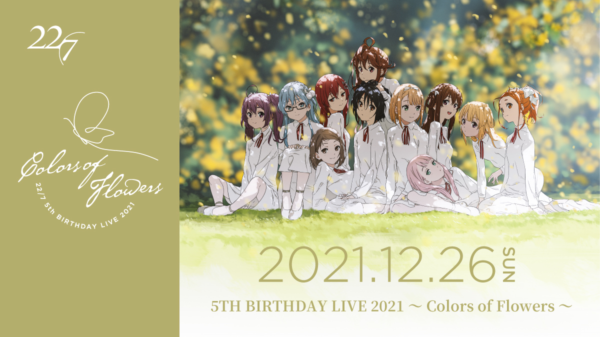

### 22/7 5TH BIRTHDAY LIVE 2021 ～ Colors of Flowers ～
##### [Back](Live_List.md)

 
Date: 26Dec,2021 

<a target="_blank" rel="noopener noreferrer" href="https://nanabunnonijyuuni.com/s/n129/news/detail/10458?ima=0757">Official New</a>

<section class="accordion">
  <input type="checkbox" name="collapse" id="handle1">
  <h4 class="handle">
    <label for="handle1">
    資訊 Information
    </label>
  </h4>
  
  

    

<blockquote>
12月24日のグループ結成5周年を記念して、12月26日に初のキャラクター単独配信ライブ 
「22/7 5TH BIRTHDAY LIVE 2021 ~Colors of Flowers~」を開催することが決定いたしました。  
キャラクターによるライブはもちろん、冠番組「22/7 計算中」の放送と連動した企画もあり、 
デジタル声優アイドルであるナナニジでしかできない、これまでの5年間にわたる活動が詰まったステージをお届けいたします。  
【公演情報】　  
22/7 5TH BIRTHDAY LIVE 2021 ~Colors of Flowers~  
日程：12月26日(日)  
第1部　開場(配信開始) 15:30 ／ 開演(ライブ開始) 16:00  
第2部　開場(配信開始) 18:00 ／ 開演(ライブ開始) 18:30  
見逃し配信：2021年12月26日(日) 22:00～　2022年1月2日 23:59  
出演：22/7 神木みかみ　斎藤ニコル　立川絢香　滝川みう　柊つぼみ　藤間桜　丸山あかね  
視聴チケット：4,000円(税込)  
販売期間：2021年11月14日(日)16:00 ～ 2022年1月2日（日）20:00  
特設サイト：https://nanabunnonijyuuni-mobile.com/s/n110/page/5th-birthday 
</blockquote>

  
  

</section>

1部： 
<section class="accordion">
  <input type="checkbox" name="collapse" id="handle2">
  <h4 class="handle">
    <label for="handle2">
    流程 Rundown
    </label>
  </h4>
  
  

    

<blockquote>
Opening 
1. 今年　初めての雪 
MC 
Release result of Christmas Confession Queen A Part 
Promotion of KeisanchuS3 Blu-ray 
2. 僕は存在していなかった 
3. シャンプーの匂いがした 
4. 理解者 
5. 何もしてあげられない 
MC 
Products Promotion 
6. ムズイ 
7. 風は吹いてるか？ 
8. 僕が持ってるものなら 
9. 覚醒 
MC 
10. ヒヤシンス 
MC 
Products and Live Tour News 
</blockquote>

  

</section>

<video width="100%" height="100%" controls>
  <source src="" type="video/mp4">
</video>

<table>
<tr>
 <th>Raw</th>
 <td><a target="_blank" rel="noopener noreferrer" href="https://www.bilibili.com/video/BV1NS4y177x5">Source</a></td>
 <td>Download <a target="_blank" rel="noopener noreferrer" href="https://github.com/LYHPandaKing/227PhotoBackup/releases/download/227_Live/20211226_227_5thBDLive_First.mp4">Github</a></td>
</tr>
<tr>
 <th>Sub</th>
 <td>Unavailable</td>
 <td>CHT (.ass)</td>
</tr>
</table>

2部： 
<section class="accordion">
  <input type="checkbox" name="collapse" id="handle3">
  <h4 class="handle">
    <label for="handle3">
    流程 Rundown
    </label>
  </h4>
  
  

    

<blockquote>
Opening 
Opening 
1. ヘッドフォンを外せ！ 
MC 
Release result of Christmas Confession Queen B Part 
Promotion of KeisanchuS3 Blu-ray 
2. 僕は存在していなかった 
3. シャンプーの匂いがした 
4. 理解者 
5. 何もしてあげられない 
MC 
Products Promotion 
6. ムズイ 
7. 風は吹いてるか？ 
8. 僕が持ってるものなら 
9. 覚醒 
MC 
Graduation of Characters 
Message from Hiiragi Tsubomi 
10. ヒヤシンス 
MC 
Products and Live Tour News 
</blockquote>

  

</section>

<video width="100%" height="100%" controls>
  <source src="" type="video/mp4">
</video>

<table>
<tr>
 <th>Raw</th>
 <td><a target="_blank" rel="noopener noreferrer" href="https://www.bilibili.com/video/BV1Db4y1J7W2/">Source</a></td>
 <td>Download <a target="_blank" rel="noopener noreferrer" href="https://github.com/LYHPandaKing/227PhotoBackup/releases/download/227_Live/20211226_227_5thBDLive_Second.mp4">Github</a></td>
</tr>
<tr>
 <th>Sub</th>
 <td>Unavailable</td>
 <td>CHT (.ass)</td>
</tr>
</table>