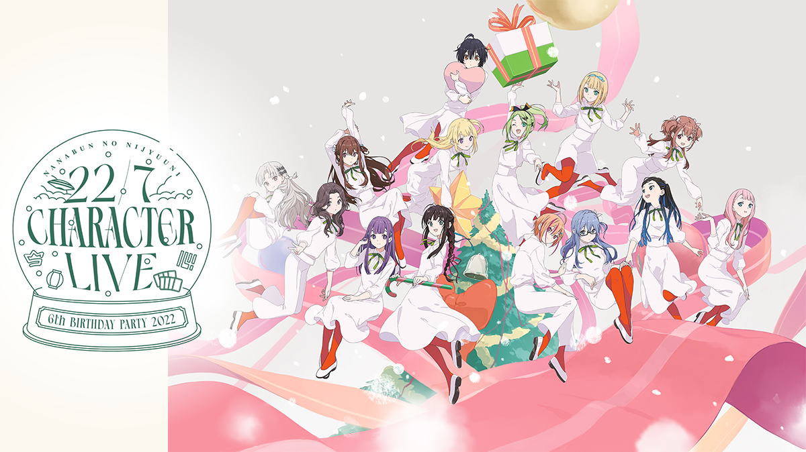

### 22/7 CHARACTER LIVE -6th BIRTHDAY PARTY 2022-
##### [Back](Live_List.md)

 
Date: 24Dec,2022 

<a target="_blank" rel="noopener noreferrer" href="https://nanabunnonijyuuni-mobile.com/s/n110/page/6th-birthday">Official Site</a>

<section class="accordion">
  <input type="checkbox" name="collapse" id="handle1">
  <h4 class="handle">
    <label for="handle1">
    資訊 Information
    </label>
  </h4>
  
  

    

<blockquote>
12月24日に新生14名でグループ結成6周年を迎える22/7のキャラクターライブの生配信が決定いたしました！ 
10月28日(金)21:00より、チケットの発売をスタートいたします。 
今年のクリスマスイブはナナニジのキャラクター達と一緒にグループ結成6周年をお祝いしましょう！  
◆販売期間◆ 
第1部：12月24日(土) 15:30公演 
2022年10月28日(金)21:00～2023年1月4日(水)12:00  
第2部：12月24日(土) 19:30公演 
2022年10月28日(金)21:00～2023年1月4日(水)12:00  
【視聴チケットのご購入はこちら】 
■Stagecrowd：https://stagecrowd.live/4151411965 
■SPWN：https://spwn.jp/events/22122415-2276thbd  
――――――――――――――――――――――――― 
【公演日時・会場】 
12月24日(土) 
第1部 開場15:00(配信開始)／開演15:30(ライブ開演) 
第2部 開場19:00(配信開始)／開演19:30(ライブ開演) 
※各公演時間は約1時間30分程を予定しております  
【料金】 
FC限定アフター配信付き視聴チケット：7,220円（税込） 
※Stagecrowdのみでの販売となります  
一般視聴チケット：6,000円（税込） 
</blockquote>

  
  

</section>

第1部： 
<section class="accordion">
  <input type="checkbox" name="collapse" id="handle2">
  <h4 class="handle">
    <label for="handle2">
    流程 Rundown
    </label>
  </h4>
  
  

    

<blockquote>
Short Drama 
Opening 
1. ポニーテールは振り向かせない 
2. 覚醒 
3. 僕らの環境 
MC 
4. 交換条件 
5. To goでよろしく！ 
^ Temporary Suspension (38:14-47:42) 
MC 
6. 好きになるのは自由だし… 
7. 読みかけの漫画 
MC 
8. 君は誰だ？ 
9. カントリーガール 
MC 
10. 君はMoon 
11. 曇り空の向こうは晴れている 
Encore 
EN1. 雷鳴のDelay 
EN2. キウイの主張 
MC 
EN3. ハレロ 
EN4. 最後のピアノ 
Goods Promotion 
EN5. 神様だって決められない 
FC 
紅組 Talk Corner 
</blockquote>

  

</section>

<video width="100%" height="100%" controls>
  <source src="https://filedn.com/lAIJkrR1ef4bIR1iETG3U3F/Public_227/Live/20221224_227_6thBDLive_First.mp4" type="video/mp4">
</video>

^ Download currently unavailable

<table>
<tr>
 <th>Raw</th>
 <td><a target="_blank" rel="noopener noreferrer" href="https://www.bilibili.com/video/BV1LM41117gw/">Source</a></td>
 <td><a target="_blank" rel="noopener noreferrer" href="https://github.com/LYHPandaKing/227PhotoBackup/releases/download/227_Live/">Download</a></td>
</tr>
<tr>
 <th>Sub</th>
 <td>Unavailable</td>
 <td>CHT (.ass)</td>
</tr>
</table>

2部： 
<section class="accordion">
  <input type="checkbox" name="collapse" id="handle3">
  <h4 class="handle">
    <label for="handle3">
    流程 Rundown
    </label>
  </h4>
  
  

    

<blockquote>
Short Drama 
Opening 
1. ポニーテールは振り向かせない 
2. 覚醒 
3. 僕らの環境 
MC 
4. 半チャーハン 
5. ソフトクリーム落としちゃった 
MC 
6. タトゥー・ラブ 
7. 君は誰だ？ 
MC 
8. カントリーガール 
9. 読みかけの漫画 
MC 
10. 君はMoon 
11. 曇り空の向こうは晴れている 
Encore 
EN1. ヘッドフォンを外せ！ 
EN2. 今年　初めての雪 
MC 
EN3. 最後のピアノ 
EN4. ハレロ 
Goods Promotion 
EN5. 神様だって決められない 
FC 
白組 Talk Corner 
</blockquote>

  

</section>

<video width="100%" height="100%" controls>
  <source src="https://filedn.com/lAIJkrR1ef4bIR1iETG3U3F/Public_227/Live/20221224_227_6thBDLive_Second.mp4" type="video/mp4">
</video>

^ Download currently unavailable

<table>
<tr>
 <th>Raw</th>
 <td><a target="_blank" rel="noopener noreferrer" href="https://www.bilibili.com/video/BV1nK411B7Sd/">Source</a></td>
 <td><a target="_blank" rel="noopener noreferrer" href="https://github.com/LYHPandaKing/227PhotoBackup/releases/download/227_Live/">Download</a></td>
</tr>
<tr>
 <th>Sub</th>
 <td>Unavailable</td>
 <td>CHT (.ass)</td>
</tr>
</table>