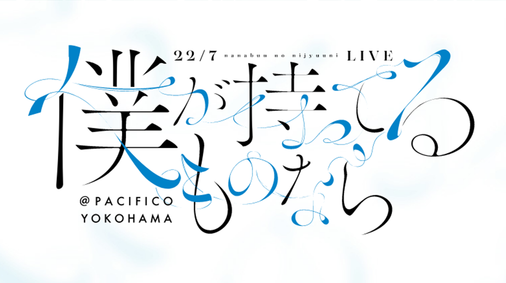

### 「僕が持ってるものなら」発売記念LIVE
##### [Back](Live_List.md)

  
Date: 28Feb,2021  

<a target="_blank" rel="noopener noreferrer" href="https://nanabunnonijyuuni.com/s/n129/diary/detail/354947?ima=2934&cd=event">Official New</a>

><公演情報>  
■イベント概要 
22/7「僕が持ってるものなら」発売記念LIVEの開催が決定いたしました！ 
卒業を発表させていただきましたメンバー、帆風千春は22/7として最後の出演となります。  
■会場：パシフィコ横浜　国立大ホール 
・来場チケット：前売り 7,500円(税込) 　／　前売り 女性エリア7,500円(税込)  
・配信チケット：一般視聴チケット:3,500円(税込)　／　ファンクラブ限定チケット：4,500円（税込） 
※ファンクラブ限定チケットご購入の方は、ファンクラブ限定の動画をご覧いただけます。  
【配信チケットご購入はこちら】https://stagecrowd.live/1984407062/ 
販売期間：2021年2月8日（月）19:00　～　2021年3月2日（火）23:59  
■日時：2021年2月28日(日) 
昼公演　開場 12：30 / 開演 13：30 
夜公演　開場 16：30 / 開演 17：30 

<blockquote>日場： 
流程 Rundown 
Opening 
1. 理解者 
2. 韋駄天娘 
MC 
3. 風は吹いてるか？ 
4. ロマンスの積み木 
5. Rain of lies 
6. 何もしてあげられない 
MC 
7. キウイの主張 
8. 雷鳴のDelay 
9. タチツテトパワー 
10. 好きと言ったのは嘘だ  
11. 僕が持ってるものなら 
MC 
12. 君はMoon 
13. ポニーテールは振り向かせない 
14. 循環バス 
Products Promotion 
Encore 
15. 地下鉄抵抗主義 
16. 僕は存在していなかった
</blockquote>

Live w/ FC Talk 

^ The online streaming service unavailable as file exceeds 2GB. 

<table>
<tr>
 <th>Raw</th>
 <th>Live w/ FC Talk</th>
 <td><a target="_blank" rel="noopener noreferrer" href="https://www.bilibili.com/video/BV1br4y1A7ZM?p=2">Source</a></td>
 <td>Download <a target="_blank" rel="noopener noreferrer" href="https://github.com/LYHPandaKing/227PhotoBackup/releases/download/227_Live/20210228_227_7thSingle_ReleaseLive_DayLive_FCVer.part1.rar">Part1 </a>| <a target="_blank" rel="noopener noreferrer" href="https://github.com/LYHPandaKing/227PhotoBackup/releases/download/227_Live/20210228_227_7thSingle_ReleaseLive_DayLive_FCVer.part2.rar">Part2</a></td>
</tr>
<tr>
 <th>Sub</th>
 <th>Live w/ FC Talk</th>
 <td>CHS - Bilibili</td>
 <td>CHT (.ass)</td>
</tr>
</table>

<blockquote>夜場： 
流程 Rundown 
Opening 
1. シャンプーの匂いがした 
2. 未来があるから 
MC 
3. 風は吹いてるか？ 
4. ロマンスの積み木 
5. Rain of lies 
6. 何もしてあげられない 
MC 
7. キウイの主張 
8. 雷鳴のDelay 
9. タチツテトパワー 
10. 好きと言ったのは嘘だ 
11. 僕が持ってるものなら 
MC 
12. ムズイ 
13. 願いの眼差し 
14. 循環バス 
Encore 
15. 優等生じゃつまらない 
Messages to Chiharu 
16. 空のエメラルド 
</blockquote>

Live w/ FC Talk 

^ The online streaming service unavailable as file exceeds 2GB. 

<table>
<tr>
 <th>Raw</th>
 <th>Live w/ FC Talk</th>
 <td><a target="_blank" rel="noopener noreferrer" href="https://www.bilibili.com/video/BV1br4y1A7ZM?p=3">Source</a></td>
 <td>Download <a target="_blank" rel="noopener noreferrer" href="https://github.com/LYHPandaKing/227PhotoBackup/releases/download/227_Live/20210228_227_7thSingle_ReleaseLive_NightLive_FCVer.part1.rar">Part1 </a>| <a target="_blank" rel="noopener noreferrer" href="https://github.com/LYHPandaKing/227PhotoBackup/releases/download/227_Live/20210228_227_7thSingle_ReleaseLive_NightLive_FCVer.part2.rar">Part2</a></td>
</tr>
<tr>
 <th>Sub</th>
 <th>Live w/ FC Talk</th>
 <td>CHS - Bilibili</td>
 <td>CHT (.ass)</td>
</tr>
</table>