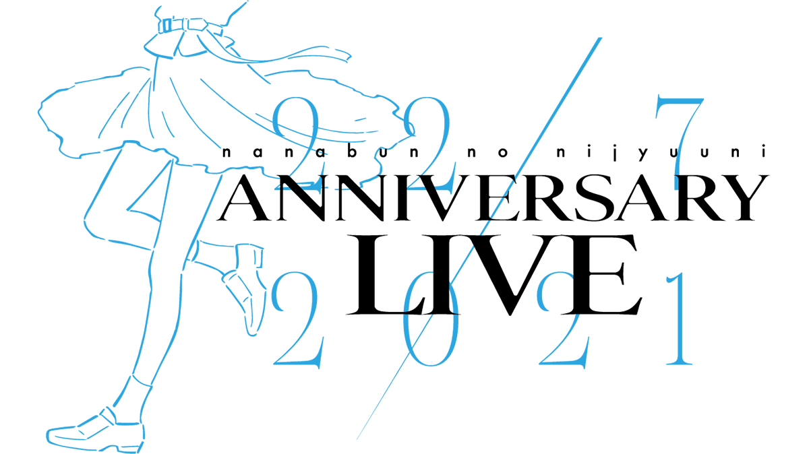

### 22/7 ANNIVERSARY LIVE 2021
##### [Back](Live_List.md)

 
Date: 14Nov,2021 

<a target="_blank" rel="noopener noreferrer" href="https://nanabunnonijyuuni.com/s/n129/news/detail/10445?ima=4654">Official New</a>

<section class="accordion">
  <input type="checkbox" name="collapse" id="handle1">
  <h4 class="handle">
    <label for="handle1">
    資訊 Information
    </label>
  </h4>
  
  

    

<blockquote>
公演情報 
22/7 ANNIVERSARY LIVE 2021  
【出演】 
22/7 
※出演者は予告なく変更となる場合がございます。あらかじめご了承ください。  
――――――――――――――――――――――――― 
【日程】 
【1部】11月14日（日）　開場(配信開始) 13:00／開演(ライブ開始)14:00　※終演(ライブ終了)16:30予定 
【2部】11月14日（日）　開場(配信開始) 17:00／開演(ライブ開始)18:00　※終演(ライブ終了)20:30予定  
【会場】 
東京国際フォーラム　ホールA  
―――――――――――――――――――――――――  
【料金】 
■FC会員限定アフター配信付き視聴チケット:4,500円(税込)　  
※アフター配信付き（コンサート終了後配信予定）  
■一般視聴チケット:3,500円(税込)  
ーーーーーーーーーーーーーーーーー  
＜FC会員限定アフター配信付き視聴チケット＞ 
■FC会員限定アフター配信付き視聴チケット:4,500円(税込)　 
＊アフター配信付き（コンサート終了後配信予定）  
※ファンクラブ会員を対象とした申込受付になります。お申込みは、ファンクラブ会員ご本人に限らせていただきます。 
※22/7ファンクラブ会員登録はコチラから  
【販売期間】 
11月7日(日)12:00～11月21日(日)20:00 
</blockquote>

  
  

</section>

日場： 
<section class="accordion">
  <input type="checkbox" name="collapse" id="handle2">
  <h4 class="handle">
    <label for="handle2">
    流程 Rundown
    </label>
  </h4>
  
  

    

<blockquote>
Opening 
1. 僕は存在していなかった 
2. 地下鉄抵抗主義 
3. 11人が集まった理由 
4. 生きることに楽になりたい 
5. One of them 
6. シャンプーの匂いがした 
7. 人格崩壊 
8. やさしい記憶 
9. 叫ぶしかない青春 
10. 循環バス 
11. 夢の船 
12. 孤独は嫌いじゃない 
13. 人生はワルツ 
14. 理解者 
15. 絶望の花 
16. 不確かな青春 
17. 未来があるから 
18. 韋駄天娘 
19. 神様に指を差された僕たち 
20. 感情無用論 
21. Moonlight 
22. 君はMoon 
23. ロマンスの積み木 
24. Rain of lies 
25. とんぼの気持ち 
26. 何もしてあげられない 
</blockquote>

  

</section>

<video width="100%" height="100%" controls>
  <source src="https://filedn.com/lAIJkrR1ef4bIR1iETG3U3F/Public_227/Live/20211114_227_AnniversaryLive2021_Day.mp4" type="video/mp4">
</video>

<table>
<tr>
 <th>Raw</th>
 <td><a target="_blank" rel="noopener noreferrer" href="https://www.bilibili.com/video/BV1Vg411T7Pp">Source</a></td>
 <td>Download <a target="_blank" rel="noopener noreferrer" href="https://github.com/LYHPandaKing/227PhotoBackup/releases/download/227_Live/20211114_227_AnniversaryLive2021_Day.7z.001">Part1 </a>| <a target="_blank" rel="noopener noreferrer" href="https://github.com/LYHPandaKing/227PhotoBackup/releases/download/227_Live/20211114_227_AnniversaryLive2021_Day.7z.002">Part2</a></td>
</tr>
<tr>
 <th>Sub</th>
 <td>Unavailable</td>
 <td>CHT (.ass)</td>
</tr>
</table>

夜場： 
<section class="accordion">
  <input type="checkbox" name="collapse" id="handle3">
  <h4 class="handle">
    <label for="handle3">
    流程 Rundown
    </label>
  </h4>
  
  

    

<blockquote>
Opening 
1. ムズイ 
2. 願いの眼差し 
3. 僕らの環境 
4. 足を洗え！ 
5. 空のエメラルド 
6. 風は吹いてるか？ 
7. ポニーテールは振り向かせない 
8. 半チャーハン 
9. ソフトクリーム落としちゃった 
10. タトゥーラブ 
11. 好きと言ったのは嘘だ 
12. 僕が持ってるものなら 
13. タチツテトパワー 
14. 雷鳴のDelay 
15. キウイの主張 
16. ヒヤシンス 
17. 空を飛んでみよう 
18. 交換条件 
19. 好きになるのは自由だし... 
20. To goでよろしく！ 
21. 覚醒 
22. 今年　初めての雪 
23. ヘッドホンを外せ！ 
24. Just here and now 
25. いつの間にSunrise 
</blockquote>

  

</section>

<video width="100%" height="100%" controls>
  <source src="https://filedn.com/lAIJkrR1ef4bIR1iETG3U3F/Public_227/Live/20211114_227_AnniversaryLive2021_Night.mp4" type="video/mp4">
</video>

<table>
<tr>
 <th>Raw</th>
 <td><a target="_blank" rel="noopener noreferrer" href="https://www.bilibili.com/video/BV1Vg411T7Pp?p=2">Source</a></td>
 <td>Download <a target="_blank" rel="noopener noreferrer" href="https://github.com/LYHPandaKing/227PhotoBackup/releases/download/227_Live/20211114_227_AnniversaryLive2021_Night.7z.001">Part1 </a>| <a target="_blank" rel="noopener noreferrer" href="https://github.com/LYHPandaKing/227PhotoBackup/releases/download/227_Live/20211114_227_AnniversaryLive2021_Night.7z.002">Part2</a></td>
</tr>
<tr>
 <th>Sub</th>
 <td>Unavailable</td>
 <td>CHT (.ass)</td>
</tr>
</table>