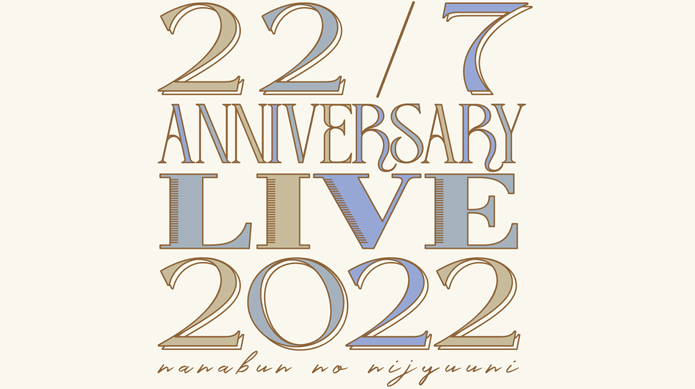

### 22/7 ANNIVERSARY LIVE 2022
##### [Back](Live_List.md)

 
Date: 22-23Oct,2022 

<a target="_blank" rel="noopener noreferrer" href="https://nanabunnonijyuuni-mobile.com/s/n110/page/anniversary-live_2022">Official Site</a>

<section class="accordion">
  <input type="checkbox" name="collapse" id="handle1">
  <h4 class="handle">
    <label for="handle1">
    資訊 Information
    </label>
  </h4>
  
  

    

<blockquote>
22/7のデビュー5周年をお祝いするANNIVERSARY LIVEの生配信が決定いたしました！ 
本日10月15日(土)20:00より、チケットの発売をスタートいたします。 
会場まで足を運べない皆さんも、ぜひご自宅で一緒に5周年をお祝いしましょう！  
◆販売期間◆ 
10月22日(土)公演 
10月15日(土)20:00～10月29日(土)20:00  
10月23日(日)昼・夜公演 
10月15日(土)20:00～10月30日(日)20:00 
視聴チケットのご購入はこちら  
――――――――――――――――――――――――― 
【公演日時・会場】 
10月22日(土)　東京国際フォーラム ホールA 
① 開場17:00(配信開始)／開演18:00(ライブ開演)  
10月23日(日)　東京国際フォーラム ホールA 
② 開場12:00(配信開始)／開演13:00(ライブ開演) 
③ 開場17:00(配信開始)／開演18:00(ライブ開演) 
※各公演時間は1時間30分を予定しております  
【料金】 
FC限定「超」視聴者チケット(3公演セット/アフター配信付き) 12,000円（税込） 
アフター配信付き視聴チケット 4,500円（税込） 
一般視聴チケット 3,500円（税込）  
※既に発表されております「３ユニット・プロデュースステージ」に関しては、会場限定特別企画となりますので、配信はございません。  
【アフター配信】 
配信限定特別番組 
『理解者の館』  
己を知り、 
未来を知り、 
そして運命を知るー。  
ナナニジ6年目の鍵を握る、 
福女は誰だ･･･!?  
※この番組は、デビュー5周年を迎えた22/7メンバーの運命を占ってみる特別番組です。  
【配信に関するお問い合わせ】 
Stagecrowd 
https://stagecrowd.live/inquiry_nanabunnonijyuuni_20220811/ 
</blockquote>

  
  

</section>

22Oct夜場： 
<section class="accordion">
  <input type="checkbox" name="collapse" id="handle2">
  <h4 class="handle">
    <label for="handle2">
    流程 Rundown
    </label>
  </h4>
  
  

    

<blockquote>
Opening 
あの日のれたしたち (西條和) 
1. 11人が集まった理由 
2. 僕は存在していなかった 
3. 地下鉄抵抗主義 
MC 
あの日のれたしたち (白沢かなえ、宮瀬玲奈) 
4. ヒヤシンス 
5. 空を飛んでみよう 
6. 交換条件 
7. 好きになるのは自由だし… 
8. To goでよろしく！ 
あの日のれたしたち (天城サリー、涼花萌) 
9. 僕が持ってるものなら 
10. 好きと言ったのは嘘だ 
11. タチツテトパワー 
12. 雷鳴のDelay 
13. キウイの主張 
あの日のれたしたち (河瀬詩) 
14. ムズイ 
15. 僕らの環境 
16. 願いの眼差し 
17. 足を洗え 
MC 
18. 空のエメラルド 
MC 
理解者之館 (望月りの、天城サリー、四条月、宮瀬玲奈、清井美那) 
</blockquote>

  

</section>

<video width="100%" height="100%" controls>
  <source src="https://filedn.com/lAIJkrR1ef4bIR1iETG3U3F/Public_227/Live/20221022_227_AnniversaryLive2022_Night.mp4" type="video/mp4">
</video>

^ Download currently unavailable

<table>
<tr>
 <th>Raw</th>
 <td><a target="_blank" rel="noopener noreferrer" href="https://www.bilibili.com/video/BV1r84y1q7xL/">Source</a></td>
 <td>Download <a target="_blank" rel="noopener noreferrer" href="https://github.com/LYHPandaKing/227PhotoBackup/releases/download/227_Live/">Part1 </a>| <a target="_blank" rel="noopener noreferrer" href="https://github.com/LYHPandaKing/227PhotoBackup/releases/download/227_Live/">Part2</a></td>
</tr>
<tr>
 <th>Sub</th>
 <td colspan="2"><a target="_blank" rel="noopener noreferrer" href="https://www.bilibili.com/video/BV1D84y1i7b2/">CHS - bilibili</a></td>
</tr>
</table>

23Oct日場： 
<section class="accordion">
  <input type="checkbox" name="collapse" id="handle3">
  <h4 class="handle">
    <label for="handle3">
    流程 Rundown
    </label>
  </h4>
  
  

    

<blockquote>
Opening 
あの日のれたしたち (宮瀬玲奈) 
1. シャンプーの匂いがした
2. 人格崩壊
3. 循環バス
4. やさしい記憶
5. 叫ぶしかない青春
MC
あの日のれたしたち (天城サリー) 
6. 風は吹いてるか？
7. 半チャーハン
8. タトゥー・ラブ
9. ソフトクリーム落としちゃった
10. ポニーテールは振り向かせない
あの日のれたしたち (涼花萌) 
11. 何もしてあげられない
12. とんぼの気持ち
13. ロマンスの積み木
14. 君はMoon
MC
15. Rain of lies
MC
理解者之館 (椎名桜月、白沢かなえ、相川奈央、西條和) 
</blockquote>

  

</section>

<video width="100%" height="100%" controls>
  <source src="https://filedn.com/lAIJkrR1ef4bIR1iETG3U3F/Public_227/Live/20221023_227_AnniversaryLive2022_Day.mp4" type="video/mp4">
</video>

^ Download currently unavailable

<table>
<tr>
 <th>Raw</th>
 <td><a target="_blank" rel="noopener noreferrer" href="https://www.bilibili.com/video/BV1r84y1q7xL?p=2">Source</a></td>
 <td>Download <a target="_blank" rel="noopener noreferrer" href="https://github.com/LYHPandaKing/227PhotoBackup/releases/download/227_Live/">Part1 </a>| <a target="_blank" rel="noopener noreferrer" href="https://github.com/LYHPandaKing/227PhotoBackup/releases/download/227_Live/">Part2</a></td>
</tr>
<tr>
 <th>Sub</th>
 <td colspan="2"><a target="_blank" rel="noopener noreferrer" href="https://www.bilibili.com/video/BV1Q84y1e7a2/">CHS - bilibili</a></td>
</tr>
</table>

23Oct夜場： 
<section class="accordion">
  <input type="checkbox" name="collapse" id="handle3">
  <h4 class="handle">
    <label for="handle3">
    流程 Rundown
    </label>
  </h4>
  
  

    

<blockquote>
Opening 
あの日のれたしたち (白沢かなえ) 
1. 理解者 
2. 未来があるから 
3. 絶望の花 
4. 韋駄天娘 
5. 不確かな青春 
MC 
あの日のれたしたち (河瀬詩、西條和) 
6. 覚醒 
7. Just here and now 
8. いつの間にSunrise 
9. ヘッドフォンを外せ！ 
10. 今年　初めての雪 
あの日のれたしたち (八名新成員) 
11. 君は誰だ？ 
12. カントリーガール 
13. 読みかけの漫画 
14. 打ち上げ花火の拒否権 
MC 
15. 曇り空の向こうは晴れている 
MC 
理解者之館 (雨夜音、河瀬詩、月城咲舞、涼花萌、麻丘真央) 
</blockquote>

  

</section>

<video width="100%" height="100%" controls>
  <source src="https://filedn.com/lAIJkrR1ef4bIR1iETG3U3F/Public_227/Live/20221023_227_AnniversaryLive2022_Night.mp4" type="video/mp4">
</video>

^ Download currently unavailable

<table>
<tr>
 <th>Raw</th>
 <td><a target="_blank" rel="noopener noreferrer" href="https://www.bilibili.com/video/BV1r84y1q7xL?p=3">Source</a></td>
 <td>Download <a target="_blank" rel="noopener noreferrer" href="https://github.com/LYHPandaKing/227PhotoBackup/releases/download/227_Live/">Part1 </a>| <a target="_blank" rel="noopener noreferrer" href="https://github.com/LYHPandaKing/227PhotoBackup/releases/download/227_Live/">Part2</a></td>
</tr>
<tr>
 <th>Sub</th>
 <td colspan="2"><a target="_blank" rel="noopener noreferrer" href="https://www.bilibili.com/video/BV1P24y1277Q/">CHS - bilibili</a></td>
</tr>
</table>