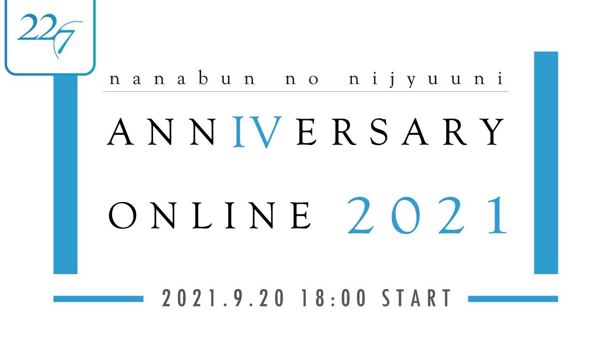

### 22/7 ANNIVERSARY ONLINE 2021
##### [Back](Live_List.md)

  
Date: 20Sep,2021  

<a target="_blank" rel="noopener noreferrer" href="https://nanabunnonijyuuni.com/s/n129/news/detail/10399?ima=0328">Official New</a>

<section class="accordion">
  <input type="checkbox" name="collapse" id="handle1">
  <h4 class="handle">
    <label for="handle1">
    資訊 Information
    </label>
  </h4>
  
  

    

<blockquote>
【9/27(月)23:59まで】9/20(月祝)配信「ANNIVERSARY ONLINE 2021」一週間限定アーカイブ配信中！ 
【9/21(火)23:59まで】Sony Music Shopにて限定特典付きCD予約販売中！ https://www.sonymusicshop.jp/m/arti/artiItm.php?site=S&cd=70008757  
==================  
【公演情報】  
22/7「ANNIVERSARY ONLINE 2021」 
配信日：9月20日（月･祝）18:00 START  
＜セットリスト＞ 
～Overture～ 
01. 僕は存在していなかった 
02. シャンプーの匂いがした 
03. 理解者 
04. 何もしてあげられない 
05. ムズイ 
06. 風は吹いてるか？  
07. 僕が持ってるものなら  
==================  
【22/7 新メンバーオーディション情報】  
22/7の新メンバーオーディションを開催 
応募期間：2021年9月20日(月・祝)20:00～2021年10月19日(火)17:00 
オーデイションHP https://nanabunnonijyuuni.com/s/n129/page/new-member-audition  
==================  
【新公演情報】  
22/7「ANNIVERSARY LIVE 2021」 
日程：11月14日(日) 昼公演　開場13:00／開演　14:00　夜公演　開場　17:00／開演18:00 
会場：東京国際フォーラム ホールA  
★ファンクラブ先行受付はコチラ！ 
https://nanabunnonijyuuni-mobile.com/s/n110/page/anniversary-live-2021  
==================  
【22/7 1st写真集（タイトル未定）詳細】  
発売日：2021年12月23日（木） 
体裁：A4判・オールカラー128ページ 
定価：3,200円（+税） 
撮影：藤本和典・Marco Perboni 
編集：声優グランプリ 
各書店・専門店にて予約受付開始！　https://seigura.com/magazine_books/71946/  
==================  
■22/7 8th SINGLE『タイトル未定』2021年11月24日発売！ 
https://227.lnk.to/20211124  
完全生産限定盤A・BのBlu-rayには、『11という名の永遠の素数Release Tour 2021』Zepp DiverCity(TOKYO)昼夜公演をそれぞれ収録！ 
また初回生産限定盤には、『11という名の永遠の素数Release Tour 2021』の裏側に密着したドキュメント映像も収録予定！  
22/7「ANNIVERSARY ONLINE 2021」  
9/20（月･祝）18:00 START 
22/7 オフィシャルYouTubeチャンネル　https://youtu.be/QCE5rnZ-2LU  
9/20のANNIVERSARYをナナニジとともにオンラインで過ごす1時間！ 
パフォーマンスとともに新情報もお届けします！ 
お楽しみに！ 
</blockquote>

  
  

</section>

<section class="accordion">
  <input type="checkbox" name="collapse" id="handle2">
  <h4 class="handle">
    <label for="handle2">
    流程 Rundown
    </label>
  </h4>
  
  

    

<blockquote>
Opening 
1. 僕は存在していなかった 
MC 
2. シャンプーの匂いがした 
3. 理解者 
4. 何もしてあげられない 
MC 
5. ムズイ 
6. 風は吹いてるか？ 
MC 
7. 僕が持ってるものなら 
</blockquote>

  

</section>

<video width="100%" height="100%" controls>
  <source src="https://github.com/LYHPandaKing/227PhotoBackup/releases/download/227_Live/20210920_227_Anniversary_Online_2021.mp4" type="video/mp4">
</video>

<table>
<tr>
 <th>Raw</th>
 <td><a target="_blank" rel="noopener noreferrer" href="https://www.youtube.com/watch?v=QCE5rnZ-2LU">Source</a></td>
 <td><a target="_blank" rel="noopener noreferrer" href="https://github.com/LYHPandaKing/227PhotoBackup/releases/download/227_Live/20210920_227_Anniversary_Online_2021.mp4">Download</a></td>
</tr>
<tr>
 <th>Sub</th>
 <td>CHS - bilibili</td>
 <td>CHT (.ass)</td>
</tr>
</table>