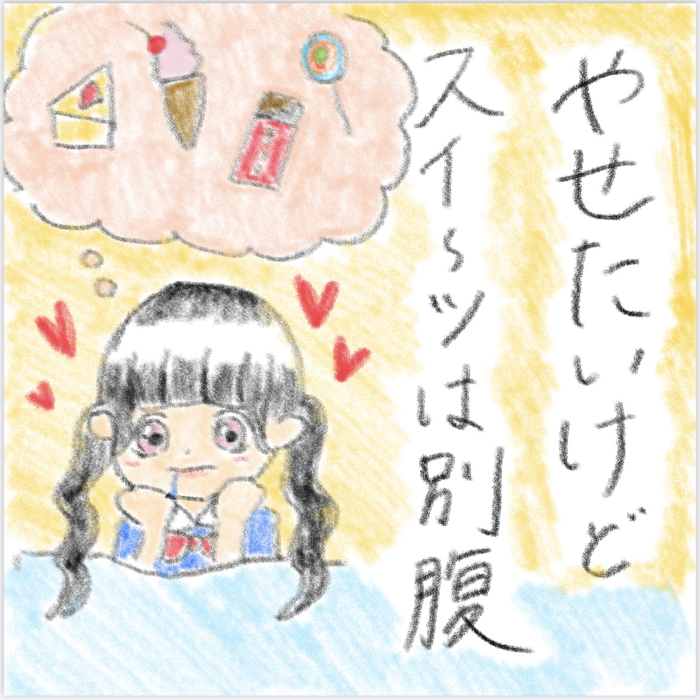

### ナナニジ 夏祭り 2022
##### [Back](Live_List.md)

  
Date: 11Aug,2022  

Official News<a target="_blank" rel="noopener noreferrer" href="https://nanabunnonijyuuni.com/s/n129/news/detail/10540?ima=5208"> 1</a>|<a target="_blank" rel="noopener noreferrer" href="https://nanabunnonijyuuni.com/s/n129/news/detail/10617?ima=4838"> 2</a>

<section class="accordion">
  <input type="checkbox" name="collapse" id="handle1">
  <h4 class="handle">
    <label for="handle1">
    插圖 Illustration
    </label>
  </h4>
  
  

    

主題 Theme: 「○○は○○」 
 
<table>
 <tr>
  <th>相川奈央 </th>
  <th>麻丘真央 </th>
  <th>天城サリー </th>
 </tr>
 <tr>
  <th>雨夜音 </th>
  <th>河瀬詩 </th>
  <th>清井美那 </th>
 </tr>
 <tr>
  <th>西條和 </th>
  <th>椎名桜月 </th>
  <th>四条月 </th>
 </tr>
 <tr>
  <th>白沢かなえ </th>
  <th>涼花萌 </th>
  <th>月城咲舞 </th>
 </tr>
 <tr>
  <th>宮瀬玲奈 </th>
  <th>望月りの </th>
 </tr>
</table>

  

</section>

<section class="accordion">
  <input type="checkbox" name="collapse" id="handle2">
  <h4 class="handle">
    <label for="handle2">
    資訊 Information
    </label>
  </h4>
  
  

    

<blockquote>
ナナニジが全国を駆け巡るZeppツアー最終日の8/11KT Zepp Yokohama公演の生配信が決定いたしました！ 
8月4日(木)12:00より、チケットの発売をスタートいたします。 
会場まで足を運べない皆さんも、ツアー最終日をぜひご自宅で一緒に楽しみましょう！  
◆販売期間◆ 
8月4日(木)12:00～8月21日(日)20:00 
視聴チケットのご購入はこちら  
――――――――――――――――――――――――― 
【公演日時・会場】 
8月11日(木・祝)　KT Zepp Yokohama 
① 開場12:15(配信開始)／開演13:00(ライブ開演) 
② 開場17:15(配信開始)／開演18:00(ライブ開演) 
※各公演時間は2時間を予定しております  
【料金】 
FC限定(アフター配信付き)チケット 4,500円（税込） 
一般視聴チケット 3,500円（税込）  
【配信に関するお問い合わせ】 
Stagecrowd 
https://stagecrowd.live/inquiry_nanabunnonijyuuni_20220811/ 
</blockquote>

  

</section>

昼公演 
<section class="accordion">
  <input type="checkbox" name="collapse" id="handle3">
  <h4 class="handle">
    <label for="handle3">
    流程 Rundown
    </label>
  </h4>
  
  

    

<blockquote>
Opening 
1. タチツテトパワー 
2. ポニーテールは振り向かせない 
MC 
3. ヒヤシンス 
4. 地下鉄抵抗主義 
5. 僕らの環境 
6. 理解者 
7. 空のエメラルド 
MC 
8. 好きになるのは自由だし… 
9. To goでよろしく！ 
10. 交換条件 
11. カントリーガール 
12. 君は誰だ？ 
13. 読みかけの漫画 
MC 
14. 曇り空の向こうは晴れている 
15. 打ち上げ花火の拒否権 
Encore 
EN1. 循環バス 
MC 
EN2. いつの間にSunrise 
FC Video 
Behind of 22/7 Summer Fest 2022 
FC1. 僕が持ってるものなら 
</blockquote>

  
  

</section>

Live w/ FC Talk 
<video width="100%" height="100%" controls>
  <source src="https://filedn.com/lAIJkrR1ef4bIR1iETG3U3F/Public_227/Live/20220811_227_SummerFest_2022_Day.mp4" type="video/mp4">
</video>

<table>
<tr>
 <th>Raw</th>
 <th>Live w/ FC Talk</th>
 <td><a target="_blank" rel="noopener noreferrer" href="https://www.bilibili.com/video/BV17G411t7on?p=1">Source</a></td>
 <td>Download <a target="_blank" rel="noopener noreferrer" href="https://github.com/LYHPandaKing/227PhotoBackup/releases/download/227_Live/20220811_227_SummerFest_2022_Day.7z.001">Part1 </a>| <a target="_blank" rel="noopener noreferrer" href="https://github.com/LYHPandaKing/227PhotoBackup/releases/download/227_Live/20220811_227_SummerFest_2022_Day.7z.002">Part2</a></td>
</tr>
<tr>
 <th>Sub</th>
 <th>Live w/ FC Talk</th>
 <td colspan="2">NA</td>
</tr>
</table>

夜公演 
<section class="accordion">
  <input type="checkbox" name="collapse" id="handle4">
  <h4 class="handle">
    <label for="handle4">
    流程 Rundown
    </label>
  </h4>
  
  

    

<blockquote>
Opening 
1. 好きと言ったのは嘘だ
2. 韋駄天娘
MC 
3. ヒヤシンス
4. 地下鉄抵抗主義
5. 僕らの環境 
6. 理解者 
7. 空のエメラルド 
MC 
8. ソフトクリーム落としちゃった
9. 半チャーハン
10. タトゥー・ラブ
11. カントリーガール 
12. 君は誰だ？ 
13. 読みかけの漫画 
MC 
14. 曇り空の向こうは晴れている 
15. 打ち上げ花火の拒否権 
Encore 
EN1. 循環バス 
MC 
EN2. いつの間にSunrise 
FC Video 
Behind of 22/7 Summer Fest 2022 後篇 
FC1. 君はMoon
</blockquote>

  
  

</section>

Live w/ FC Talk 
<video width="100%" height="100%" controls>
  <source src="https://filedn.com/lAIJkrR1ef4bIR1iETG3U3F/Public_227/Live/20220811_227_SummerFest_2022_Night.mp4" type="video/mp4">
</video>

<table>
<tr>
 <th>Raw</th>
 <th>Live w/ FC Talk</th>
 <td><a target="_blank" rel="noopener noreferrer" href="https://www.bilibili.com/video/BV17G411t7on?p=2">Source</a></td>
 <td>Download <a target="_blank" rel="noopener noreferrer" href="https://github.com/LYHPandaKing/227PhotoBackup/releases/download/227_Live/20220811_227_SummerFest_2022_Night.7z.001">Part1 </a>| <a target="_blank" rel="noopener noreferrer" href="https://github.com/LYHPandaKing/227PhotoBackup/releases/download/227_Live/20220811_227_SummerFest_2022_Night.7z.002">Part2</a></td>
</tr>
<tr>
 <th>Sub</th>
 <th>Live w/ FC Talk</th>
 <td colspan="2">NA</td>
</tr>
</table>