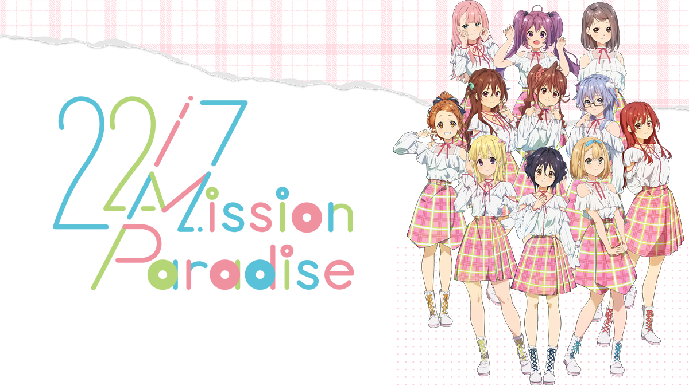

### TVアニメ「22/7」スペシャルイベント Mission Paradise
##### [Back](Live_List.md)

  
Date: 11Jan,2021  

<a target="_blank" rel="noopener noreferrer" href="https://nanabunnonijyuuni.com/s/n129/news/detail/10166?ima=2413">Official New</a>

>ライブ配信詳細 
 日時： 
【昼公演】2021年1月11日(祝・月) 14時30分配信開始 (予定) 
アーカイブ視聴期間終了: 2021年1月14日(木) 23時59分 
【夜公演】2021年1月11日(祝・月) 18時30分配信開始 (予定) 
アーカイブ視聴期間終了: 2021年1月14日(木) 23時59分  
配信プラットフォーム：Streaming+  
配信視聴チケット料金：各公演 3,500円(税込) 
※両公演の視聴をご希望の方は両公演のチケットをご購入ください。  
出演者(敬称略)：西條 和、天城サリー、倉岡水巴、帆風千春、海乃るり、白沢かなえ、宮瀬玲奈、河瀬 詩、涼花 萌、高辻 麗 
※登壇者は予告なく変更となる場合がございます。  
【一般販売】 
チケット受付URL：　https://eplus.jp/227anime_st/ 
販売期間：2021年1月8日(金) 18時00分 ～ 2021年1月13日(水) 23時59分 
※配信開始日2日前（1月9日 0時00分）からはカード決済のみでの販売となります。 
※チケット代の他に手数料が必要になります。詳しくはお申込時にご確認下さい。 
※視聴方法：ご入金確認後メールで視聴URLをお知らせします（またはイープラス申込状況照会より「QRチケット表示」を押す）ので、購入時のイープラスID／PWでログインをしてください。  
【注意事項】 
・途中から視聴した場合はその時点からのライブ配信となり、巻き戻しての再生はできません。 
・ライブ配信後に再配信処理を行いますのでご覧いただけない時間がございます。 
・動画視聴には高速で安定したインターネット回線が必要です。圏外や電波が弱い場所ではないか、パケット残容量はあるかを必ず事前に確認してください。共有WiFiを使っている場合は、使用していない端末のWiFiをOFFにする、ルータとの間に障害となる物を置かないなど工夫してください。また、人混みやコンクリートで囲まれた場所は避けてください。お客様の通信状況により視聴できない場合でも、一切の責任を負いません。 
・ログインID/PWは、お客様の責任において厳重に管理し、他人には絶対に教えないでください。お客様の個人情報を他人に知られるだけでなく、クレジットカードの不正利用、悪質サイトへの誘導、ウイルス感染等の被害に繋がる恐れがあります。 
・【毎月第1、第3木曜日午前2時00分～8時00分】は、システムメンテンナンスのためアーカイブ視聴をご利用いただけません。 
・本コンテンツは、著作権法などの諸法令により保護されています。インターネット上への無断転載等を行った場合、法的責任に問われる場合がございます。マナーを守ってお楽しみください。  
その他詳細は「Streaming+ご利用ガイド」にてご確認ください 
https://eplus.jp/sf/guide/streamingplus-userguide  
【チケットに関するお問い合わせ】イープラス　http://eplus.jp/qa/ 
【公演に関するお問い合わせ】ショウゲート　http://sginfo.jp/  

<blockquote>日場： 
流程 Rundown 
Opening 
1. ムズイ(11人ver.) 
Short Anime 
Variety Show 
Short Anime 
Variety Show 
Short Anime 
2. Rain of lies 
3. 生きることに楽になりたい 
4. 感情無用論 
5. Moonlight 
6. 優等生じゃつまらない 
MC 
7. 僕は存在していなかった(11人ver.) 
Memorial 
8. 夢の船 
9. 人生はワルツ 
10. 神様に指を差された僕たち 
11. 孤独は嫌いじゃない 
12. One of them 
MC 
13. 僕が持ってるものなら 
14. 空のエメラルド(11人ver.) 
Encore 
Short Anime 
15. 不確かな青春 
16. やさしい記憶 
</blockquote>

^ The online streaming service unavailable as file exceeds 2GB. 

<table>
<tr>
 <th>Raw</th>
 <th><a target="_blank" rel="noopener noreferrer" href="https://www.bilibili.com/video/BV12U4y1x7fr?p=1">Source</a></th>
 <th>Download <a target="_blank" rel="noopener noreferrer" href="https://github.com/LYHPandaKing/227PhotoBackup/releases/download/227_Live/20210111_Anime227_SpecialEvent_MissionParadise_DayLive.part1.rar">Part1 </a>| <a target="_blank" rel="noopener noreferrer" href="https://github.com/LYHPandaKing/227PhotoBackup/releases/download/227_Live/20210111_Anime227_SpecialEvent_MissionParadise_DayLive.part2.rar">Part2</a></th>
</tr>
<tr>
 <th>Sub</th>
 <th>Unavailable</th>
 <th>CHT (.ass)</th>
</tr>
</table>

<blockquote>夜場： 
流程 Rundown 
Opening 
1. ムズイ(11人ver.) 
Short Anime 
Variety Show 
Short Anime 
Variety Show 
Short Anime 
2. 風は吹いているか? 
3. 生きることに楽になりたい 
4. 感情無用論 
5. Moonlight 
6. 優等生じゃつまらない 
MC 
7. 僕は存在していなかった(11人ver.) 
Memorial 
8. 夢の船 
9. 人生はワルツ 
10. 神様に指を差された僕たち 
11. 孤独は嫌いじゃない 
12. One of them 
MC 
13. 僕が持ってるものなら 
14. 空のエメラルド(11人ver.) 
Encore 
Short Anime 
15. 願いの眼差し 
16. 未来があるから 
</blockquote>

^ The online streaming service unavailable as file exceeds 2GB. 

<table>
<tr>
 <th>Raw</th>
 <th><a target="_blank" rel="noopener noreferrer" href="https://www.bilibili.com/video/BV12U4y1x7fr?p=2">Source</a></th>
  <th>Download <a target="_blank" rel="noopener noreferrer" href="https://github.com/LYHPandaKing/227PhotoBackup/releases/download/227_Live/20210111_Anime227_SpecialEvent_MissionParadise_NightLive.part1.rar">Part1 </a>| <a target="_blank" rel="noopener noreferrer" href="https://github.com/LYHPandaKing/227PhotoBackup/releases/download/227_Live/20210111_Anime227_SpecialEvent_MissionParadise_NightLive.part2.rar">Part2</a></th>
</tr>
<tr>
 <th>Sub</th>
 <th>Unavailable</th>
 <th>CHT (.ass)</th>
</tr>
</table>
