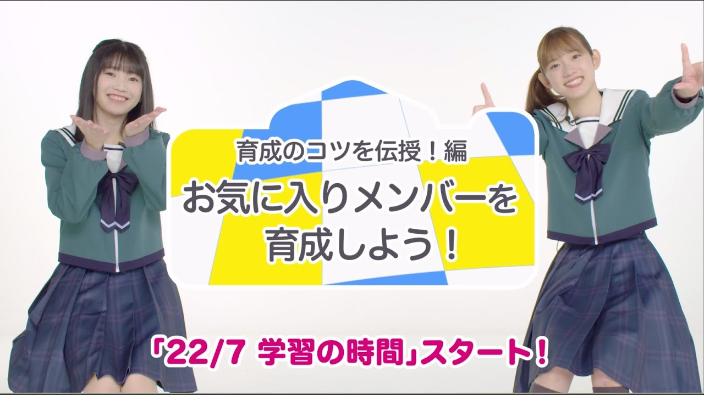

### ナナオン初心者向け動画「22/7 学習の時間」 #2 ～お気に入りメンバーを育成しよう！～ 【22/7 音楽の時間】
##### [Back](227OfficialYouTube.md)

#### [ナナオン初心者向け動画「22/7 学習の時間」 #2 ～お気に入りメンバーを育成しよう！～ 【22/7 音楽の時間】](https://www.youtube.com/watch?v=J6SPfX2IfHI)
Date: 25Sep,2020  

<video width="100%" height="100%" controls>
  <source src="https://github.com/LYHPandaKing/227PhotoBackup/releases/download/227_OfficialYouTube/20200925_Nanaon_Tutorial2.mp4" type="video/mp4">
</video>

>現在好評配信中のリズムゲームアプリ「22/7 音楽の時間」の初心者プレイヤー向けの動画です。  
「リズムゲームにあまり慣れていない…」「ゲームの設定は複雑でどこを変えればいいのか分からない…」 
「どうすればスコアが伸びるの？」「もっとナナオン上手くなりたい！」  
という方向けに、ナナニジメンバーが「22/7 音楽の時間」について基礎から分かりやすく解説！  
「学習の時間」を観て、よりよいナナオンライフをお送りくださいね！  
【「22/7 音楽の時間」概要】 
タイトル：22/7 音楽の時間 
ジャンル：アイドル育成リズムゲーム 
対応端末：iOS/Android 
価格：基本プレイ無料(アイテム課金制) 
開発/運営：株式会社ハ・ン・ド  
■ダウンロード方法： 
App Store / Google Play Storeにてダウンロード 
URL： 
《App Store》https://t.co/y58aP2gZHx?amp=1 
《Google Play Store》https://t.co/buuBm8VqMH?amp=1  
■公式サイト/SNS 
《公式Twitter》https://twitter.com/nanaon_official 
《公式LINE》https://lin.ee/hvSv6yC 
《公式サイト》https://227-game.com/  
【最新リリース情報】 
22/7 6thシングル 
タイトル：「風は吹いてるか？」 
発売日：2020年9月30日(水) 
タイアップ：リズムゲームアプリ「22/7 音楽の時間」主題歌 
形態数：全3形態 
①完全生産限定盤 ￥5,980（税込） 
　CD+Blu-ray+スペシャルグッズ+トレカ（完全盤 アーティストトレカ11種のうちランダムで1枚を封入） 
②初回仕様限定盤 ￥1,850（税込） 
　CD+DVD+トレカ（初回盤 アーティストトレカ11種のうちランダムで1枚を封入） 
③通常盤 ￥1,250（税込） 
　CD only   
＜CD収録内容＞ 
1.風は吹いてるか？ 
2.ポニーテールは振り向かせない（全形態共通） 
3.ユニットソングA～C（各形態違い） 
4～6.各曲 off vocal ver.  
＜完全盤 Blu-ray収録内容＞ 
22/7 5thシングル「ムズイ」発売記念スペシャル無観客ライブ（2020.2.27 Zepp Tokyo） 
・ムズイ 
・僕らの環境 
・韋駄天娘 
・地下鉄抵抗主義 
・足を洗え！ 
・未来があるから 
・願いの眼差し 
・Rain of lies　 
・空のエメラルド 
・Making of LIVE at Zepp Tokyo  
＜初回盤 DVD収録内容＞ 
・風は吹いてるか？ -music video-  
■SNS情報 
22/7(ナナブンノニジュウニ)公式HP 
http://www.nanabunnonijyuuni.com/  
22/7(ナナブンノニジュウニ)スタッフtwitter 
https://twitter.com/227_staff  
TVアニメ公式HP 
https://227anime.com/  
TVアニメ公式Twitter 
＠227anime（推奨ハッシュタグ：ナナニジ）  
「22/7 計算中」Twitter  
22/7 計算中（@227keisanchu） 
https://twitter.com/227keisanchu
