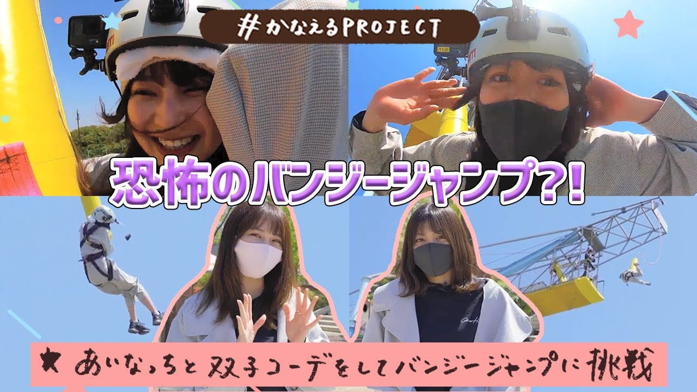

### かなえるPROJECT ～あいなっちと双子コーデでバンジージャンプ～
##### [Back](227OfficialYouTube.md)

Date: 21Aug,2021 

<section class="accordion">
  <input type="checkbox" name="collapse" id="handle1">
  <h4 class="handle">
    <label for="handle1">
    資訊 Description
    </label>
  </h4>
  
  

    

白沢かなえの夢を「#かなえるPROJECT」 
22/7メンバーの武田愛奈と、双子コーデで衝撃のバンジージャンプを敢行！  
==================  
■22/7 1st ALBUM『11という名の永遠の素数』2021年7月14日発売！ 
https://nanabunnonijyuuni-mobile.com/s/n110/page/1st_album_2021  
==================  
■1stシングル『僕は存在していなかった』music video 
https://youtu.be/X1pg-wBqSxU  
■2ndシングル『シャンプーの匂いがした』music video 
https://youtu.be/79qPHlqistg  
■3rdシングル『理解者』music video 
https://youtu.be/DB98rK3xnbU  
■4thシングル 『何もしてあげられない』music video 
https://youtu.be/frO6XqKCeZ0  
■5thシングル『ムズイ』music video （TVアニメ『22/7』オープニングテーマ） 
https://youtu.be/J9JQrg1ugsk  
■『空のエメラルド』music video（TVアニメ『22/7』エンディングテーマ／5thシングル『ムズイ』収録楽曲） 
https://youtu.be/QK_DuHHT4UU  
■6thシングル『風は吹いてるか？』music video 
https://youtu.be/Hl1SvbaI0ls  
■6thシングル『風は吹いてるか？』dance video 
https://youtu.be/PO78JmxBIbM  
■晴れた日のベンチ『半チャーハン』music video 
https://youtu.be/s_VUSolZX0c  
■7thシングル『僕が持ってるものなら』music video 
https://youtu.be/wfhOmvXL0i0  
■1stアルバムリード曲『ヒヤシンス』music video 
https://youtu.be/UHdSCRu9ZdQ  
==================  
■滝川みう(CV.西條和)『One of them』（TVアニメ「22/7」#3 エンディングテーマ） 
https://youtu.be/LdKdX5K5czg  
■藤間桜(CV.天城サリー)『生きることに楽になりたい』（TVアニメ「22/7」#4 エンディングテーマ） 
https://youtu.be/ZPUib75Yr7k  
■河野都(CV.倉岡水巴)『夢の船』（TVアニメ「22/7」#5 エンディングテーマ） 
https://youtu.be/tRPkdefEy9s  
■佐藤麗華(CV.帆風千春)『優等生じゃつまらない』（TVアニメ「22/7」#6 エンディングテーマ） 
https://youtu.be/4Ku0EhS-OOc  
■戸田ジュン(CV.海乃るり)『人生はワルツ』（TVアニメ「22/7」#7 エンディングテーマ） 
https://youtu.be/E35pqNJtKps  
■丸山あかね(CV.白沢かなえ)『感情無用論』（TVアニメ「22/7」#8 エンディングテーマ） 
https://youtu.be/rSoAkN_2JJM  
■立川絢香(CV.宮瀬玲奈)『Moonlight』（TVアニメ「22/7」#9 エンディングテーマ） 
https://youtu.be/qFEjzUXdInQ  
■斎藤ニコル(CV.河瀬詩)『孤独は嫌いじゃない』（TVアニメ「22/7」#11 エンディングテーマ） 
https://youtu.be/J9zp5D6JddI  
■神木みかみ(CV.涼花萌)＆東条悠希(CV.高辻麗)＆柊つぼみ(CV.武田愛奈)『神様に指を差された僕たち』 
https://www.youtube.com/watch?v=n8aVRLi8XFk  
==================  
■22/7（ナナブンノニジュウニ）メンバー 
https://nanabunnonijyuuni.com/s/n129/search/artist?ima=0040&tag=artist  
天城 サリー（藤間桜 役 声優） 
海乃 るり（戸田ジュン  役 声優） 
河瀬 詩（斎藤ニコル 役 声優） 
倉岡 水巴（河野都 役 声優） 
西條 和（滝川みう 役 声優） 
白沢 かなえ（丸山あかね 役 声優） 
涼花 萌（神木みかみ 役 声優） 
高辻 麗（東条悠希 役 声優） 
武田 愛奈（柊つぼみ 役 声優） 
宮瀬 玲奈（立川絢香 役 声優）  
==================  
■SNS情報 
22/7(ナナブンノニジュウニ)公式HP 
http://www.nanabunnonijyuuni.com/  
22/7(ナナブンノニジュウニ)スタッフtwitter 
https://twitter.com/227_staff  
TVアニメ公式HP 
https://227anime.com/  
TVアニメ公式Twitter 
https://twitter.com/227anime​  
「22/7 計算中」Twitter  
https://twitter.com/227keisanchu  
「22/7 音楽の時間」公式Twitter 
https://twitter.com/nanaon_official  
22/7公式コミュニティ「ナナコミ」 
https://nana-comi.com/community_details/faAGHO70RFeCjbGxJWj1/0  
================== 

  
  

</section>

<video width="100%" height="100%" controls>
  <source src="https://github.com/LYHPandaKing/227PhotoBackup/releases/download/227_OfficialYouTube/20210822_KanaeruPROJECT_BungeeJumping.mp4" type="video/mp4">
</video>

<table>
 <tr>
  <th>Raw</th>
  <td><a target="_blank" rel="noreferrer noopener" href="https://www.youtube.com/watch?v=OM3_uCkhUpU">Source</a></td>
  <td><a target="_blank" rel="noreferrer noopener" href="https://github.com/LYHPandaKing/227PhotoBackup/releases/download/20210822_KanaeruPROJECT_BungeeJumping.mp4">Download</a></td>
 </tr>
</table>