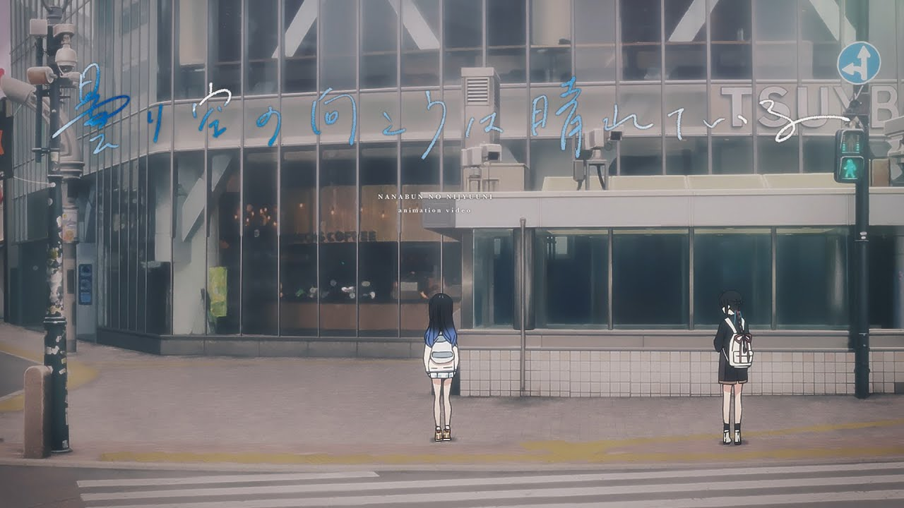

### 22/7 『曇り空の向こうは晴れている』music video
##### [Back](227OfficialYouTube.md)

Date: 27Jul,2022 

<section class="accordion">
  <input type="checkbox" name="collapse" id="handle1">
  <h4 class="handle">
    <label for="handle1">
    資訊 Description
    </label>
  </h4>
  
  

    

『曇り空の向こうは晴れている』ご購入はコチラ！ → https://227.lnk.to/K3362rvy 
『曇り空の向こうは晴れている』dance movie 公開中！ → https://youtu.be/UlqWsGKCius  
==================  
22/7(ナナブンノニジュウニ) 9thシングル『曇り空の向こうは晴れている』music videoを公開！  
14人体制となり第2章を迎えた、22/7初の表題曲『曇り空の向こうは晴れている』。 
新メンバーキャラクターも登場し、新たなる物語を予感させる今作のmusic videoは、全編セルアニメーションで描かれています。  
監督は、22/7キャラクターPV『あの日の彼女たち』（day6 丸山あかね、day8 藤間桜）で絵コンテ・演出を手掛けた山﨑雄太、 
キャラクターデザイン・作画監督に堀口悠紀子、 
そしてアニメーション制作はCloverWorksと、 
「あの日の彼女たち」以来となるスタッフ陣が集結。  
新キャラクター達を中心に描かれるドラマでは、彼女たちのキャラクター性が活き活きと表現され、 
視聴者の想像に委ねられるような劇中劇の展開は、MVでありながら、まるで1本のショートフィルムを観ているかのように感じられる作品となっています。  
==================  
■『曇り空の向こうは晴れている』music video staff 
監督：山﨑雄太 
キャラクターデザイン・作画監督：堀口悠紀子 
プロップデザイン：井上晴日 
原画：三住宮古、Nogya、サカタノヌシ、らるる、お米ぷん、Magho、Park Se Young、朱浩然、大倉啓右、忍田雄介、みやち、さく、山本 健、苗川裕毅、浅賀和行、伊波、とまど、川上大志、Niii、杉田 柊、助川裕彦、小林麻衣子 
CloverWorks 東 可楠子、浦 未希子、助永理恵 
作画育成監督：岡 勇一 
第二原画：西川知栄美、Mahkey 
動画検査：八木尚之 
動画：Ast、CloverWorks海外作画・仕上げルーム、但 伊楊、八木尚之 
色彩設計：中島和子 
色指定・検査：鳥越 栞 
仕上げ：CloverWorks 長井彩香、辻󠄀 桃佳、岩渕里菜、梶山 翼、平井綾乃、鞠川未来、廣澤ちひろ 
TripleA、ＭＳＪ武蔵野制作所 
美術監督：狹田 修 
美術：CygamesPictures 岡部美緒、今村優美、王 寒、北山竜太、張 思遠、岡本 朗 
CGワークス：山本優馬、松本愛琉 
撮影監督：伊藤幸子、本倉悠介 
テクニカルディレクター：佐久間悠也 
撮影：CloverWorks 佐藤瑠里、伊藤誠将、比嘉佑大、西岡奈津、石坂海斗 
HD編集スタジオ：キュー・テック 
HD編集 ：本田裕樹 
取材協力：愛知県立千種高等学校　映画研究部 
通訳協力：FAR、劉 喆 
制作応援：山本里佳子、比嘉 薫、成田聖香 
制作進行：梅原翔太 
制作統括：清水 暁 
アニメーション制作：CloverWorks  
==================  
総勢14名で初の9thシングル『曇り空の向こうは晴れている』発売中！  
▼形態数（全4形態） 
①完全生産限定盤A　SRCL-12150～2 / 7,000円（税込） 
②完全生産限定盤B　SRCL-12153～5 / 7,000円（税込） 
③初回生産限定盤　SRCL-12156～7 / 1,850円（税込） 
④通常盤　SRCL-12158 / 1,250円（税込）  
https://nanabunnonijyuuni.com/s/n129/news/detail/10591?ima=5727  
==================  
■22/7（ナナブンノニジュウニ）メンバー 
https://nanabunnonijyuuni.com/s/n129/search/artist?ima=0040&tag=artist  
天城 サリー（藤間桜 役 声優） 
河瀬 詩（斎藤ニコル 役 声優） 
西條 和（滝川みう 役 声優） 
白沢 かなえ（丸山あかね 役 声優） 
涼花 萌（神木みかみ 役 声優） 
宮瀬 玲奈（立川絢香 役 声優） 
相川奈央（西浦そら 役 声優） 
麻丘真央（桐生塔子 役 声優） 
雨夜音（八神叶愛 役 声優） 
清井美那（永峰楓 役 声優） 
椎名桜月（織原純佳 役 声優） 
四条月（一之瀬蛍 役 声優） 
月城咲舞（氷室みず姫 役 声優） 
望月りの（瀬良穂乃花 役 声優）  
================== 

  
  

</section>

<video width="100%" height="100%" controls>
  <source src="https://github.com/LYHPandaKing/227PhotoBackup/releases/download/227_OfficialYouTube/20220727_Kumorizora_no_muko_wa_hareteiru_MV.mp4" type="video/mp4">
</video>

<table>
 <tr>
  <th>Raw</th>
  <td><a target="_blank" rel="noreferrer noopener" href="https://www.youtube.com/watch?v=Mh9E1iZxoHs">Source</a></td>
  <td><a target="_blank" rel="noreferrer noopener" href="https://github.com/LYHPandaKing/227PhotoBackup/releases/download/20220727_Kumorizora_no_muko_wa_hareteiru_MV.mp4">Download</a></td>
 </tr>
</table>