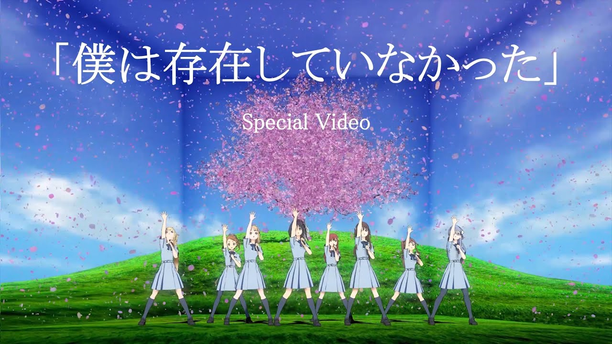
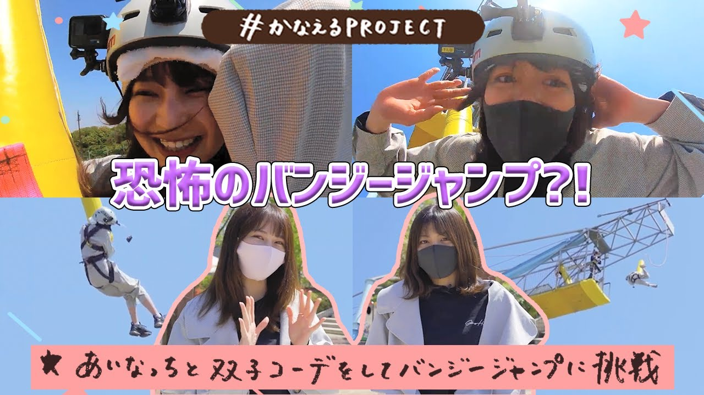
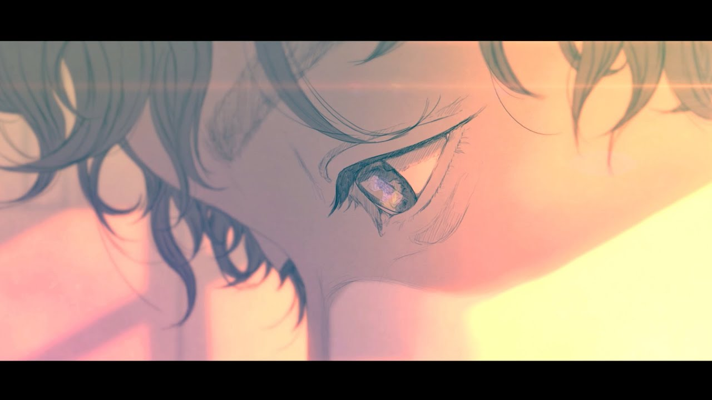
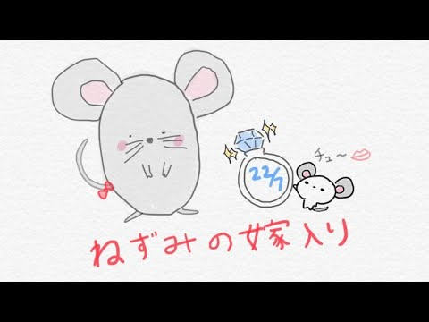
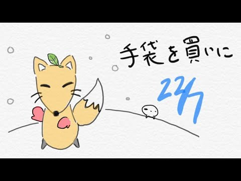
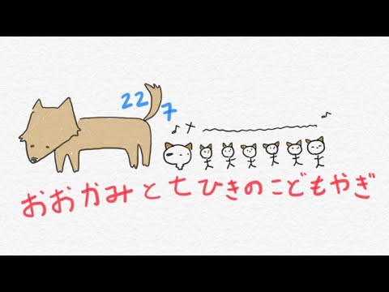

### 22/7 OFFICIAL YouTube CHANNEL
##### [Back](../YouTube_List.md)

- [22/7『僕は存在していなかった』× 360 Reality Audio スペシャルビデオ](20211222_BokuwaSonzai_360RealityAudio.md) 
Date: 22Dec,2021 

- [22/7『とんぼの気持ち』夜公演＠Zepp DiverCity(TOKYO)（2021.07.22）](20211124_TomboNoKimochi_@ZeppDiverCityTOKYO.md) 
Date: 24Nov,2021 

- [22/7『ヒヤシンス』夜公演＠Zepp DiverCity(TOKYO)（2021.07.22）](20211122_Hyacinth_@ZeppDiverCityTOKYO.md) 
Date: 22Nov,2021 

- [22/7 8thシングル『覚醒』music video](20211120_8thSG_Kakusei_MV.md) 
Date: 20Nov,2021 

- [かなえるPROJECT ～なごみんとオリジナルブランド「SHIROSAI」プロデュース～](20210923_KanaeruPROJECT_OriginalBrand.md) 
Date: 23Sep,2021 

- [22/7『11という名の永遠の素数 Release Tour 2021』夜公演ダイジェスト＠Zepp DiverCity（2021.07.22）](20210831_1stALReleaseLive_EveningPerformance.md) 
Date: 31Aug,2021 

- [22/7『11という名の永遠の素数 Release Tour 2021』昼公演ダイジェスト＠Zepp DiverCity（2021.07.22）](20210830_1stALReleaseLive_DayPerformance.md) 
Date: 30Aug,2021 

- [かなえるPROJECT ～あいなっちと双子コーデでバンジージャンプ～](20210822_KanaeruPROJECT_BungeeJumping.md) 
Date: 22Aug,2021 

- [かなえるPROJECT ～みずはんとバカッコイイ動画を撮りたい～](20210821_KanaeruPROJECT_CoolVideo.md) 
Date: 21Aug,2021 

- [かなえるPROJECT ～うたちゃんと江ノ島で共通点探しの旅～](20210820_KanaeruPROJECT_Enoshima.md) 
Date: 20Aug,2021 

- [かなえるPROJECT ～もえちゃんとドッグカフェで癒されたい～](20210819_KanaeruPROJECT_DogCafe.md) 
Date: 19Aug,2021 

- [22/7 生放送の時間 vol.11～ナナオン夏の陣～](20210724_Namahousounjikan_Vol11.md) 
Date: 24Jul,2021 

- [22/7『タチツテトパワー』夜公演＠PACIFICO Yokohama（2021.02.28）](20210720_TachitsutetoPower_@PACIFICO_Yokohama.md) 
Date: 20Jul,2021 

- [超!A&G+『くらてん！～1stアルバム「11という名の永遠の素数」発売記念スペシャル～』](20210716_Kuraten_1stALRelease_Special.md) 
Date: 16Jul,2021 

- [22/7 紅組『雷鳴のDelay』夜公演＠PACIFICO Yokohama（2021.02.28）](20210715_RaimeinoDelay_@PACIFICO_Yokohama.md) 
Date: 15Jul,2021 

- [22/7 白組『キウイの主張』夜公演＠PACIFICO Yokohama（2021.02.28）](20210714_KiwinoShuchoShirogumi_@PACIFICO_Yokohama.md) 
Date: 14Jul,2021 

- [22/7 復活定期公演「ナナニジライブ 2021」～あの日の彼女たち～ (2021.06.30)](20210707_NananijiLive_TheGirlsOfThatDay.md) 
Date: 7Jul,2021 

- [1stアルバム「11という名の永遠の素数」リリース記念イベント「復活定期公演“ナナニジライブ 2021”」](20210630_NananijiLive.md) 
Date: 30Jun,2021 

- [22/7『ヒヤシンス』music video](20210628_Hyacinth_MV.md) 
Date: 28Jun,2021 

- [ナナオン初心者向け動画「22/7 学習の時間」 #2 ～お気に入りメンバーを育成しよう！～ 【22/7 音楽の時間】](20200925_Nanaon_Tutorial2.md) 
Date: 25Sep,2020 

- [22/7 #せいゆうろうどくかい 「ねずみの嫁入り」](20200924_Seiyu_Rohoku_MarriageOfAMouse.md) 
Date: 24Sep,2020 

- [22/7 晴れた日のベンチ「半チャーハン」・蛍光灯再生計画「タトゥー・ラブ」・気の抜けたサイダー「ソフトクリーム落としちゃった」 ～22/7 新ユニット 全曲視聴 ～](20200920_6thSingle_UnitSongs_Trial) 
Date: 20Sep,2020 

- [22/7 #せいゆうろうどくかい 「手袋を買いに」](20200910_Seiyu_Rohoku_BuyGloves.md) 
Date: 10Sep,2020 

- [ナナオン初心者向け動画「22/7 学習の時間」 #1 ～ナナオンを上達しよう！～ 【22/7 音楽の時間】](20200902_Nanaon_Tutorial1.md) 
Date: 2Sep,2020 

- [22/7 生放送の時間 Vol.3 ～残暑見舞い申し上げます～](20200901_227Vol.3_Live.md) 
Date: 1Sep,2020 

- [22/7 #せいゆうろうどくかい 「文福茶がま」](20200820_Seiyu_Rohoku_BunfukuChagama.md) 
Date: 20Aug,2020 

- [22/7 #せいゆうろうどくかい 「おおかみと七ひきのこどもやぎ」](20200806_Seiyu_Rohoku_Wolfn7Goats.md) 
Date: 6Aug,2020 

- [22/7 #せいゆうろうどくかい 「雨あがり」](20200723_Seiyu_Rohoku_Aftertherain.md) 
Date: 23Jul,2020 

- [22/7 『風は吹いてるか？』dance video](20200722_dancevideo.md) 
Date: 22Jul,2020 

- [ナナニジ オンラインフェス2020](20200722_live.md) 
Date: 22Jul,2020 

- [22/7 5thシングル「ムズイ」発売記念スペシャル無観客ライブ（2020.2.27 Zepp Tokyo）ダイジェスト映像](20200630_Summary.md) 
Date: 30Jun,2020 
