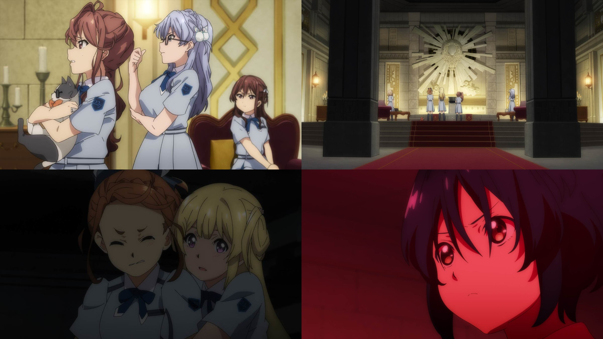
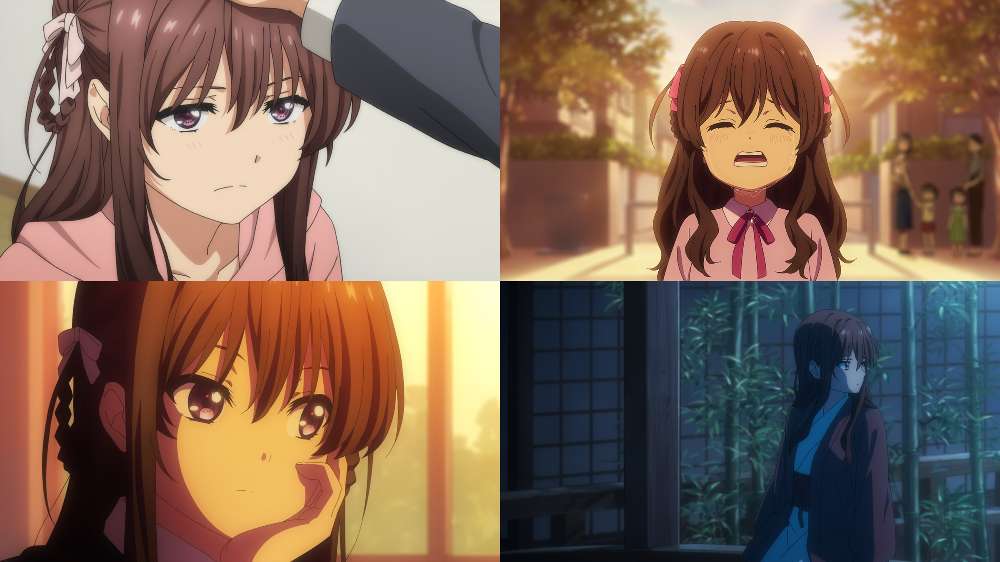
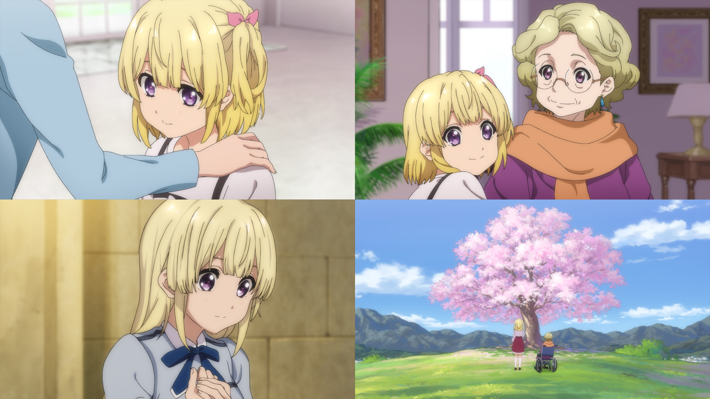

### 22/7 動畫 Anime
##### [Back](../../../readme.md)

#### BD & DVD

- [#13 8+3=？](Ep13.md)  

- [#12 ナナブンノニジュウニ    七分之二十二](Ep12.md)  

- [#11 ただその背中を追いつづけて    只是不斷追隨著他](Ep11.md)  

- [#10 さよなら、私たちの世界    再見了，我們的世界](Ep10.md)  

- [#9 お星さまのララバイ    星星的搖籃曲](Ep9.md)  

- [#8 ゆめみるロボット    作夢的機器人](Ep8.md)  

- [#7 ハッピー☆ジェット☆コースター    HAPPY☆雲霄☆飛車](Ep7.md)  

- [#6 偶数と奇数のあいだ    偶數與奇數之間](Ep6.md)  

- [#5 ひっくり返せばええねんで！   翻個面就好了唄！](Ep5.md)  

- [#4 約束に咲く花    約定綻放之花](Ep4.md)  

- [#3 こんにちは、新しい世界    你好，新世界](Ep3.md)  

- [#2 めまいの真ん中    暈眩之中](Ep2.md)  

- [#1 さよなら、私のささやかな世界    再見了，我那小小的世界](Ep1.md)  

