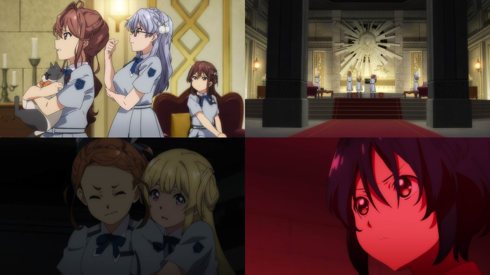

### #12  ナナブンノニジュウニ #12 七分之二十二
##### [Back](Anime_List.md)

  

##### 故事 Story
22/7への想いを確かめあった8人に、解散会見以来止まっていたはずの”壁”が突如語り出す。これまでメンバーを監視し、その活動の全てが“壁”による実験だったのだと明かされる。実験が次のフェーズに移ったいま、22/7は『用済み』と言われ、自分たちもファンも全て利用されていたと憤るメンバー。しかしニコルだけはひとり、22/7を守ろうと必死に嘆願する。 

##### 工作人員 Staff
脚本：永井千晶 
絵コンテ：髙橋さつき、阿保孝雄 
演出：田中智也 
総作画監督：まじろ、田村里美 
作画監督：香田知樹、大貫巧、山本真夕子、樋口香里、牧野和俊、吉田尚人、齋藤悠、りお、横松雄馬、岡崎洋美、田川裕子、成川多加志、一ノ瀬結梨、錦見楽 

BD Ver. 
<video width="100%" height="100%" controls>
  <source src="https://github.com/LYHPandaKing/227PhotoBackup/releases/download/227_BD_Anime/Bastard-Raws.Nanabun.no.Nijyuuni.-.01.BDRip.1920x1080.x264.FLAC.mp4" type="video/mp4">
</video>

巴哈 Ver. 
<video width="100%" height="100%" controls>
  <source src="https://github.com/LYHPandaKing/227PhotoBackup/releases/download/227_Baha_Anime/227.-.12.1080p.AVC.AAC.CHT.mp4" type="video/mp4">
</video>

<table>
  <tr>
    <th>Raw</th>
    <th><a target="_blank" rel="noopener noreferrer" href="https://nyaa.si/view/1304154">Source</a></th>
  </tr>
  <tr>
    <th>Sub</th>
    <th><a target="_blank" rel="noopener noreferrer" href="https://ani.gamer.com.tw/animeVideo.php?sn=15119">CHT - 巴哈</a></th>
  </tr>
</table>
