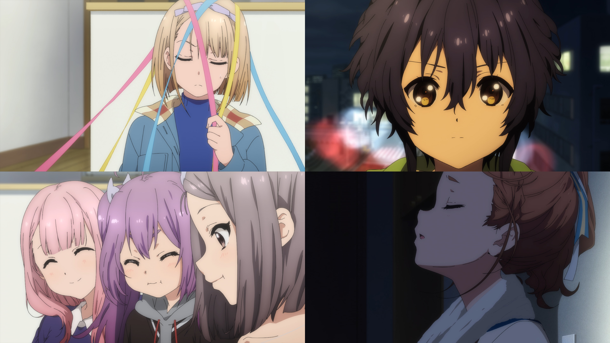

### #13 ８＋３＝？
##### [Back](Anime_List.md)

  

##### 故事 Story
結成日の12月24日にファンの前で復活を遂げた22/7。 
翌日、8人が事務所へやってくると“壁”は完全復活しており、ますます謎は深まるばかり。 
不穏な予感を払拭しようと、桜が再会のお祝いを兼ねてクリスマスパーティーを開こうと提案する。 
するとそこへ見知らぬ3名が入ってくる。 
8人と同じ制服を着た彼女たちは、神木みかみ、東条悠希、柊つぼみと名乗り、新たな“壁”の指令で集められた新メンバーだと語った。 

##### 工作人員 Staff
脚本：永井千晶 
絵コンテ：阿保孝雄 
演出：阿保孝雄 
総作画監督：まじろ 
作画監督：大貫 巧、あおのゆか、田中みどり、横松雄馬、成川多加志、笠原由博 

BD Ver. 
<video width="100%" height="100%" controls>
  <source src="https://github.com/LYHPandaKing/227PhotoBackup/releases/download/227_BD_Anime/Bastard-Raws.Nanabun.no.Nijyuuni.-.01.BDRip.1920x1080.x264.FLAC.mp4" type="video/mp4">
</video>

巴哈 Ver. 
<video width="100%" height="100%" controls>
  <source src="https://github.com/LYHPandaKing/227PhotoBackup/releases/download/227_Baha_Anime/227.-.13.1080p.AVC.AAC.CHT.mp4" type="video/mp4">
</video>

<table>
  <tr>
    <th>Raw</th>
    <th><a target="_blank" rel="noopener noreferrer" href="https://nyaa.si/view/1304154">Source</a></th>
  </tr>
  <tr>
    <th>Sub</th>
    <th><a target="_blank" rel="noopener noreferrer" href="https://ani.gamer.com.tw/animeVideo.php?sn=18371">CHT - 巴哈</a></th>
  </tr>
</table>
