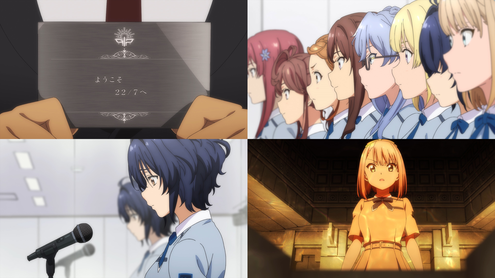

### #2 めまいの真ん中 #2 暈眩之中
##### [Back](Anime_List.md)

  

##### 故事 Story
突然”壁”が吐き出したプレートによって『22/7』と名付けられたみうたち。吐き出された2枚目のプレートには『審査会を行う』という“指令”が。戸惑いながらも思い思い準備を始めるメンバーだが、みうはまだアイドルとしての自分をイメージ出来ず、ひとり落ち込む。不安と緊張の中で始まる審査会。向けられる大人たちの厳しい眼差し。 
圧倒的実力を見せつけるニコルとは裏腹に、みうは自己紹介すら上手く出来ず……。 

##### 工作人員 Staff
脚本：永井千晶 
絵コンテ：髙橋さつき 
演出：髙橋さつき 
総作画監督：田村里美 
作画監督：波部崇、笠原由博、木村麻亜紗 

BD Ver. 
<video width="100%" height="100%" controls>
  <source src="https://github.com/LYHPandaKing/227PhotoBackup/releases/download/227_BD_Anime/Bastard-Raws.Nanabun.no.Nijyuuni.-.02.BDRip.1920x1080.x264.FLAC.mp4" type="video/mp4">
</video>

巴哈 Ver. 
<video width="100%" height="100%" controls>
  <source src="https://github.com/LYHPandaKing/227PhotoBackup/releases/download/227_Baha_Anime/227.-.02.1080p.AVC.AAC.CHT.mp4" type="video/mp4">
</video>

<table>
  <tr>
    <th>Raw</th>
    <th><a target="_blank" rel="noopener noreferrer" href="https://nyaa.si/view/1304154">Source</a></th>
  </tr>
  <tr>
    <th>Sub</th>
    <th><a target="_blank" rel="noopener noreferrer" href="https://ani.gamer.com.tw/animeVideo.php?sn=14591">CHT - 巴哈</a></th>
  </tr>
</table>
