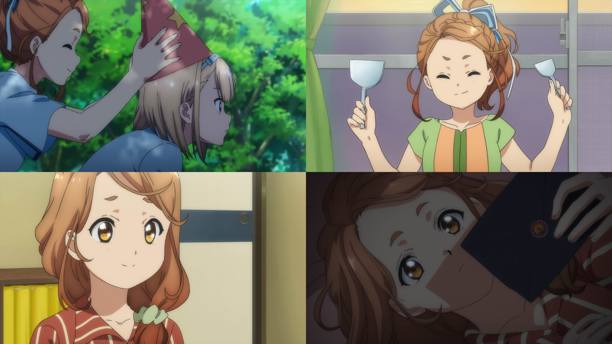

### #5 ひっくり返せばええねんで！ #5 翻個面就好了唄！
##### [Back](Anime_List.md)

{: width="70%"}  

##### 故事 Story
新たな“壁”の指令は、アイドルの登竜門・ITF（アイドルトーキョーフェスティバル）に参加すること。 
22/7にとって初めてのフェス。しかし他のアイドルグループと比べ、まだまだ結束が足りない。 
危機感を抱いた都が提案したのは、全員強制参加のお好み焼きパーティー。 
和気藹々とお好み焼きを作り始めるメンバーたち。みんなを優しく見守る都。 
そして、そんな都にも誰にも話していない〈アイドルになった理由〉があった……。 

##### 工作人員 Staff
脚本：大西雄仁 
絵コンテ：舛成孝二 
演出：村山靖 
総作画監督：田村里美 
作画監督：成川多加志、山本真夕子、樋口香里、斎藤悠 

BD Ver. 
<video width="100%" height="100%" controls>
  <source src="  " type="video/mp4">
</video>

巴哈 Ver. 
<video width="100%" height="100%" controls>
  <source src="https://github.com/LYHPandaKing/227PhotoBackup/releases/download/227_Baha_Anime/227.-.05.1080p.AVC.AAC.CHT.mp4" type="video/mp4">
</video>

<table>
  <tr>
    <th>Raw</th>
    <th><a target="_blank" rel="noopener noreferrer" href="https://nyaa.si/view/1304154">Source</a></th>
  </tr>
  <tr>
    <th>Sub</th>
    <th><a target="_blank" rel="noopener noreferrer" href="https://ani.gamer.com.tw/animeVideo.php?sn=14637">CHT - 巴哈</a></th>
  </tr>
</table>
