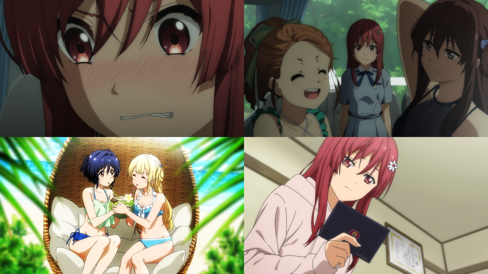

### #6 偶数と奇数のあいだ #6 偶數與奇數之間
##### [Back](Anime_List.md)

  

##### 故事 Story
『リーダーは佐藤麗華』と突然”壁”から任命され、人一倍責任感の強い麗華はひとり思い悩む。 
そんな中、22/7は新たな指令で沖縄へ写真集の撮影に向かう。 
晴れ渡る沖縄の空の下、海辺ではしゃぐメンバーたちとは裏腹に、麗華の心はもやもやと曇ったまま。 
その矢先、麗華に渡された撮影用の衣裳は、なんとセクシーな水着。 
「清く正しく」がモットーの麗華は激しく抵抗するが……。 

##### 工作人員 Staff
脚本：永井千晶 
絵コンテ： 橘紗央莉 
演出： 橘紗央莉 
総作画監督： 髙田　晃 
作画監督：小松沙奈、斎藤千恵、森田莉奈、神本兼利、前田学史、戸髙真希、水野辰哉、監物ケビン雄太 

BD Ver. 
<video width="100%" height="100%" controls>
  <source src="https://github.com/LYHPandaKing/227PhotoBackup/releases/download/227_BD_Anime/Bastard-Raws.Nanabun.no.Nijyuuni.-.01.BDRip.1920x1080.x264.FLAC.mp4" type="video/mp4">
</video>

巴哈 Ver. 
<video width="100%" height="100%" controls>
  <source src="https://github.com/LYHPandaKing/227PhotoBackup/releases/download/227_Baha_Anime/227.-.06.1080p.AVC.AAC.CHT.mp4" type="video/mp4">
</video>

<table>
  <tr>
    <th>Raw</th>
    <th><a target="_blank" rel="noopener noreferrer" href="https://nyaa.si/view/1304154">Source</a></th>
  </tr>
  <tr>
    <th>Sub</th>
    <th><a target="_blank" rel="noopener noreferrer" href="https://ani.gamer.com.tw/animeVideo.php?sn=14734">CHT - 巴哈</a></th>
  </tr>
</table>
