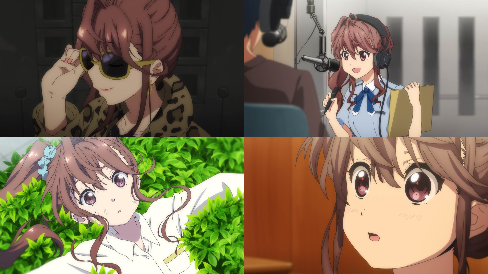

### #7 ハッピー☆ジェット☆コースター #7 HAPPY☆雲霄☆飛車
##### [Back](Anime_List.md)

  

##### 故事 Story
突如、倒れてしまったメンバーたち。 
しかし仕事が増え始めた22/7には、今日もスケジュールが詰まっている。この緊急事態を前に、無事だったのはまさかのジュンただ一人。 
「みんなの分もわたし頑張る！」 
どれほど大変な仕事でも、明るくこなしていくジュン。しかし昔のジュンは、病弱で後ろ向きな性格の少女だった。そんな彼女を変えたのは、一人の女の子で……。  

##### 工作人員 Staff
脚本：大西雄仁 
絵コンテ：森　大貴 
演出：森　大貴 
総作画監督：まじろ 
作画監督：三井麻未、田川裕子、川村幸祐、木藤貴之、りお、凌空　凛、飯野雄大 

BD Ver. 
<video width="100%" height="100%" controls>
  <source src="https://github.com/LYHPandaKing/227PhotoBackup/releases/download/227_BD_Anime/Bastard-Raws.Nanabun.no.Nijyuuni.-.01.BDRip.1920x1080.x264.FLAC.mp4" type="video/mp4">
</video>

巴哈 Ver. 
<video width="100%" height="100%" controls>
  <source src="https://github.com/LYHPandaKing/227PhotoBackup/releases/download/227_Baha_Anime/227.-.07.1080p.AVC.AAC.CHT.mp4" type="video/mp4">
</video>

<table>
  <tr>
    <th>Raw</th>
    <th><a target="_blank" rel="noopener noreferrer" href="https://nyaa.si/view/1304154">Source</a></th>
  </tr>
  <tr>
    <th>Sub</th>
    <th><a target="_blank" rel="noopener noreferrer" href="https://ani.gamer.com.tw/animeVideo.php?sn=14735">CHT - 巴哈</a></th>
  </tr>
</table>
