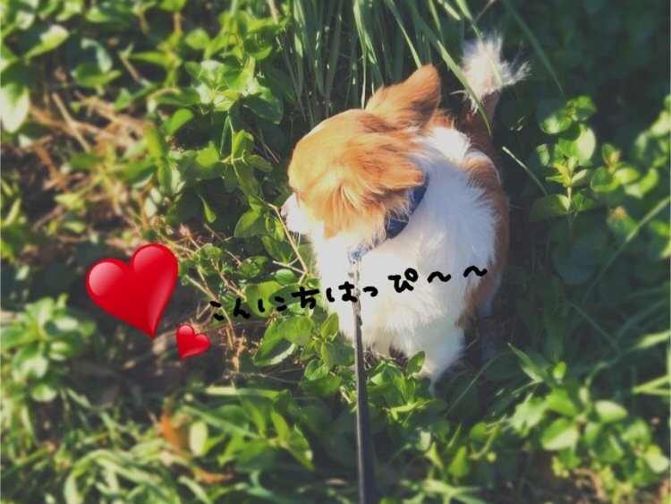
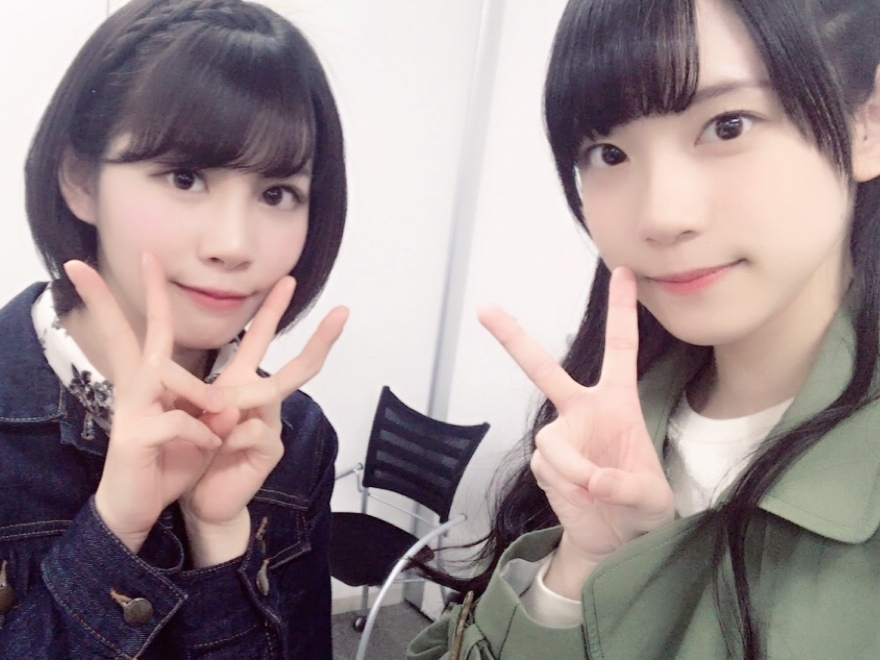

### 新たな経験📻
<a target="_blank" rel="noreferrer noopener" href="http://blog.nanabunnonijyuuni.com/s/n227/diary/detail/81?ima=3050&cd=blog">2017.12.28 </a>| 中文翻譯 
武田愛奈    
今日も天気よき〜〜☀︎  
  
(いつかのハッピーちゃん)   
今日朝起きたときから今日はいい一日になるって思った！ 
気持ちって大事だよね(﹡ˆoˆ﹡)    
今日も一緒にいい一日にしよ〜〜♪      
⑅︎∙︎˚┈︎┈︎┈︎┈︎┈︎┈︎┈︎┈︎┈︎┈︎┈︎┈︎┈︎┈︎˚∙︎⑅︎   
昨日は初めての、ラジオ " 生放送 " で、 
『FM-FUJI artist special "LIVE TALK SHOW"！』 
に出演させていただきました！    
きいてくださった方、観覧に来てくれた方、楽しんでいただけましたか？(*･･*)   
そばにいてくれた方々、 
お寒い中、本当にありがとうございます。 
すっごく嬉しかった！！！ 
見守ってくれてる〜〜〜♡って 
風邪引いてないかな…心配です。。 
いっぱいいっぱい暖まってくださいね    
行きたいけど行けなかった…という方も、気持ち届いてます∩^ω^∩ 
みなさん、ありがとう♡    
メールもたくさんありがとうございます。全部読みたかったなあ。    
割り切れないラジオとはまた違った緊張感で、そして生放送！という、また新たに初めての経験ができて、すごく楽しかったあ(*´꒳`*)    
でも、たくさんの人を楽しませたいって思ったのがこの業界を目指すきっかけでもある武田ですが、ラジオでどうしたらもっともっと楽しませることができるか、大きな課題だなあ…と。      
ちはるんってすごいなあ……      
私もいつかちはるんみたいにまわせるようになりたい！ 
って思ったの！日々勉強ですね╰(*´︶`*)╯   
⑅︎∙︎˚┈︎┈︎┈︎┈︎┈︎┈︎┈︎┈︎┈︎┈︎┈︎┈︎┈︎┈︎˚∙︎⑅︎   
るーりーのごめんねありがとうのダブルパンチとかもえちんのリカちゃん目指してるところとかちはるんのときどき…いや、ナチュラルに甘えてくるところとか    
たまらないよね 
•̑‧̮•̑      
………ラジオの感想書くつもりだったのに全然書けてないなあ      
  
(いつかのるりちゃんとの、パシャっ) 
はああ……♡  
本日12:00〜showroom配信します。 
よかったら遊びにきてちょ( ˊᵕˋ* )  
武田愛奈