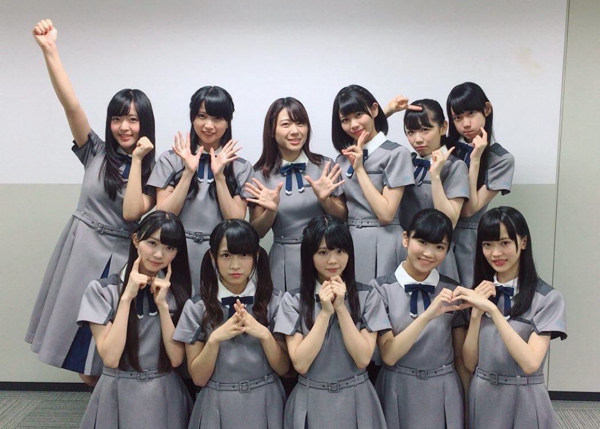

### 2017 ありがとう
<a target="_blank" rel="noreferrer noopener" href="http://blog.nanabunnonijyuuni.com/s/n227/diary/detail/120?ima=3050&cd=blog">2017.12.31 </a>| 中文翻譯 
武田愛奈    
大晦日！！！ 
今日で2017ラストdayだなんて(｡･д･｡)びっくり    
今年1年は本当にはやかった    
お天気さまも2017年最後でさみしがってるのかな    
2017年は、演技や、ダンス、ボーカルレッスンも始まり、たくさん初めての経験をして、みなさまとたくさんお会いできて、充実していた忘れられない大切な1年になりました         
ふと思ったことがあって    
存在しているものがあってもそこにあるって知らなかったら存在してないのかなって    
今日いつもの道を歩いていたら公衆電話があったことに気づいて      
なんで今まで気づかなかったんだろ。     
見えていても見ようとしてなかったら気づけないことがたくさんあるんじゃないかって      
1年の最後の日に何かに気づけた気がして、よくわからないけどよかったなあって。        
ナナブンノニジュウニというグループが存在していていて私たちも存在していて、みなさまの心にも、これから知ってくださるたくさんの方々にも、ちゃんと存在していたいなって、必要とされていたいなって         
そんなことを思う2017年の大晦日の朝でした♪ 
今年最後だし、ちゃんとしたこと書こうって思ったけどちゃんとしたことってなんだろって思って、今日の感じたことをそのまま書いてみました(´・∀・｀)    
お天気さんは元気なくても心は快晴☀️    
終わりよければすべてよし！！！ 
一緒に今日も楽しい1日にしよう(﹡ˆoˆ﹡)    
そして最高の2018年迎えよう〜〜♡         
来年は、メンバーと、そして応援してくださるみなさんと一緒に、もっともっと見たこともない景色をみたい！  
お見せできるように、みなさまに必要とされるように、 
もっともっと頑張ります。   
    
2017年ありがとう♡ 
みなさま、ありがとうございました！！   
来年も素晴らしい1年になりますように₍ᵔ·͈༝·͈ᵔ₎ 
良いお年を……✧︎*。   
武田愛奈