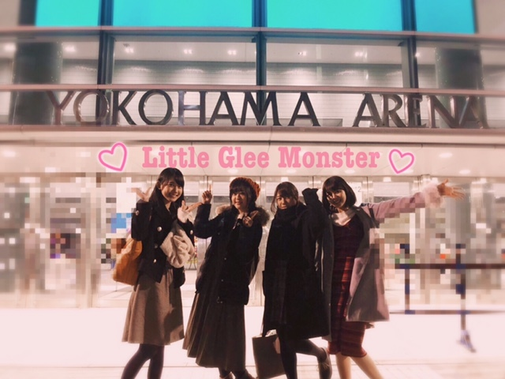

### ⊂︎( ˆoˆ )⊃︎
<a target="_blank" rel="noreferrer noopener" href="http://blog.nanabunnonijyuuni.com/s/n227/diary/detail/503?ima=1221&cd=blog">2018.02.04 </a>| 中文翻譯 
武田愛奈    
こんばんは〜(﹡ˆoˆ﹡)    
お昼一瞬お天気雨でした        
昨日は、Little Glee Monsterさんのライブに行かせていただきました！  
生で聴くのは初めてだったのですが、鳥肌がとまりませんでした。  
歌っているときの表情とか表現力がすごかった。歌によって歌い方が違ったり、そしてもうとにかく、すごく歌が上手で感動しました。   
最近はライブに行くときや、テレビみるときも歌を聴くときも、ただ楽しむだけじゃなくて、いろいろ考えるようになった😊   
今回もとても勉強になりました！ 
もっともっとたくさんの方のライブに行きたい！  	
歌ってすごいなあ。 
音楽って最高だなあ。   
って改めて思いました！   
       
今回学んだこの思いを、2月27日に生かせるといいな😊  
『割り切れないライブ 〜シャンプーの匂いがした〜』 
まだまだ応募受付中です✩︎ 
https://www.sonymusicshop.jp         
今日は日曜日！ 
『22/7 割り切れないラジオ』聴いてくださいましたか〜？☺️  
超A&G+さんにて、毎週日曜日13:30〜放送しております！  
今日からの放送で今月2月が私がメインパーソナリティを務めさせていただいてます！    
来週からも聴いていただけると嬉しいです(﹡ˆoˆ﹡)メールもお待ちしてます♪         
今日の聞けてないの… 
アーカイブきくのこわいよーーーーー。       
成長を見守っていてくださると嬉しいです(﹡ˆˆ﹡)♡          
ドン・キホーテで大人のミルクポッキーが100円だったから買ってしまった♡  
細くてかためですっごく美味しいの！！  
ぜひ食べてみて〜〜(๑˃̵ᴗ˂̵)☀️   
武田愛奈