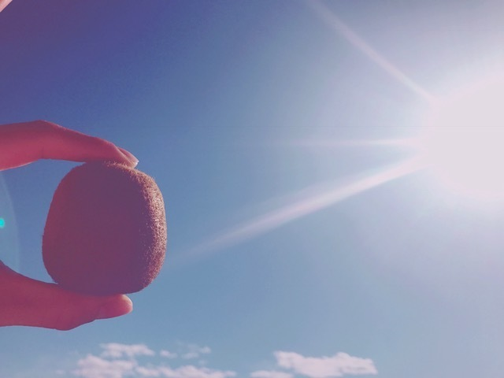

### キウイ
<a target="_blank" rel="noreferrer noopener" href="http://blog.nanabunnonijyuuni.com/s/n227/diary/detail/524?ima=1221&cd=blog">2018.02.07 </a>| 中文翻譯 
武田愛奈    
こんにちは🥝(*ﾟ∀ﾟ*)   
ぱあ〜〜！ 
天気が良くて良くて、きもちいい！ 
      
キウイ🥝🥝   
果物って、朝は金🥇、お昼は銀🥈、夜は銅🥉っていうよね\( ˆoˆ )/   
私も朝は果物摂るようにしてる😊☀️          
でもね…！ 
紫外線を吸収しやすくするものと、紫外線を予防してくれるものがあるの！    
そう💡    
キウイは紫外線を吸収しやすい果物で、食べてから2時間くらい？で、その力を発揮してしまうみたいなの、だから朝食べちゃったら、ちょうど移動中で外にいるときと時間がかぶったりしちゃって、紫外線からお肌を守るには夜の方がいいのです(﹡ˆoˆ﹡)  
キウイにはビタミンCがたくさんだから美白効果は抜群だし、せっかく摂るなら、メリットがたくさんの方がいいよね☺️💕    
小さいころから果物がすっごく好きで、その中でもキウイって一年中売ってて手にしやすいし、食べやすいし、毎朝食べてたの！  
これを知ったときはおそろしかった〜〜！  
だから焼けやすいのか！っておもった！     
一年中で、手軽に買える果物で1番ビタミンCが豊富なのはたぶんキウイだと思う∩^ω^∩
意外なことにレモンよりキウイの方がビタミンC豊富なんです！！   
この時期は旬ないちごかな！🍓 
あ！いちごは朝が👍👍👍 
もえちんに間違えて伝えちゃったかも🙌🏻   
アセロラはダントツ！ 
でもなかなか手に入らないよね(> <) 
そういう場合はジュースでもあり！      
あとね！紫外線とは別のお話なのですが、食べるときは１種類だけがいいみたい(﹡ˆoˆ﹡)   
果物って栄養が短時間で吸収されるけど、いろんな種類のもの入れちゃうと時間がかかって本領発揮できないみたいなの…(´⊙ω⊙`)   
お腹の中でごちゃまぜは要注意ですな〜〜\( ˆoˆ )/      
もえちんのブログのアンサーでした🐾  
なんか字ばっかりで堅苦しくなってしまった 
長々とごめんなさい(´・∀・｀)     
打ってるのすごく楽しかった…♡          
そして、 
『朗読女王決定戦』 
今日20:00〜 
涼花萌ちゃんと私が対決です(> <)    
精一杯、お互い出しきります 
がんばるぞ〜〜！    
みなさん、ぜひ見に来てください。 
よろしくお願いいたします！      
その前にちょこっとだけ、 
16:00〜showroom配信します∩^ω^∩ 
みんなお話しよう〜☺️♩   
武田愛奈