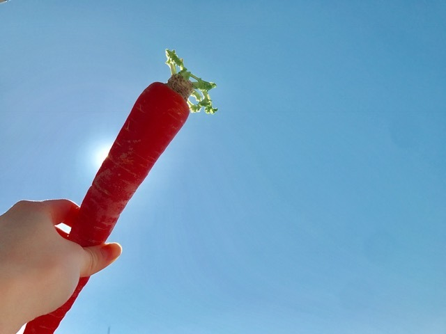

### 🥕🍩🥕🍩
<a target="_blank" rel="noreferrer noopener" href="http://blog.nanabunnonijyuuni.com/s/n227/diary/detail/578?ima=4920&cd=blog">2018.02.13 </a>| 中文翻譯 
武田愛奈 

   
こんにちはっぴ〜〜(﹡ˆoˆ﹡)      
今日は2月13日！ 
3のつく日！    
三太郎の日＼(^o^)／ 
👹🎍🍑🐢      
半年くらい前から言っててやっと使用したよ〜〜🍩💕 
ミスタードーナツ😳  
だけど、食欲がおかしくてまだ食べれてない(´･_･`) 
めずらしい〜〜〜⚠️⚠️      
ミスタードーナツって言ったら 
やっぱり『ポン・デ・リング』      
チュロスみたいなのも好き… 
あ、あと、ハニーディップ…     
今日はポン・デ・リングとエンゼルクリームにしました☀️           
🥕みてみて🥕 
金時人参(●´ω｀●) 
もえちんからもらった〜〜！  
   
すっごく甘くて美味しいんだって！ 
なに作ろうか迷っちゃう☺️♡  
もえちん前にんじんスープ作ってたなあ 
私も作ってみようかな！       
人参は風邪の予防もしてくれるから今の時期に最適だ〜〜（＾Ｏ＾）   
金時人参、色が濃いからいっぱい予防してくれそう♪   
金時人参みんなで食べよ〜〜！           
今日もがんばろうね(﹡ˆoˆ﹡)  
武田愛奈
