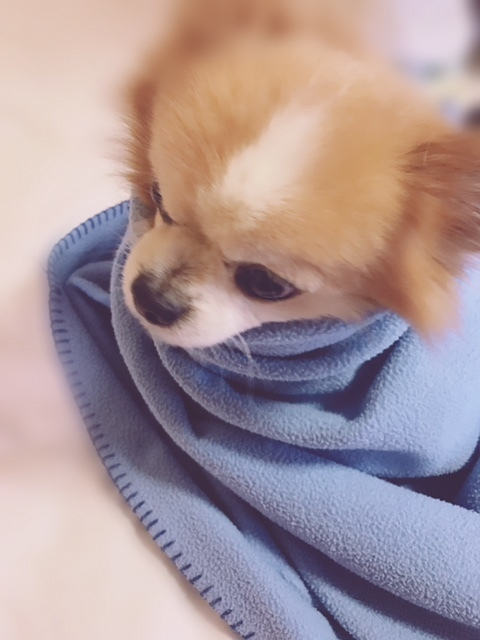
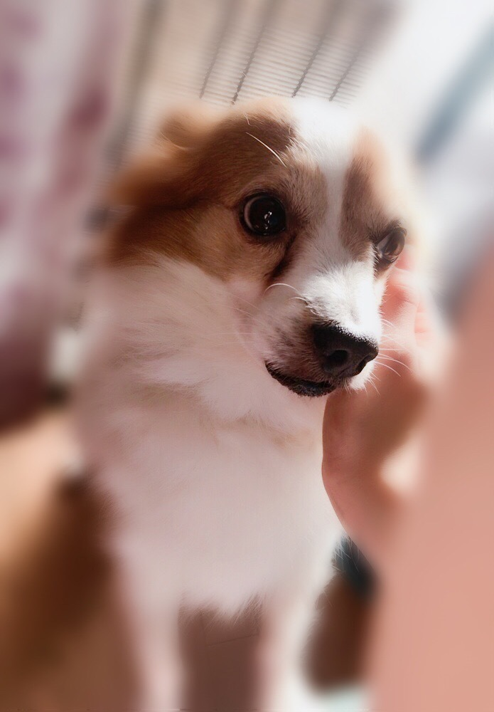
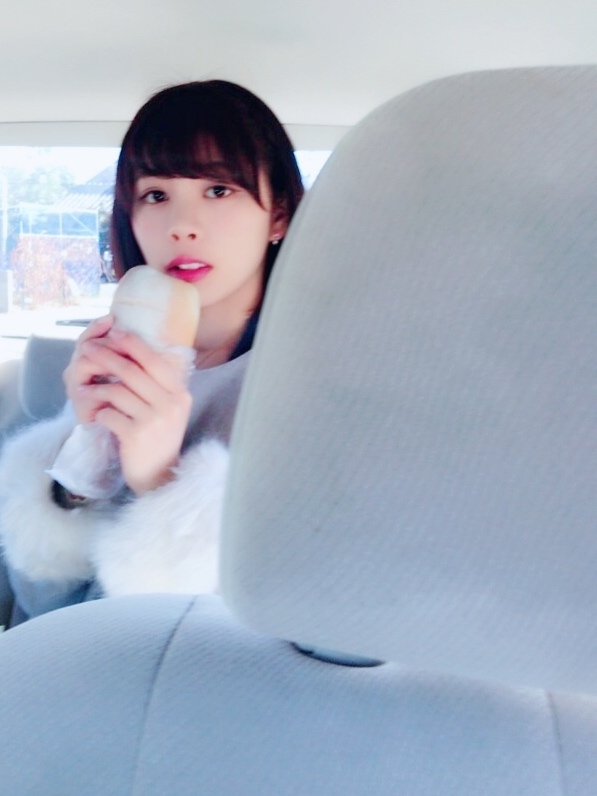

### かわいこちゃんたち⑅⃝︎
<a target="_blank" rel="noreferrer noopener" href="http://blog.nanabunnonijyuuni.com/s/n227/diary/detail/171?ima=3212&cd=blog">2018.01.04 </a>| 中文翻譯 
武田愛奈    
こんばんわんU^ェ^U     
ふああ〜〜 
やっと会えたああ     
みんなお待ちかねの〜〜〜🐾     
ジョンちょん 
     
はっぴーちゃん  
     
かわいいでしょ(⑉︎• •⑉︎)♡ 
わんちゃんどの子もかわいいけど、やっぱり自分の子が1番だよね//    
ジョンと久しぶりにぎゅーして寝た♪ 
まるまるのもふもふ    
今日もジョンちょんと一緒に寝るんだー∩^ω^∩         
初詣にも行けました☻ 
おみくじは吉でした☻          
そして、、、   
   
噂の私の大、大、大好きな！ 
地元のお米パン！！！🥖❤️  
お米パンの写真撮ろうと思ってたけど忘れてたから、お兄ちゃん感謝だね  
こんなふいな顔だけど許してちょ( 笑 )         
お刺身も食べて、地元の大好きなイタリアンも食べて、オーディションの前日に全力出せるように行ってた大好きなラーメンも食べれて、クレープも食べて、しあわせ〜まだ帰ってきて２日なのに( ⸝⸝⸝•_•⸝⸝⸝ )♡︎♡︎   
まあいっか〜〜♪          
お仕事の方はもう始まったりしてるのかな？ 
たくさん食べて一緒にがんばろう∩^ω^∩  
寒いし風邪にも気をつけようね✦ฺ︎   
武田愛奈