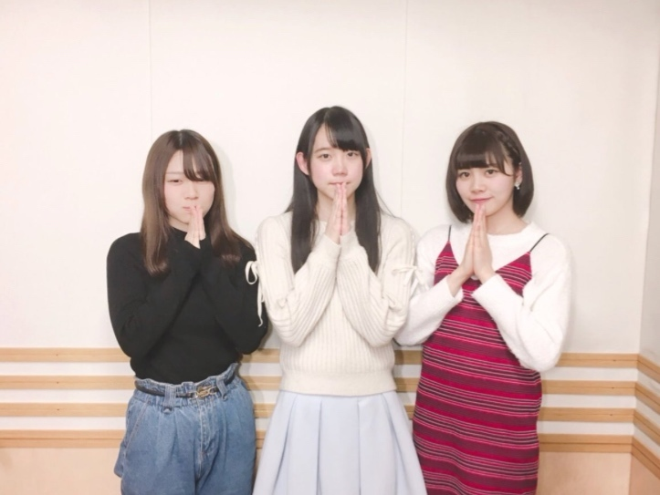
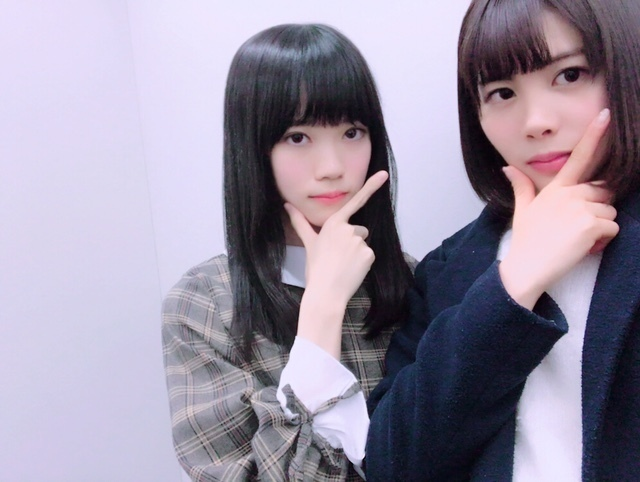
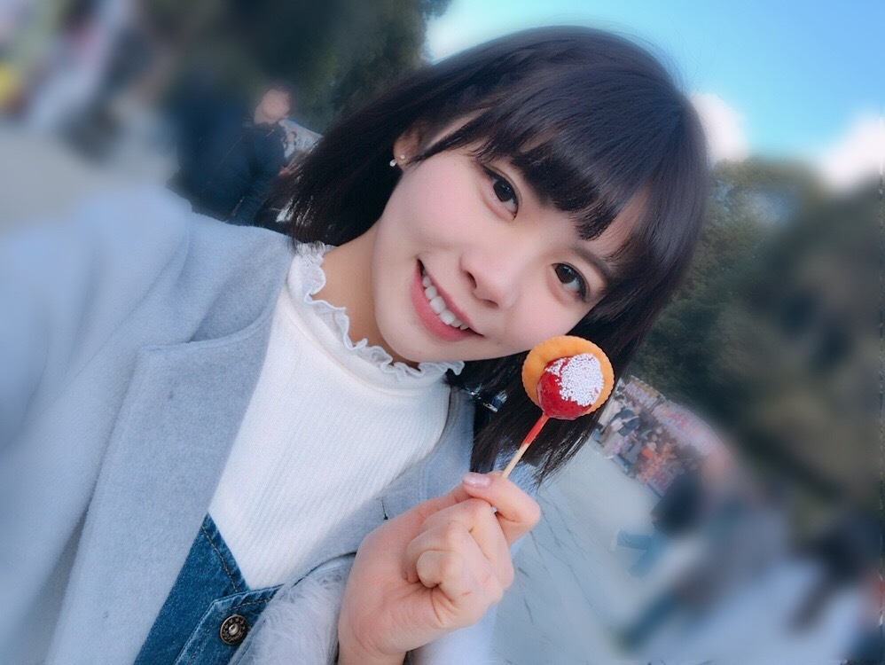
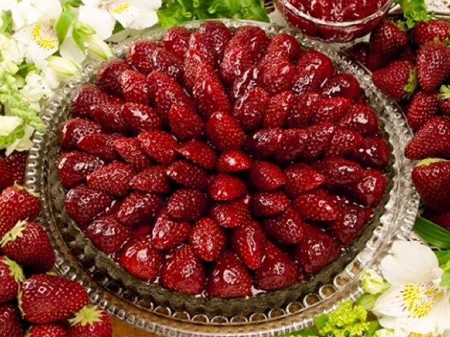

### きのう✱︎
<a target="_blank" rel="noreferrer noopener" href="">2018.01.16 </a>| 中文翻譯 
武田愛奈    
みなさん、おはっぴー☀️  
   
毎週日曜日、13:30より 
ナナブンノニジュウニ割り切れないラジオ 
放送中！  
前回1月14日、きいてくださいましたか〜？？   
聞けなかった方、大丈夫です！！！ 
アーカイブから聞けますので、UPされたらご報告します(*´ω`*)   
twitterも要チェックです☝︎         
しゃき〜ん✔︎✔︎ 
ぱわわっぷ╰(*´︶`*)╯♪  
   
みんな大好きれったん！とシャキーン✌︎('ω')✌︎   
昨日は久しぶりに全員に会えました(*´꒳`*) 
なんだかほっこり♪ 
なごみんともえちんからお土産もらったの美味しかった〜♡        
そうそう！ 
階段降りてるとき、一個ずつ降りてるのか、一個飛ばしで降りてるのかわからなくなって、中途半端に開いてコケることありませんか｡ﾟ(ﾟ´ω`ﾟ)ﾟ｡   
最近頻繁なの   
ケガしませんように！！        
昨日はいちごの日だったね🍓 
みなさんいちごは食べましたか？(*ﾟ∀ﾟ*)  
    
私食べてない…    
   
キルフェボンのくろいちごタルトが食べたい(๑˃̵ᴗ˂̵)！！！  
くろいちごは千葉県産なのです！！！ 
糖度が高くて甘いの♪  
食べたくなったでしょ〜〜//笑 
いちご狩りも行かなくっちゃ    
今日も一緒にがんばろ〜〜✧︎*。    
(*´･ω･)ﾉ ･ﾟ  
武田愛奈