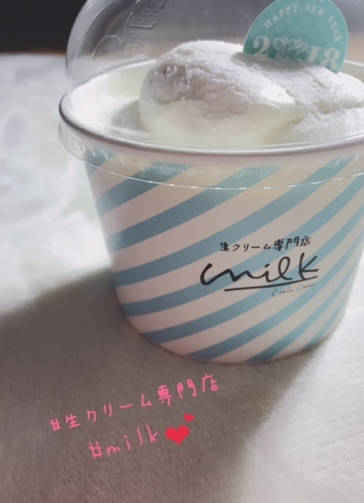

### 🐮🥛💕モォ〜ゥ
<a target="_blank" rel="noreferrer noopener" href="http://blog.nanabunnonijyuuni.com/s/n227/diary/detail/401?ima=1914&cd=blog">2018.01.24 </a>| 中文翻譯 
武田愛奈    
実はね〜〜〜〜    
じゃん！！  
     
生クリーム専門店のmilkのやっと食べれた〜〜〜！！   
ずっと食べたかったの…   
お久しぶりの生クリーム😳 😳      
生クリームシュークリーム 
生クリームフレンチトースト 
生クリームシェイク 
生クリームチーズケーキ  
…とかね！  
たくさんあるの！      
私は生クリームシフォンケーキにした😳😳  
だって名前がね！？  
『生クリームを食べるためのふわとろシフォンケーキ』    
だよ！？    
他のもすっごく気になるけどまずは生クリーム！って思ったからこれに決めました✩︎  
優柔不断だからすっごく時間かかったけどね( ˊ̱˂˃ˋ̱ ) 
でも考えてる時間がしあわせよね( ˊ̱˂˃ˋ̱ )      
あんまり重たくなくてスッキリ系の生クリームだった！ 
ぺろっとだったよ〜〜！ 
おいしかったああ。     
もっともっといろんな生クリームが食べた〜〜〜い＼(^o^)／  
次は1番人気の生クリームシュークリームにしてみよ♩     
食べるはHAPPY☺️💕 
食べたら動けばいいのさ〜☺️💕  
武田愛奈