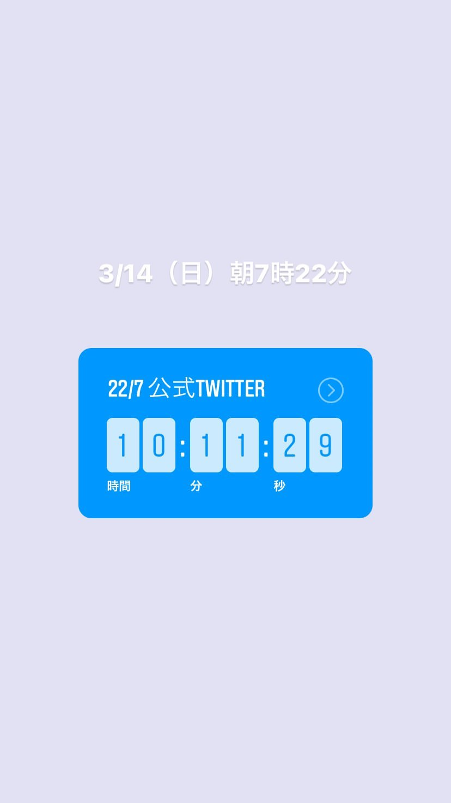
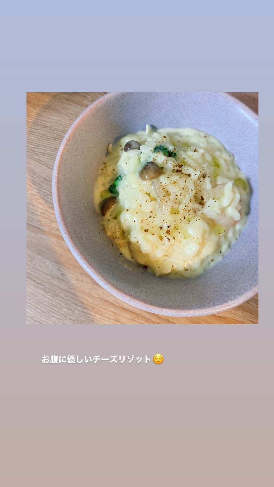
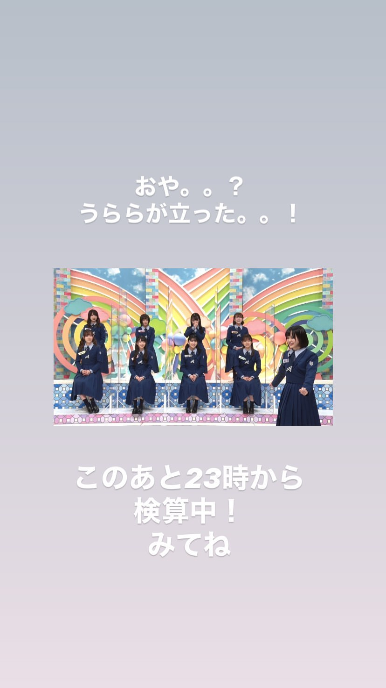

### Instagram Story 限時動態 - 20210313 (Sat)
##### [Back](../../IGstory_List.md)

<table>
<tr>
<th><a href="#kawase_uta">河瀬詩 kawase_uta</a></th>
<th><a href="#__shiro227">白沢かなえ __shiro227</a></th>
<th><a href="#reinyan_0526">宮瀬玲奈 reinyan_0526</a></th>
<th><a href="#urara_tantan">高辻麗 urara_tantan</a></th>
<th><a href="#sallyamaki">天城サリー sallyamaki</a></th>
</tr>
</table>

#### 河瀬詩 kawase_uta

<video width="70%" height="70%" controls>
  <source src="../../../../../Album/Instagram/IGstory/Mar2021/20210313/20210313_kawase_uta_1.MP4" type="video/mp4">
</video>
Post at about 13:26 (JST) 

<video width="70%" height="70%" controls>
  <source src="../../../../../Album/Instagram/IGstory/Mar2021/20210313/20210313_kawase_uta_2.MP4" type="video/mp4">
</video>
Post at about 21:14 (JST) 

#### 白沢かなえ __shiro227

<video width="70%" height="70%" controls>
  <source src="../../../../../Album/Instagram/IGstory/Mar2021/20210313/20210313_shiro227_1.MP4" type="video/mp4">
</video>
Post at about 17:28 (JST) 

 
Post at about 21:10 (JST) 

 
Post at about 21:54 (JST) 

 
Post at about 23:00 (JST) 

#### 宮瀬玲奈 reinyan_0526

 
Post at about 19:17 (JST) 

#### 高辻麗 urara_tantan

 
Post at about 22:45 (JST) 

#### 天城サリー sallyamaki

 
Post at about 23:00 (JST) 
