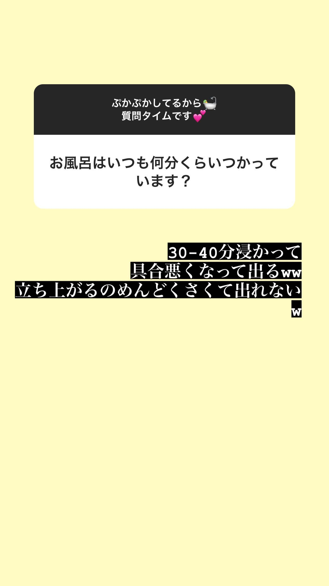
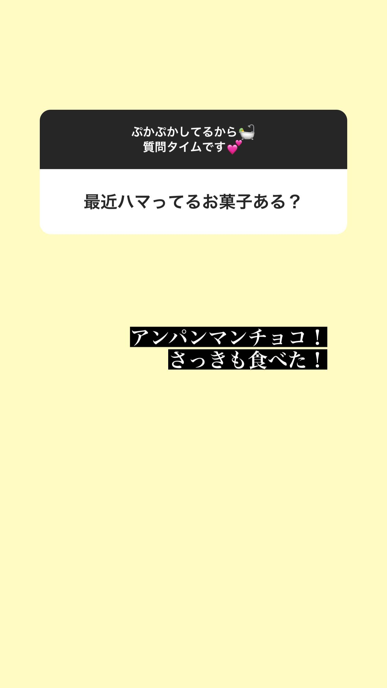
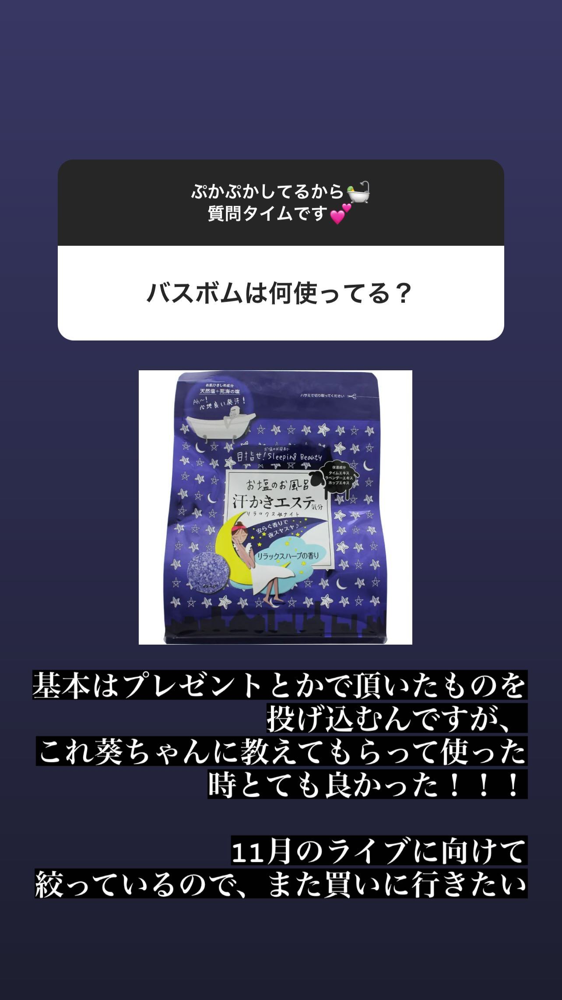

### Instagram Story 限時動態 - 20230516 (Tue)
##### [Back](../../IGstory_List.md)

<table>
<tr>
<th><a href="#asaoka_mao">麻丘真央 asaoka_mao__</a></th>
<th><a href="#sallyamaki">天城サリー sallyamaki</a></th>
</tr>
</table>

#### 麻丘真央 asaoka_mao__

  

    
1157 | 1/7

    
  

    
  

    
1641 | 2/7
 
     <video width="100%" autoplay muted controls>
  <source src="../../../../../Album/Instagram/IGstory/May2023/20230516/20230516_asaoka_mao_2.mp4" type="video/mp4">
</video> 
  

  
  

    
1646 | 3/7

    
  

  
  

    
1700 | 4/7

    
  

  
  

    
1708 | 5/7
 
     <video width="100%" autoplay muted controls>
  <source src="../../../../../Album/Instagram/IGstory/May2023/20230516/20230516_asaoka_mao_5.mp4" type="video/mp4">
</video> 
  

  

    
1737 | 6/7
 
     <video width="100%" autoplay muted controls>
  <source src="../../../../../Album/Instagram/IGstory/May2023/20230516/20230516_asaoka_mao_6.mp4" type="video/mp4">
</video> 
  

  

    
2343 | 7/7

    
  
 

  <a class="prev" onclick="plusSlides(-1, 0)">&#10094;</a>
  <a class="next" onclick="plusSlides(1, 0)">&#10095;</a>

#### 天城サリー sallyamaki

  

    
2318 | 1/6

  
  

  
  

    
2323 | 2/6

  
  

  
  

    
2325 | 3/6

  
  

  
  

    
2328 | 4/6

  
  

  
  

    
2335 | 5/6

  
  

  

    
2337 | 6/6

  
  
 

  <a class="prev" onclick="plusSlides(-1, 1)">&#10094;</a>
  <a class="next" onclick="plusSlides(1, 1)">&#10095;</a>

  