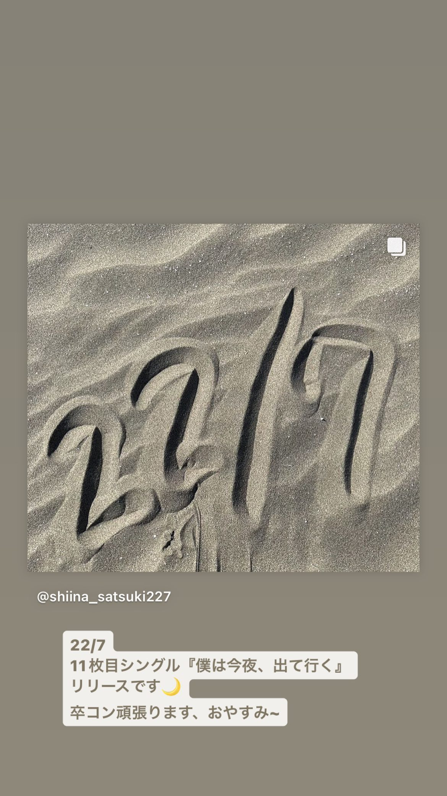
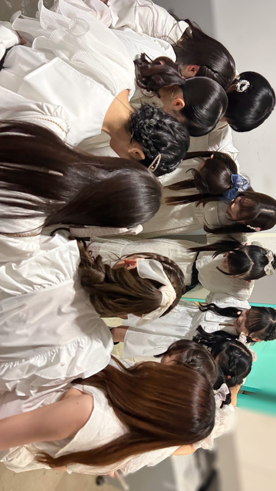
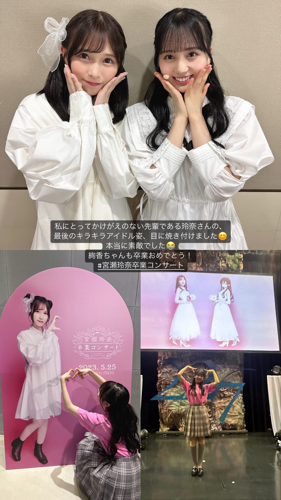

### Instagram Story 限時動態 - 20230525 (Thur)
##### [Back](../../IGstory_List.md)

<table>
<tr>
<th><a href="#shiina_satsuki227">椎名桜月 shiina_satsuki227</a></th>
<th><a href="#cure_rinochi">望月りの cure_rinochi</a></th>
<th><a href="#asaoka_mao">麻丘真央 asaoka_mao__</a></th>
</tr>
</table>

#### 椎名桜月 shiina_satsuki227

  

    
0049 | 1/2

    
  

  

    
1827 | 2/2

     <video width="100%" autoplay muted controls>
  <source src="../../../../../Album/Instagram/IGstory/May2023/20230525/20230525_shiina_satsuki227_2.mp4" type="video/mp4">
</video>
  
 

  <a class="prev" onclick="plusSlides(-1, 0)">&#10094;</a>
  <a class="next" onclick="plusSlides(1, 0)">&#10095;</a>

#### 望月りの cure_rinochi

  

    
0957 | 1/2

    
  

  
  

    
2355 | 2/2

    
  
  

  <a class="prev" onclick="plusSlides(-1, 1)">&#10094;</a>
  <a class="next" onclick="plusSlides(1, 1)">&#10095;</a>

#### 麻丘真央 asaoka_mao__

  

    
1424 | 1/2

     <video width="100%" autoplay muted controls>
  <source src="../../../../../Album/Instagram/IGstory/May2023/20230525/20230525_asaoka_mao_1.mp4" type="video/mp4">
</video>
  

  
  

    
2338 | 2/2

    
  

  <a class="prev" onclick="plusSlides(-1, 2)">&#10094;</a>
  <a class="next" onclick="plusSlides(1, 2)">&#10095;</a>

