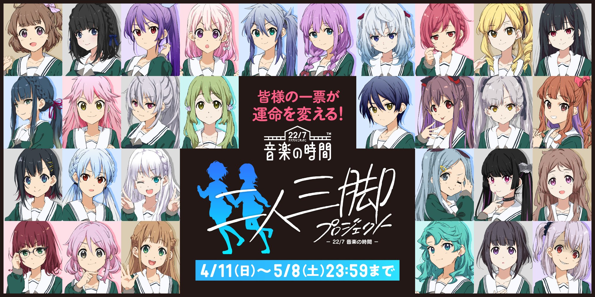

#### 二人三脚プロジェクト 2nin3kyaku Project
##### [Back](../../../readme.md)

 
<a target="_blank" ref="noopener noreferrer" href="https://227-game.com/2nin3kyaku/">Official Site</a> 

#### 關於 About
<!--
これは、22/7メンバー成長のためのプロジェクトーー 
メンバーそれぞれが六番町学院の後輩を 
指導・育成することになる。  
このプロジェクトに参加する後輩を 
決定するのは皆様の投票。  
皆様の手によって運命が大きく変わるプロジェクト。 -->
<blockquote>
這是個關於22/7成員成長的計劃─ 
每位成員將在六番町学院 
指導、培訓後輩。  
參加這個計劃的後輩 
將由各位的投票決定。  
一個因各位的手而命運產生巨變的計劃。 
</blockquote>

#### 規則 Rule
<!--
アプリゲーム「22/7 音楽の時間」における新プロジェクトが始動いたします。 
このプロジェクトでは皆様の投票によって、30キャラクターの中から「22/7」とゲーム内で 
先輩後輩関係になる11キャラが選ばれます。  
投票は1日で「1キャラに1票」、最大で3キャラまで投票することが可能です。 -->
<blockquote>
手遊「22/7 音楽の時間」新的計劃即將開始。 
在這個計劃中的30名角色內，將由您投票選出11名並在「22/7」遊戲內有前後輩關係。  
每日可投「一個角色一票」，每日最多可投三票。 
</blockquote>

#### 行程 Schedule
<!--●キャラクターボイス第2弾、ランキング上位10名中間発表 -->●角色聲音第2彈、排首10名角色中期報告 

4月18日（日）
 

<!--●キャラクターボイス第3弾、ランキング上位10名中間発表 -->●角色聲音第3彈、排首10名角色中期報告 

4月25日（日）
 

<!--●ランキング上位10名中間発表 -->●排首10名角色中期報告 

5月2日（日）
 

<!--●投票終了 -->●投票結束 

5月8日（土）
 

<!--●結果発表（1周年直前配信番組） -->●公佈結果 

5月23日予定
  

<!--※コミュニティサイト「ナナコミ」（<a target="_blank" ref="noopener noreferrer" href="https://nana-comi.com/">https://nana-comi.com/</a>）での投票後にSNSへと投票完了シェアをおこなうと、 
そのキャラに対して投票数が2倍で（2票分として）カウントされます。 
※「22/7」2期生のオーディションではございません。 -->
<blockquote>
※在社群網頁「ナナコミ」(<a target="_blank" ref="noopener noreferrer" href="https://nana-comi.com/">https://nana-comi.com/</a>)內投票後，分享「完成投票」至SNS， 
則投給相關角色的票數將增加一倍(即當作兩票計算)。 
※這並不是「22/7」2期生試鏡。 
</blockquote>

#### 角色 Characters

<table>
 <tr>
  <td></td>
  <td>年齡: 16歳 身高: 155cm 三圍: 83/55/82 嗜好: 杯麵</td>
 </tr>
 <tr>
  <td></td>
  <td>年齡: 16歳 身高: 156cm 三圍: 94/56/88 嗜好: 料理…或者是把食物混合在一起</tsd>
 </tr>
 <tr>
  <td></td>
  <td>年齡: 17歳 身高: 162cm 三圍: 87/56/85 嗜好: 弓道</td>
 </tr>
 <tr>
  <td></td>
  <td>年齡: 16歳 身高: 154cm 三圍: 78/53/77 嗜好: 製作苔玉</td>
 </tr>
 <tr>
  <td></td>
  <td>年齡: 17歳 身高: 160cm 三圍: 90/56/87 嗜好: 謎題</td>
 </tr>
 <tr>
  <td></td>
  <td>年齡: 16歳 身高: 155cm 三圍: 91/56/87 嗜好: 閱讀(詩集)</td>
 </tr>
 <tr>
  <td></td>
  <td>年齡: 16歳 身高: 148cm 三圍: 71/50/69 嗜好: 書道</td>
 </tr>
 <tr>
  <td></td>
  <td>年齡: 16歳 身高: 153cm 三圍: 90/57/88 嗜好: 煩擾他人</td>
 </tr>
 <tr>
  <td></td>
  <td>年齡: 17歳 身高: 158cm 三圍: 86/54/82 嗜好: 節約</td>
 </tr>
 <tr>
  <td></td>
  <td>年齡: 17歳 身高: 161cm 三圍: 92/56/88 嗜好: ？</td>
 </tr>
 <tr>
  <td></td>
  <td>年齡: 16歳 身高: 156cm 三圍: 82/56/80 嗜好: 黑白棋</td>
 </tr>
 <tr>
  <td></td>
  <td>年齡: 16歳 身高: 161cm 三圍: 82/55/80 嗜好: 踏單車</td>
 </tr>
 <tr>
  <td></td>
  <td>年齡: 17歳 身高: 160cm 三圍: 88/56/85 嗜好: 直播</td>
 </tr>
 <tr>
  <td></td>
  <td>年齡: 16歳 身高: 153cm 三圍: 74/52/70 嗜好: 相機</td>
 </tr>
 <tr>
  <td></td>
  <td>年齡: 16歳 身高: 150cm 三圍: 70/50/68 嗜好: 跳舞、裁縫</td>
 </tr>
 <tr>
  <td></td>
  <td>年齡: 17歳 身高: 157cm 三圍: 91/58/89 嗜好: 釣魚</td>
 </tr>
 <tr>
  <td></td>
  <td>年齡: 16歳 身高: 156cm 三圍: 80/53/78 嗜好: 精油</td>
 </tr>
 <tr>
  <td></td>
  <td>年齡: 17歳 身高: 155cm 三圍: 79/53/75 嗜好: 收集家具</td>
 </tr>
 <tr>
  <td></td>
  <td>年齡: 16歳 身高: 156cm 三圍: 79/54/77 嗜好: 羽毛球</td>
 </tr>
 <tr>
  <td></td>
  <td>年齡: 16歳 身高: 155cm 三圍: 82/58/80 嗜好: 瑜伽、跑步、讀書</td>
 </tr>
 <tr>
  <td></td>
  <td>年齡: 16歳 身高: 158cm 三圍: 85/56/84 嗜好: 遊戲</td>
 </tr>
 <tr>
  <td></td>
  <td>年齡: 16歳 身高: 152cm 三圍: 81/55/78 嗜好: 魔術</td>
 </tr>
 <tr>
  <td></td>
  <td>年齡: 16歳 身高: 155cm 三圍: 88/56/85 嗜好: 研究偶像</td>
 </tr>
 <tr>
  <td></td>
  <td>年齡: 16歳 身高: 148cm 三圍: 77/53/73 嗜好: 拍照、化妝</td>
 </tr>
 <tr>
  <td></td>
  <td>年齡: 17歳 身高: 159cm 三圍: 79/56/73 嗜好: 散步</td>
 </tr>
 <tr>
  <td></td>
  <td>年齡: 16歳 身高: 149cm 三圍: 71/50/70 嗜好: 觀察昆蟲</td>
 </tr>
 <tr>
  <td></td>
  <td>年齡: 16歳 身高: 157cm 三圍: 82/54/80 嗜好: 陶藝</td>
 </tr>
 <tr>
  <td></td>
  <td>年齡: 17歳 身高: 163cm 三圍: 80/54/78 嗜好: 愛情小說、午間劇</td>
 </tr>
 <tr>
  <td></td>
  <td>年齡: 16歳 身高: 155cm 三圍: 81/54/78 嗜好: 和朋友在一起</td>
 </tr>
 <tr>
  <td></td>
  <td>年齡: 16歳 身高: 157cm 三圍: 83/54/79 嗜好: ？</td>
 </tr>
</table>