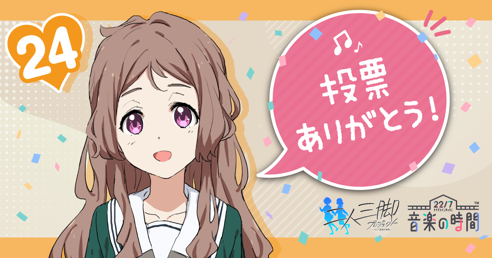
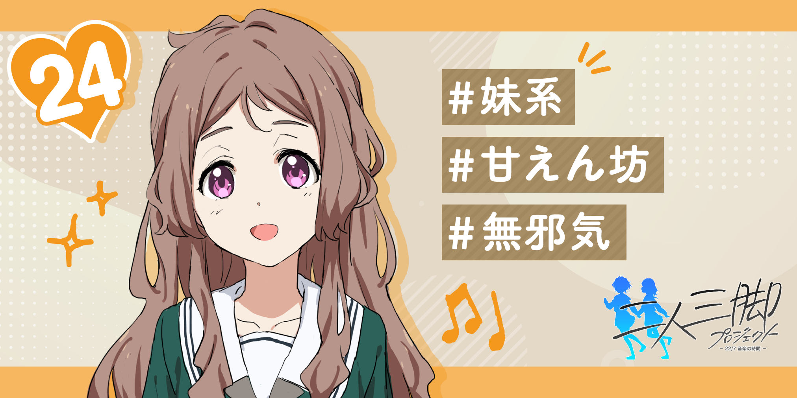
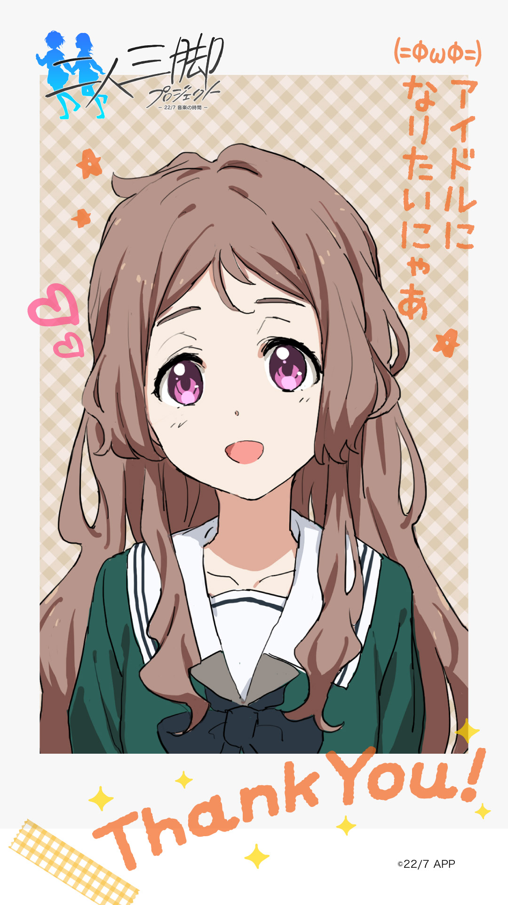

#### 二人三脚プロジェクト 2nin3kyaku Project
##### [Back](2nin3kyaku_List.md)

#### 岬心彩 (No.24)
CV. 小茅楓 <a rel="noreferrer noopener" target="_blank" href="https://www.crocodile-ltd.com/talent/kogaya-kaede">Crocodile Official Site</a> <a rel="noreferrer noopener" target="_blank" href="https://twitter.com/kogaya_kaede">Twitter</a>  
 
 
 
 
 
 
生日: 6月24日 
年齡: 16歳 
身高: 148cm 
三圍: B77/W53/H73 
血型: B型 
出身: 広島県 
 
嗜好: 拍照、化妝 
 
Q1.請告訴我你的嗜好/特殊技能 
<audio controls="controls">
  <source type="audio/mp3" src="../../../Resources/2nin3kyaku/No24_voice_1.mp3"></source>
  
Your browser does not support the audio element.

</audio> 
Q2. 對你而言，甚麼是偶像?  
<audio controls="controls">
  <source type="audio/mp3" src="../../../Resources/2nin3kyaku/No24_voice_2.mp3"></source>
  
Your browser does not support the audio element.

</audio> 
Q3. ぐっ(嗚)!?剛才被殭屍咬傷了左臂……!🧟  
<audio controls="controls">
  <source type="audio/mp3" src="../../../Resources/2nin3kyaku/No24_voice_3.mp3"></source>
  
Your browser does not support the audio element.

</audio> 