### 下載 Brightcove Player 影片 Download Brightcove Player videos
##### [Back](/Article_List.md)
###### 撰文日期 Publish Date: 12Sep,2020
###### 更新日期 Update Date: 11Jul,2022

以下教學會以下載<b>22/7割り切れないラジオ+</b>影片作示例。 
This tutorial will demonstrate how to download <b>22/7 Warikirenai Radio Plus</b> videos as an example.  

<!-- 舊方法(已失效) / Old method (Not working)

<b>1. 所需程式 | Software(s) Needed</b> 
- VLC Player <a target="_blank" rel="noopener noreferrer" href="https://www.videolan.org/vlc/">Official Page</a>  

<b>2. 取得 Brightcove Player 連結 | Get the Brightcove Player link</b> 

首先，進入「<a target="_blank" rel="noopener noreferrer" href="http://www.nanabunnonijyuuni.com/special/radio-2/">22/7割り切れないラジオ+</a>」。 
然後，按F12 打開主控台。 
First, go to "<a target="_blank" rel="noopener noreferrer" href="http://www.nanabunnonijyuuni.com/special/radio-2/">22/7Warikirenai Radio Plus</a>" official page. 
Then, press <i>F12</i> to open console. 
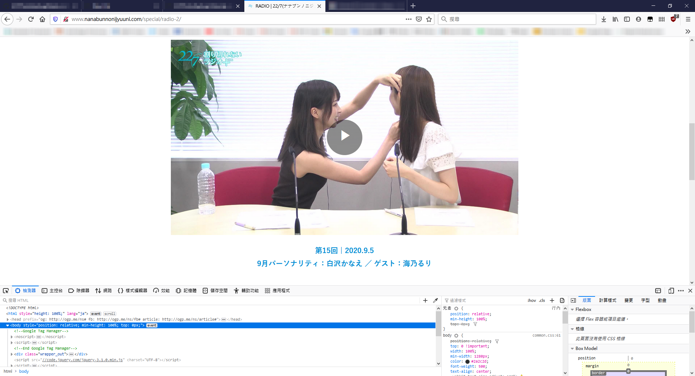  
在「搜尋」欄輸入「player」。 
Key in <i>player</i> in the "Search" box. 
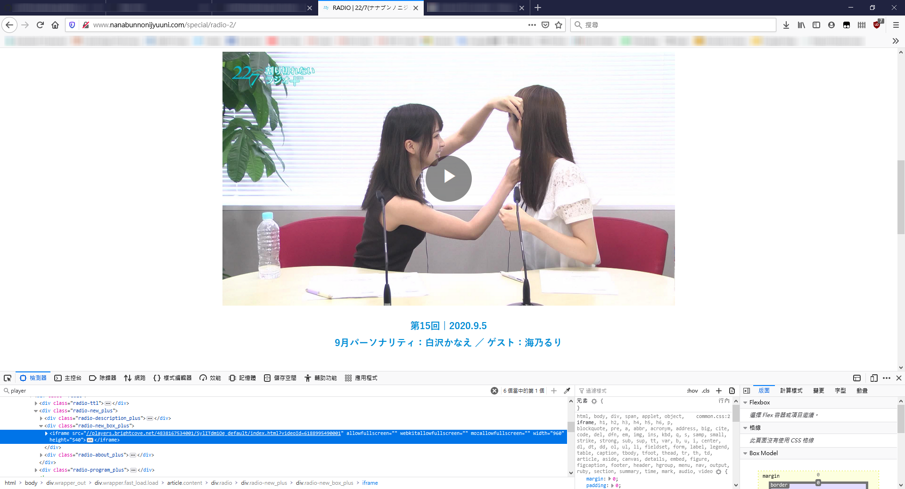  
找到 Brightcove player 連結並將其複製。 
Find the Brightcove player link and copy it.  

<b>3. 轉換 Brightcove player 連結至 M3U8 | Convert Brightcove player link to M3U8</b> 
開啟「<a target="_blank" rel="noopener noreferrer" href="https://www.tubeoffline.com/download-BrightCove-videos.php">TubeOffline</a>」網頁並貼上剛才的 Brightcove player 連結。然後按「GET video」。 
Open "<a target="_blank" rel="noopener noreferrer" href="https://www.tubeoffline.com/download-BrightCove-videos.php">TubeOffline</a>" website and paste the Brightcove player link. After that, press <i>GET video</i>. 
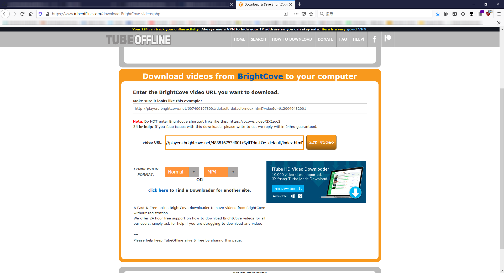  

等候片刻，然後在「COPY this link」上右擊，按「複製鏈結網址」。 
Wait for a while. Then right click and copy the link on <i>COPY this link</i>. 
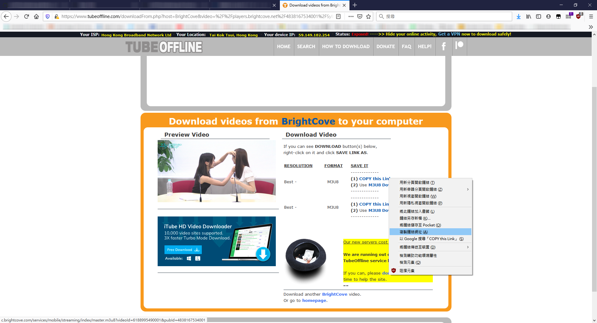  

<b>4. 利用VLC player轉換至mp4 | Using VLC player to convert to mp4</b> 
開啟VLC player，按「媒體 > 開啟網絡串流」。然後貼上剛才複製的M3U8網址。 按「播放」旁下拉選單，選「轉換」。 
Open "VLC player". Click "Media > Open Network Stream" and paste to link. Click the drop-down list near "Play". Then select "Convert". 
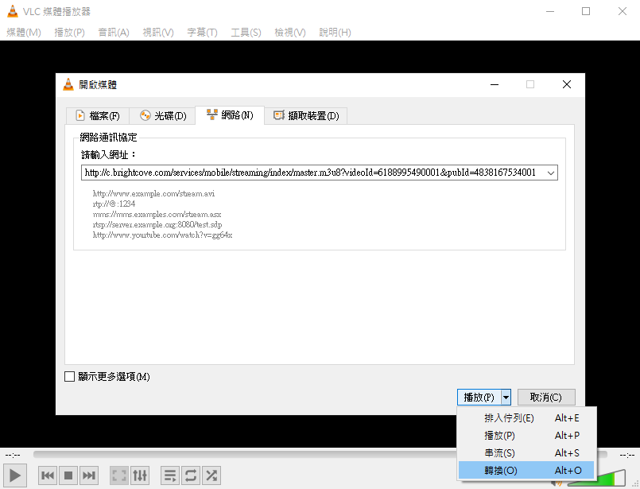  

在「設定檔」中選擇「Video - H.264 + MP3 (MP4)」。及後選擇檔案目的地後按「開始」。 
Choose <i>Video - H.264 + MP3 (MP4)</i> under <i>Profile</i>. Then decide your file destination. Finally, click Start. 
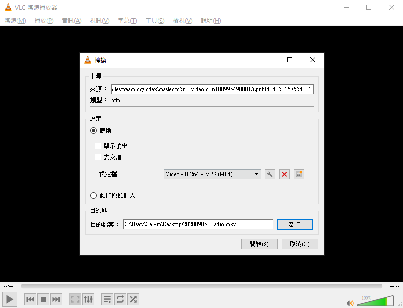  

等候轉換成功。 <i>^ 如中途VLC意外關閉，則需要重做以上步驟。</i> 
Wait for the convert to complete. <i>^ If VLC shutdown during the converting process, you need to redo the above steps.</i> 
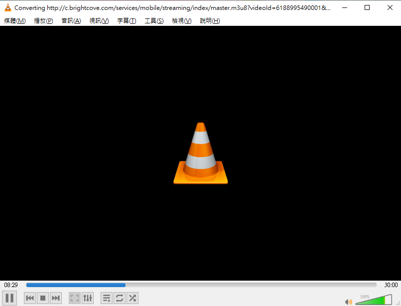  

查看檔案是否能正常播放。 
Check whether the video can play or not. 
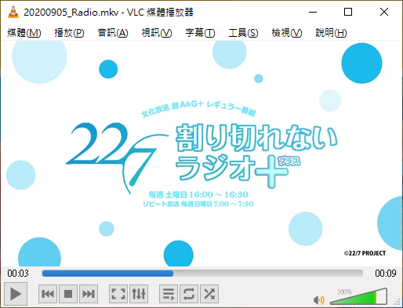  

><b>4a. 附加資料 | Additionial Information</b> 
如相關影片像上圖所示一樣只有約十秒時間，則需要使用另一方法下載。先複製M3U8連結。 
If the converted video just like the one in the above image, which only got a few secord long. You need to use another way to download it again. 
Firstly, please copy the M3U8 link.  
然後按「媒體 > 開啟網絡串流」。然後貼上剛才複製的M3U8網址。按「播放」。 等候影片開始播放。它應該有合理的片長，如30分鐘。 
Click "Media > Open Network Stream" and paste to link. Click "Play". Wait for the video to play. It should have a reasonable video length (eg. 30mins). 
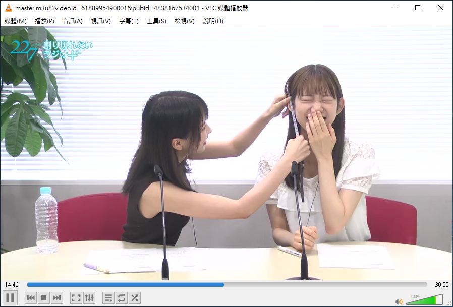  
按上方工具欄「檢視 > 播放清單」。 
Click "View > Playlist" on the above toolbar. 
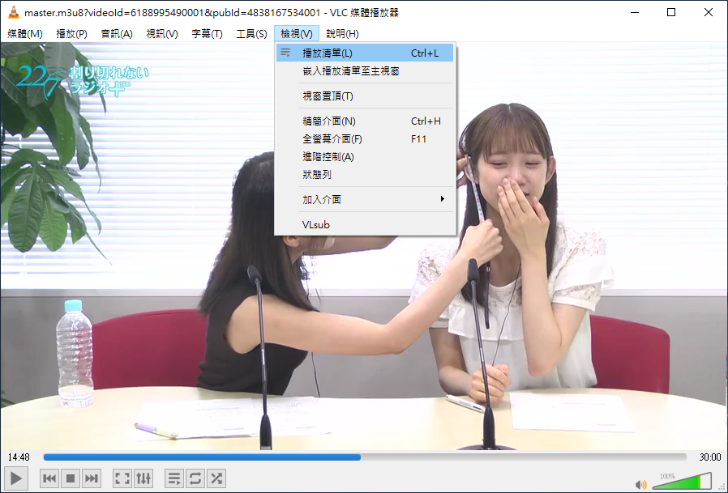  
在該串流影片上右擊，選「儲存」。請仔細查看片長是否正常。 
Right click on that stream video. Choose "Save". Please double check whether the video has a reasonable video length or not. 
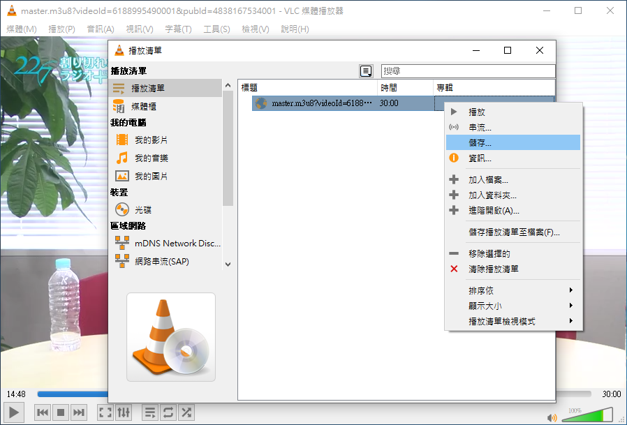  
跟上方步驟一樣，選擇好「設定檔」及檔案目的地後按開始。
Just like the above steps, choose the right profile and decide your file destination. After all, click "Start". 
轉換成功後，查看檔案是否能正常播放。 
Wait for the convert to complete. And check whether the video can play or not. 

<b>5. 完成 | Finish</b> 
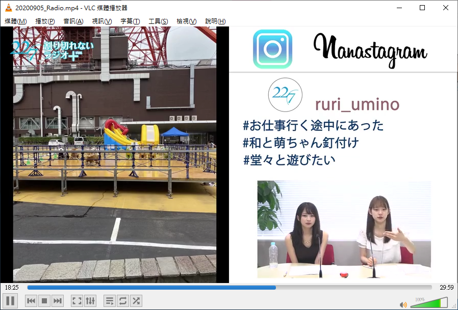  

<b>6. 如無法直接找到 Brightcove player 網址 | If cannot find the Brightcove player link directly</b> 
如無法直接找到 Brightcove player 網址，則可以根據以下格式寫出。 
If cannot find the Brightcove player link directly, then your can form it yourself by following the below format.  
<i>* 需事先取得該影片<b>Account ID</b>、<b>Player ID</b>及<b>Video ID</b>。可以在「F12」的主控台或在影片上右擊查看有關資訊。</i> 
<i>* You need to obtain the <b>Account ID</b>, <b>Player ID</b> and <b>Video ID</b> beforehand. You can view these info by viewing the console through press <i>F12</i> or right click on the video.</i> 

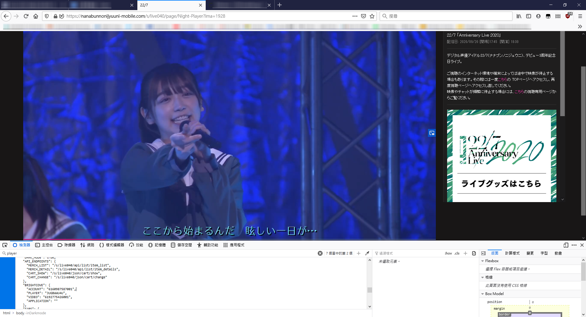  
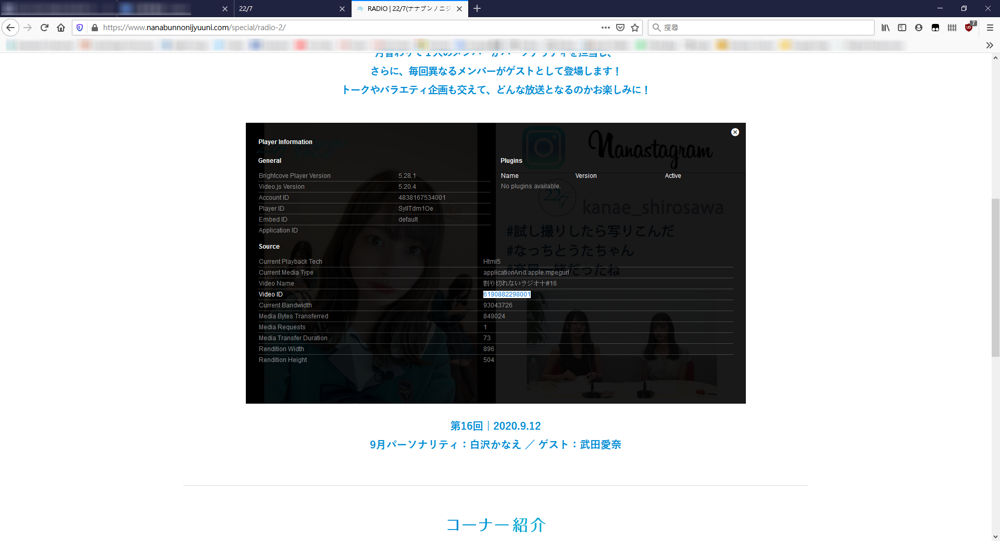  

http://players.brightcove.net/<i><b>Account ID</b></i>/<i><b>Player ID</b></i>_default/index.html?videoId=<i><b>Video ID</b></i>  
Eg. http://players.brightcove.net/<i><b>6160987587001</b></i>/<i><b>JUGBWWU4U</b></i>_default/index.html?videoId=<b><i>6186246913001</i></b> 
<i>* 註：例子中的鏈結乃虛構。 Remark: The sample link is fictional.</i> 

然後跟上方步驟一樣貼上Brightcove player 網址至「Tube Offline」，繼續進行轉換過程。 
Then just like the above steps, copy the Brightcove player link to "Tube Offline" and continue the convert process. 

-->

新方法 / New Method 

<b>1. 所需程式 | Software(s) Needed</b> 
- iTubeGo YouTube Downloader (Pro Version) <a target="_blank" rel="noopener noreferrer" href="https://itubego.com/4k-youtube-video-downloader63/">Official Page</a>  

<b>2. 取得 Brightcove Player 連結 | Get the Brightcove Player link</b> 
首先，進入「<a target="_blank" rel="noopener noreferrer" href="https://nanabunnonijyuuni.com/s/n129/diary/special/list?ima=4358">22/7割り切れないラジオ+</a>」。 
然後，在影片上方右擊，按「Player Information」。 
First, go to "<a target="_blank" rel="noopener noreferrer" href="https://nanabunnonijyuuni.com/s/n129/diary/special/list?ima=4358">22/7Warikirenai Radio Plus</a>" official page. 
Then, hover the video and right click. Select "Player Information". 
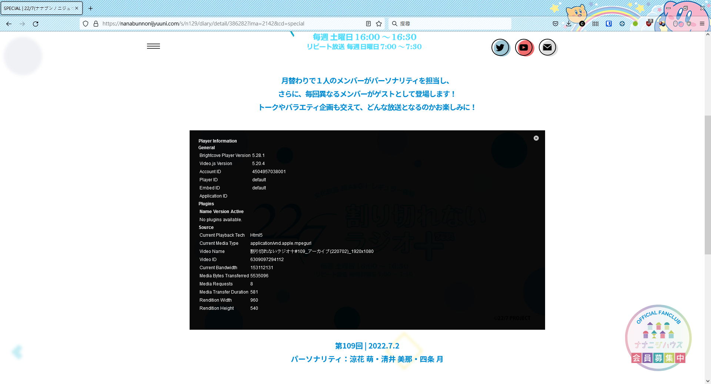  

按以下方式依次序填入「Account ID」、「Player ID」及「Video ID」。 
Follow the sample link below and key in "Account ID", "Player ID", and "Video ID" correspondingly.  
http://players.brightcove.net/<i><b>Account ID</b></i>/<i><b>Player ID</b></i>_default/index.html?videoId=<i><b>Video ID</b></i>  
Eg. http://players.brightcove.net/<i><b>4504957038001</b></i>/<i><b>default</b></i>_default/index.html?videoId=<b><i>6309097294112</i></b> 
<i>* 註：例子中的鏈結乃虛構。 Remark: The sample link is fictional.</i>  

將此連結複製。 
Copy this Brightcove player link.  

<b>2. 轉換 Brightcove player 連結至 MP4 | Convert Brightcove player link to MP4</b> 
開啟「iTubeGo YouTube Downloader」並貼上剛才的 Brightcove player 連結。然後按「Download」。 
Open "iTubeGo YouTube Downloader" and paste the Brightcove player link. After that, press <i>Download</i>. 
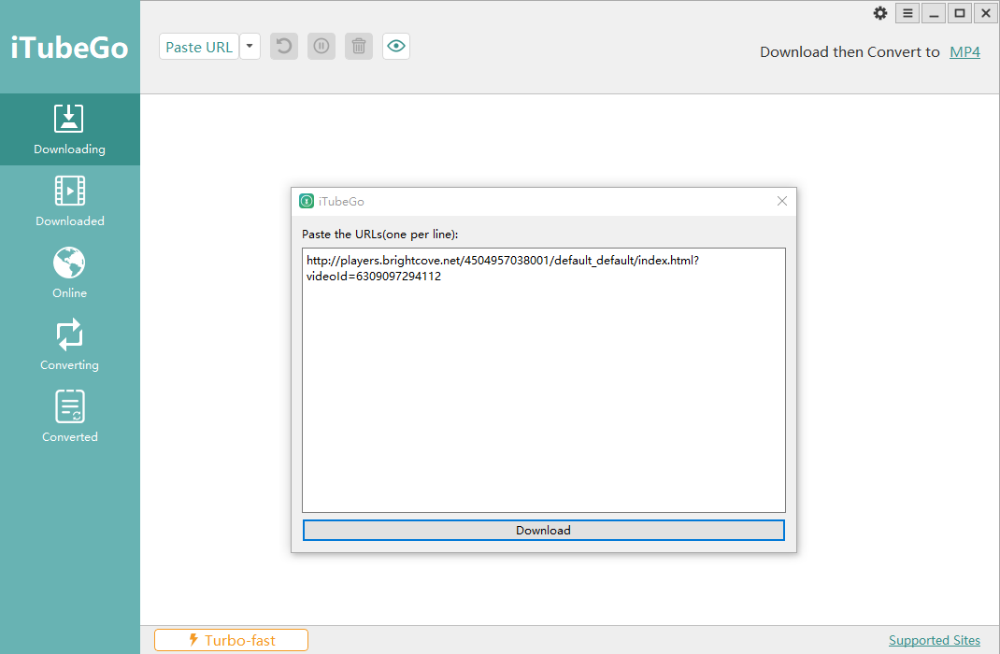  

等候下載。 
Wait for the video to download. 
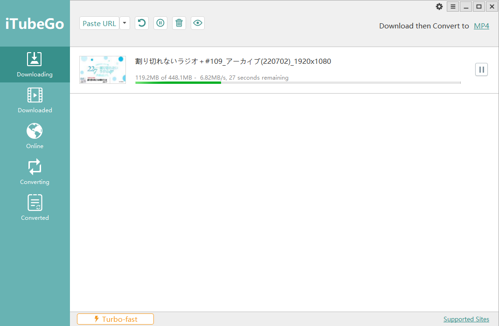  

<b>3. 完成 | Finish</b> 
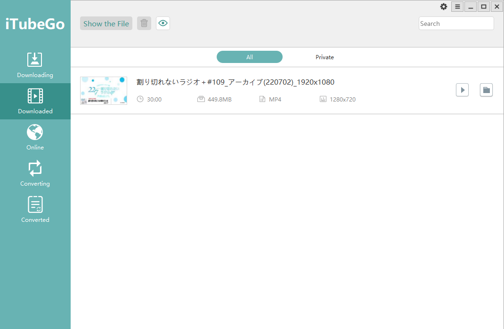  

^ 查看檔案是否能正常播放。 
^ Check whether the video can play or not. 
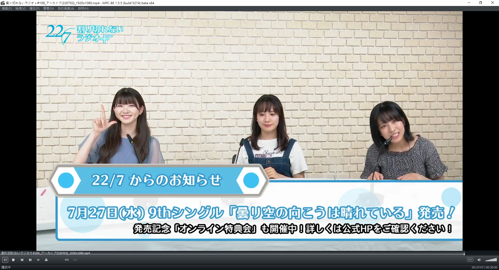  

<b>Fin.</b>