### 【舊聞】海乃るり / 清澄なつは
##### [Back](Article_List.md)
###### 撰文日期 Date: 29Dec,2020  

文章（隨緣）翻譯 
原文：https://ameblo.jp/va-infonavi/entry-12283769777.html  

海乃るり：曾以「清澄なつは」名義從事藝能活動  
雖然由秋元康先生所策劃的團體22/7，是一個由新人所組成的組合，但似乎其中一位成員曾從事藝能活動。  
現在，她以藝名「海乃るり」進行活動。以往，她是以「清澄なつは」名義在Sony Music Artists 進行活動。若你並排相片作比較，會有一種「是她本人」的感覺。如果你有興趣亦歡迎嘗試一下。  
簡單而言，她就是水瀬いのり和伊波杏樹的後輩。  
現在，她和乃木坂46、欅坂46（現稱櫻坂46）隸屬同一公司，名為Sony Music Labels。離開了SMA，估計是因為合約問題。  
如果是內部推薦的話，並沒別說。當在申請這試鏡時，不太可能辭去活動後申請，因為在申請指引上寫着「並沒專屬合約」。因此，成員們是基於一些未知的理由而作決定。  
或者，因為22/7這組合最近有不少氣質怪異的孩子，我會說即使她們不成為偶像，也要成為聲優。也許有些人因而改變他們的進路，而其他成員的技能是我所擔憂的地方。 

清澄なつは 
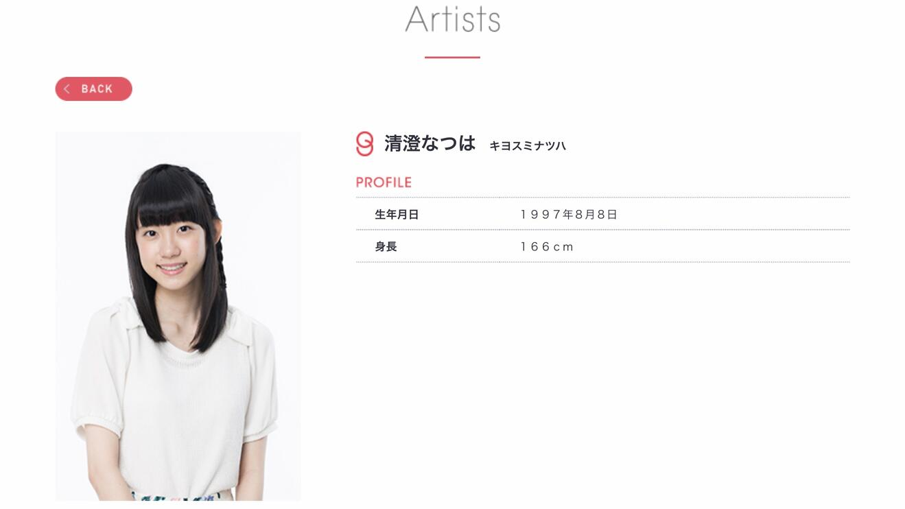  

部分 清澄なつは 在SMA時所參與的活動：  

27May,2016 - GIRLS WONDERWORLD vol.1 
  
<blockqoute>
出演者：  
麻生夏子、伊波杏樹、井澤美香子、ダイアナガーネット、劇団ハーベスト、清澄なつは、たけだまりこ、高橋マリン 
</blockqoute>  
1-7Jul,2016 - 七夕節2016 in Sunshine City (天象館虛擬約會體驗) 
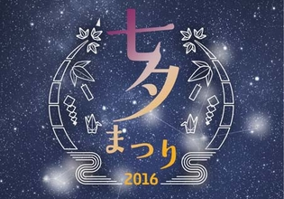  
<blockqoute>
從配戴的耳機中，聽由新人聲優大海将一郎及清澄なつは擔任約會對象的聲音。採用雙路立體聲錄音(binaural recording)可錄製出與平時接收聲音一樣的效果，產生一種在耳邊細語的效果。
</blockqoute> 
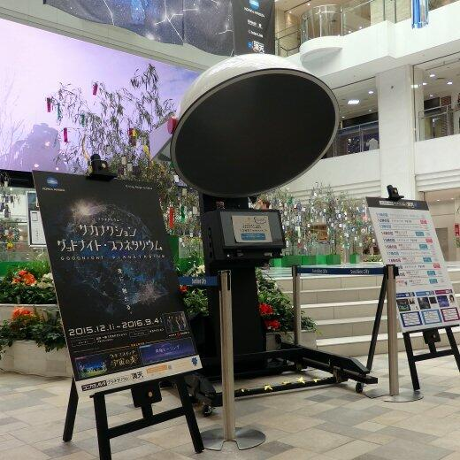 
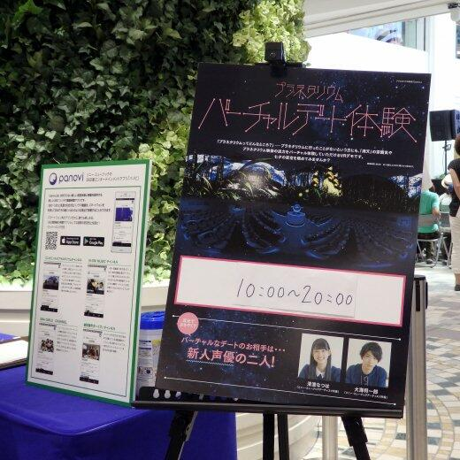 
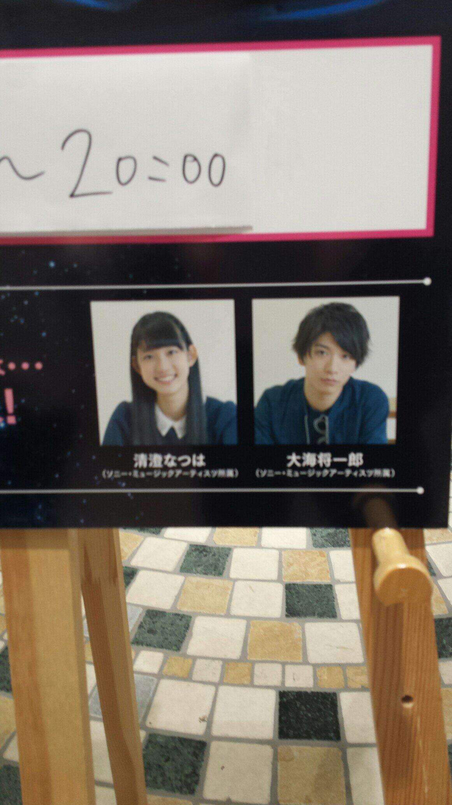  

2016 - レムリア～Strada Of Chain～【角色：リーファ】 
配音角色：リーファ 

SMA時期照片 
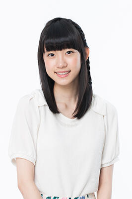 
公式照 
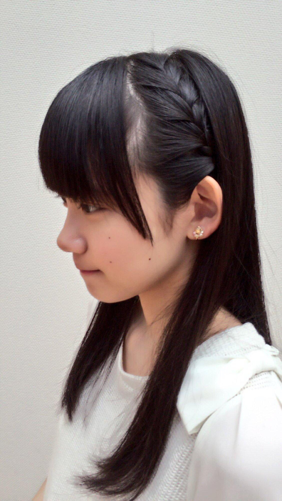 
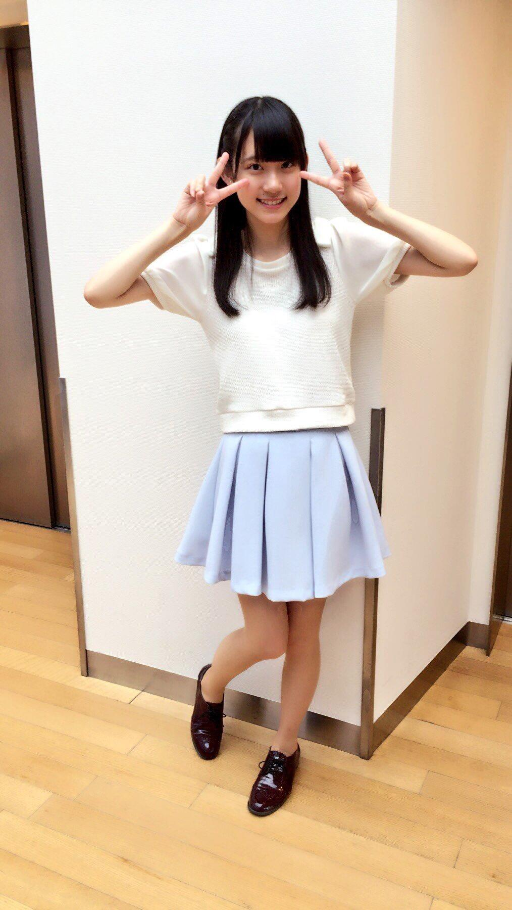 
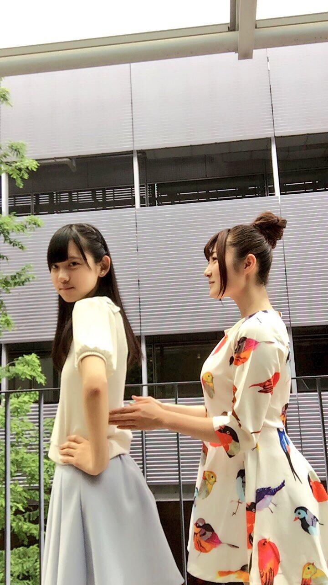 
右為井澤美香子 
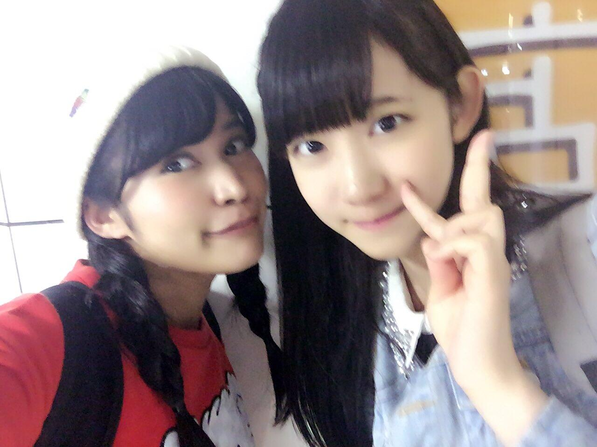 
左為中野 さいま 
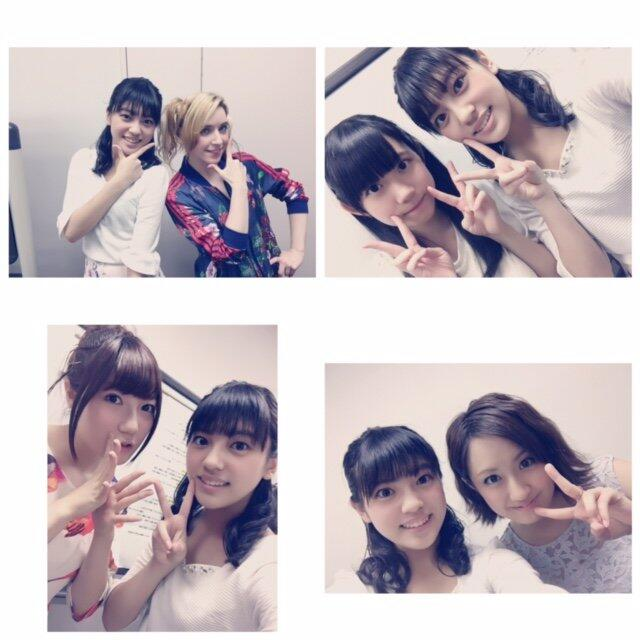 
右上，與劇団ハーベスト成員合照 
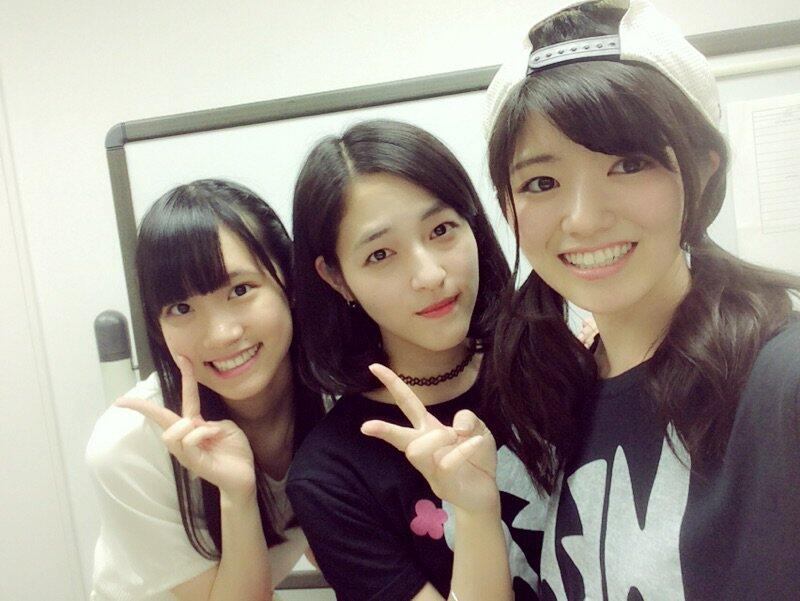 
左一，與劇団ハーベスト成員合照 
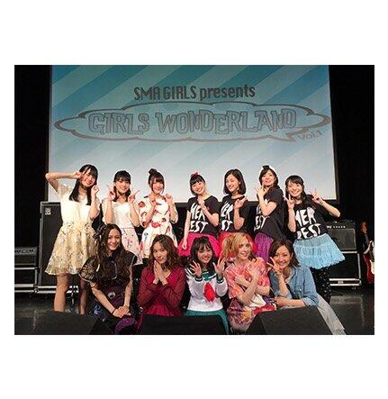 
後排左一 
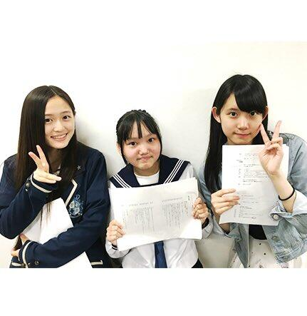 
Fin.